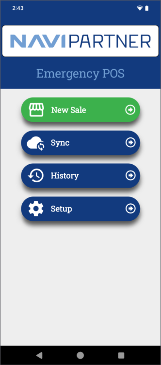
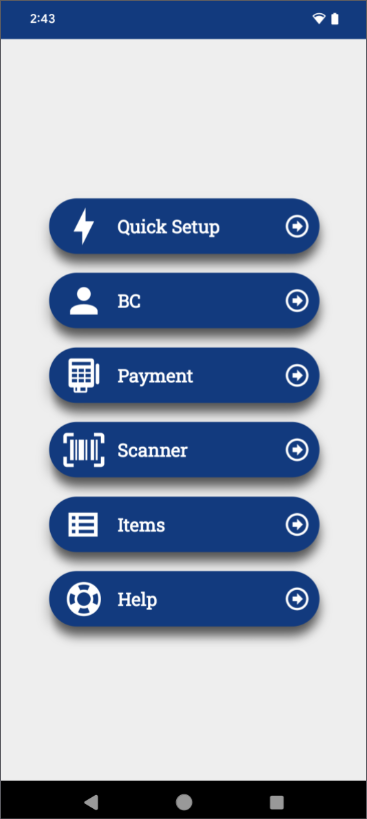
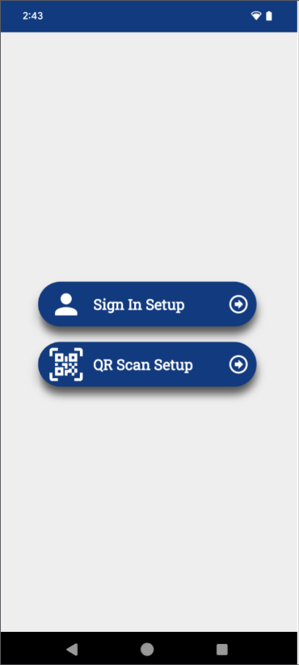
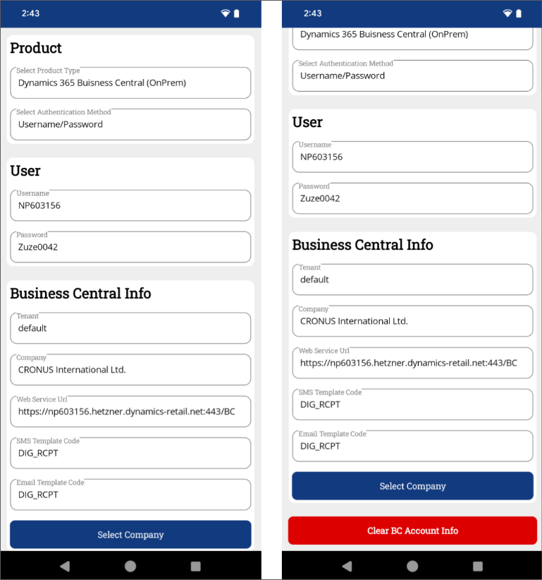
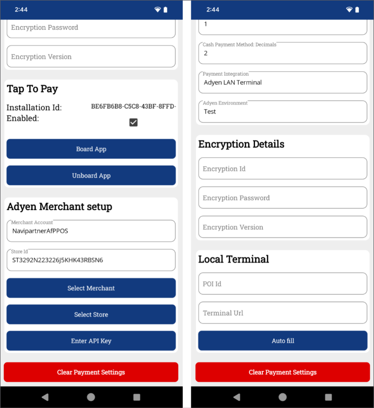
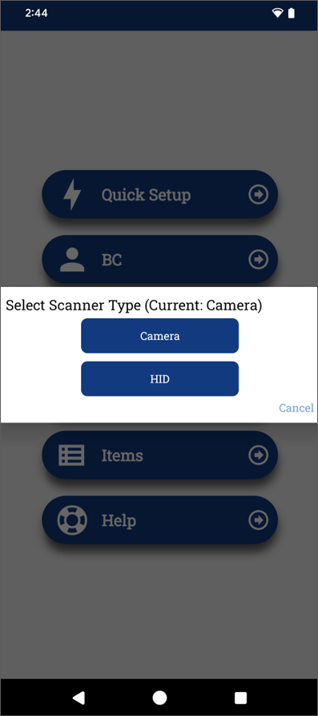

NP Retail Emergency mPOS is an application designed to help customers process payments when Business Central (BC) or the internet is unavailable. This article walks you through the process of setting it and using its features.

## Configure Business Central

1. Click the  button, enter **Emergency mPOS Setup**, and choose the related link.           
2. Provide the basic information needed for the emergency POS to work correctly, such as supported payment methods and SMS/email templates.
3. Contact the NaviPartner consultancy team to assist with **NP Pay POS Payment Setup** for automatic configuration and installation of necessary software (if applicable).

## Prepare your device

### Prerequisite

#### Android devices and NP Pay terminals

If you are using an Android device or an NP Pay terminal, install [<ins>NP Retail Emergency mPOS<ins>](https://play.google.com/store/apps/details?id=com.navipartner.retail.emergencympos) from Google Play. If your setup includes [<ins>Tap to pay<ins>](), you also need the **Adyen Payments** app, which is available in both live and test variants.

#### Windows

If you are using Windows, install the NP Retail Emergency mPOS Windows app from your organization's approved software distribution source. After installation, connect the app to Business Central by running the standard **Quick Setup** flow and authenticating either by sign-in or by scanning the setup QR code.

### Set up the Emergency mPOS app

1. Open the **NP Retail Emergency mPOS** app on your device.      
   The home screen is displayed.

    

2. Tap **Setup**. 

     

    The setup menu is displayed.

2. Tap **Quick Setup**.       

   

3. Sign in or scan a QR code to configure the device.       
   The QR code is provided by the **Emergency mPOS Setup** administrative section in Business Central.

   

## Additional setup

The other setup pages and the options they contain are briefly outlined in this section. For more details on each individual page, switch to the [<ins>reference guide<ins>]()

### BC setup

- Connect the app to Business Central for synchronization.
- Configure SMS/email receipt templates.

   

### Payment setup

The payment setup page specifies all configurations related to sales and payments. 

- Define payment methods (EFT, cash).
- Select the payment integration, depending on the device you're using:   
  - **Tap to Pay** - uses the Adyen Payments app; applicable for Android devices.
  - **LAN Terminal** - uses the built-in payment feature on NP Pay terminals.
- Configure encryption details for secure transactions.
- Establish connection with the Adyen Payments app (**Board App**).      
  The **Board App** option is only relevant if you're also using Tap to Pay.

  

For Windows setups, the Adyen **Board App** flow is not used. In practice, this means Tap to Pay-specific configuration applies to Android-based devices only.

### Scanner setup

- Use **Binary Eye** for camera-based barcode scanning.
- Opt for HID mode for built-in hardware scanners.

  

In Windows environments, BinaryEye and camera-based scanning are not part of the flow. The scanner options in this section therefore describe Android-based device behavior.

### See also

- [<ins>NP Retail Emergency mPOS overview<ins>]()   
- [<ins>Make a sale on NP Retail Emergency mPOS<ins>]()
- [<ins>NP Retail Emergency mPOS (reference guide)<ins>]()