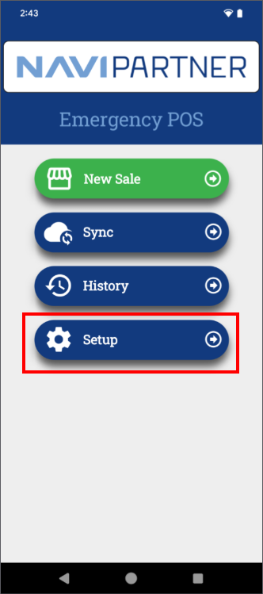
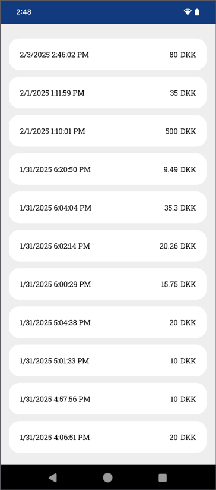
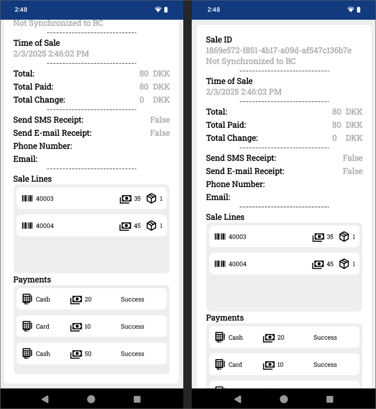

This article walks you through the entire process of setting up the NP Retail Emergency MPOS app.

## Setup in Business Central

- In the **Emergency mPOS Setup** administrative section, provide the basic information needed for the emergency POS to work correctly.   
  This information includes supported payment methods and SMS/email templates.
- Reach out to the NaviPartner consultancy team for assistance with populating the information needed in the **NP Pay POS Payment Setup** administrative section for automatic setup on the NP Pay emergency POS.

## Emergency MPOS app setup

### Prerequisites

- Submit a request to the NaviPartner consultancy team to install the necessary software for your NP Pay terminal.
- Install the **Adyen Payments** app if you're also using the [<ins>Tap to pay<ins>]() feature.      
  There is both a live and a test version of this app in the Google Play store. 

### Procedure

1. Open the **NP Retail Emergency MPOS** app on your device.      
   The home screen is displayed. If there are any unsynchronized sales, the app alerts you that there are sales ready to be synchronized.        
   
   The following options are available:

  | Action Name      | Description |
  | ----------- | ----------- |
  | **New Sale** | Begins a new sale or prompts you to resume an existing sale on the POS. | 
  | **Sync** | Begins to synchronize unsynchronized sales. |
  | **History** | Opens a list of completed sales. |
  | **Setup** | Opens the setup menu. | 

  

2. Press **Setup**.       

  The following options are available: 

  | Action Name      | Description |
  | ----------- | ----------- |
  | **Quick Setup** | Opens the **Quick Setup** page. |
  | **BC** | Opens the Business Central setup page. | 
  | **Payment** | Opens the **Payment Setup** page. | 
  | **Scanner** | Prompts you to choose between **Camera** and **HID** (Hardware Input Device/keyboard simulator) for scanning. | 
  | **Items** | Opens the **Item List**. |
  | **Help** | Opens the **Help Page**. | 

  

3. Press **Quick Setup**.       
   The **Quick Setup** page allows you to choose between setting up the device by signing in or scanning the QR code.      
   These options only work if the preliminary setup has been performed in the **Emergency mPOS Setup** administrative section in Business Central. 

  

### Additional setup

The other setup pages and the options they contain are described in this section.

### BC setup

The Business Central setup page is used for connecting to Business Central and synchronizing sales. Most of the available fields it contains are used for targeting specific Business Central environments. The SMS and Email Template codes refer to special setups that are used when sending out receipts. 

  

### Payment setup

The payment setup page specifies all configurations related to sales and payments. 

  | Action Name      | Description |
  | ----------- | ----------- |
  | **Sale POS ID** | References the POS unit. There should be only one device per a POS unit. This allows for sharing the same cash drawer between the regular POS unit and the emergency POS unit. | 
  | **EFT Payment Method** fields | All EFT payment method fields are related to the POS payment method. For EFT, when parsing the payment details of NP Pay after synchronization, card mapping occurs automatically. |
  | **Cash Payment Method** fields | These fields define specific details about the cash payment method. |
  | **EFT Payment Method: Monetary Unit/Cash Payment Method: Monetary Unit** | Monetary unit is the lowest payable amount, e.g. a value of 0.50 means that you can pay 1.00, 1.50 and 2.00, but not 1.33, 1.25 etc. | 
  | **Payment Integration** | The following options are available:   <ul> <li>**Adyen Tap to Pay** - uses the Adyen Payments app for payment integration. This option is used for Android devices.</li> <li>Adyen LAN Terminal - uses the built-in payment feature on NP Pay devices. </li> </ul> | 
  | **Encryption Details** | The ID, password and the version are all specified either on a terminal level or on a store level. When using the [<ins>Tap to pay<ins>]() feature, the info needs to be configured on the store level, since it doesn't appear on the **Terminal List**. | 
  | **Tap to Pay** | When all settings are configured in **Encryption Details** and the **Adyen Merchant Setup**, it is possible to establish a connection with the **Adyen Payments** app. This process is called **Boarding**. If the Adyen Payments app has been uninstalled or if a user has unregistered the app, a new boarding process is required. | 
  | **Local Terminal** | The **POI ID** identifies the NP Pay device (it typically has the following structure: "[device model]-[Serialnumber]). This is only applicable to NP Pay devices, and is automatically populated in most cases. | 

  

### Scanner setup

For scanning, you can either use the camera together with the **Binary Eye** app for barcode scanning, or the HID (Hardware Input Device), which is keyboard simulated events. The latter is typically used with devices that have built-in laser scanner functionality. 

  

### Help page

The **Help** page is used for troubleshooting the app. It contains **Logs** and **Data** sections.

  

#### Logs

Error and crash events are automatically collected, but enabling the **Logs** feature extends the info written to a local file. The upload logs can upload the log file to a NaviPartner online storage, so a developer can identify issues with the app. 

#### Data

The database is another type of local storage that keeps track of all sale and item data. In case of data corruption, the database can be uploaded and inspected to identify issues within the sale data. 

   

### Item page

The **Item** page contains a list of all created items. The items can contain the following information:

- Name
- Barcode
- Price

If a user scans a barcode and the barcode is registered in the app, the app will automatically fill the information when inserting the sale line. 

  

### POS page

The **POS** page contains the list of items in sale lines. The sale lines can be created in one of the following ways:

- Scanning a barcode
- Creating a new empty line
- Creating a new item
- Adding an existing item

  

You can also take the following actions:

- Cancel the entire sale if no payments have been made. 
- Proceed to the **Payments** page, by pressing the green cart button.
- Edit or remove lines with the buttons that appear from swiping the item to the right and left respectively.

  

  

### Payment page

On the **Payment** page, you can create new payments either with cash or electronic payments that use the NP Pay setup. It also contains the overview of the sale total, the amount paid and the remaining amount. 

If the sufficient amount has been paid, the user is prompted with the **End of Sale** pop-up window, where the phone number and email can be collected, as well as information on whether the customer wishes to receive an electronic receipt when the sale is synchronized to Business Central. After you click **End Sale**, the sale is finished and you will be redirected back to the home screen. 

  

### History page

The **History** page contains all sales made with the app in reverse chronological order. If you press on a sale, you will be presented with its details. 

  

  