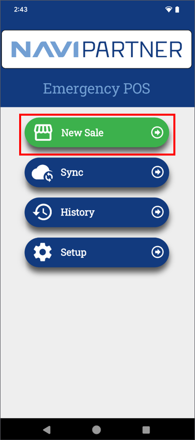
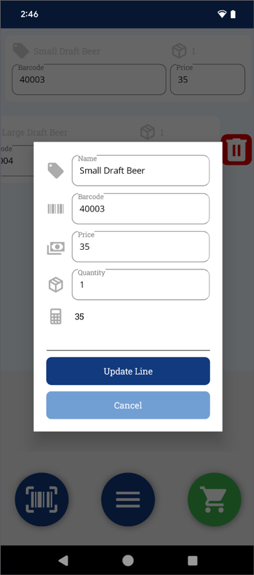
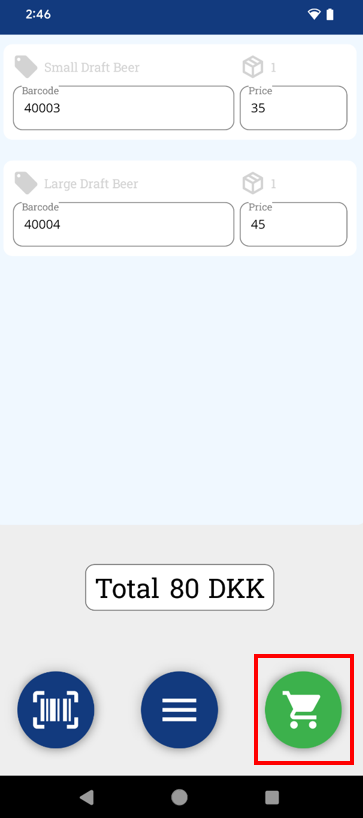
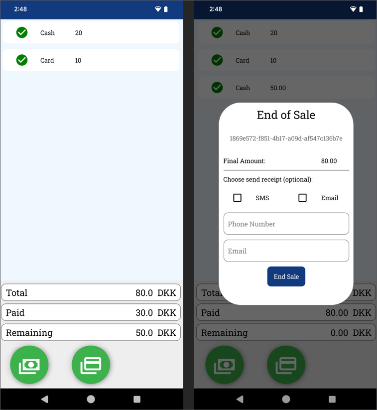
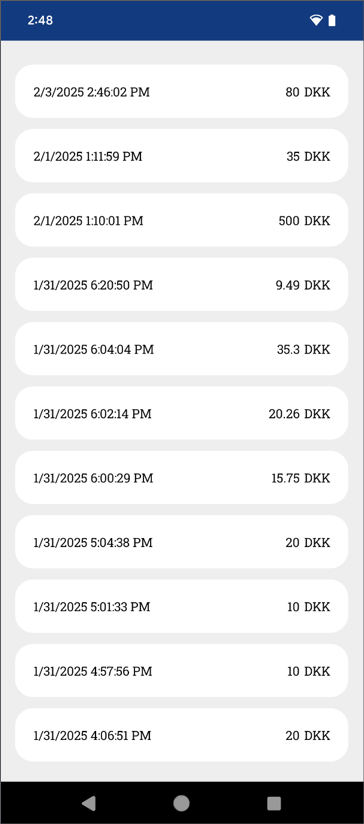
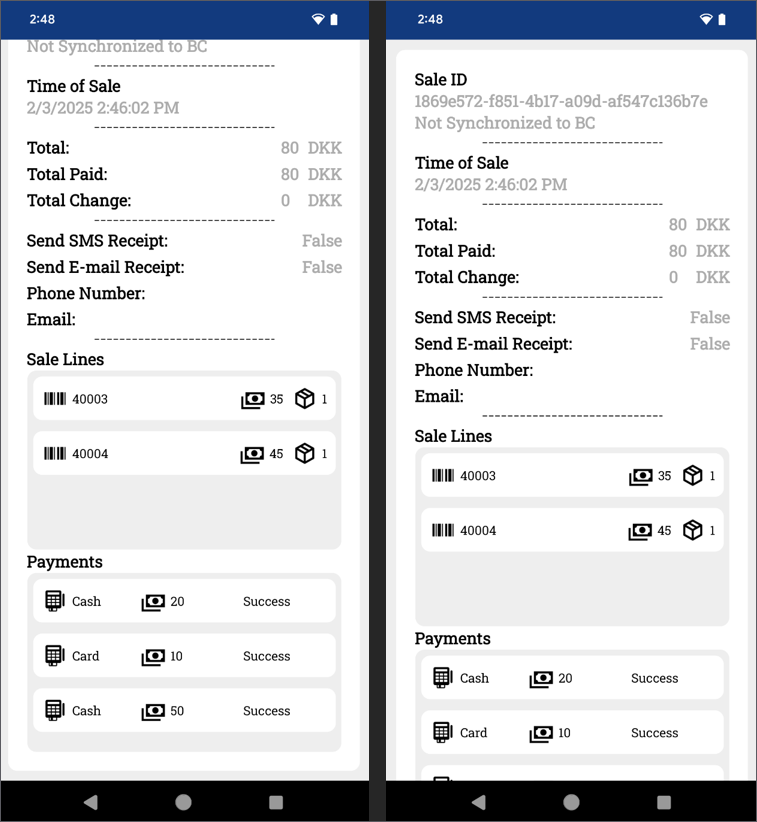

Use the NP Retail Emergency mPOS to process a transaction by adding items, selecting a payment method, and completing the sale. If the internet is unavailable, sales will sync automatically once connectivity is restored.

## Prerequisite

- Make sure your device of choice is properly [<ins>set up<ins>]().      
  For more information on devices, refer to the [<ins>feature overview<ins>]().

## Procedure

1. Open the **NP Retail Emergency mPOS** app on your device.      
   The home screen is displayed.

    

2. Tap **New Sale**

   

3. Scan or add items manually.
4. (Optional) If needed, edit or remove lines with the buttons that appear from swiping the item to the right and left respectively.

     

5. Tap the **Cart** icon to proceed to payment.

     

6. Choose a payment method and complete the transaction.       
   If the sufficient amount has been paid, the user is prompted with the End of Sale pop-up window.

    
   
7. Provide the customer's phone number and email, and tick the checkbox next to the preferred receipt format (SMS or Email).    
   The customer will get the receipt as soon as the sale is synchronized to Business Central.
   
8. Tap **End Sale**.     
   The sale is finished and are redirected back to the home screen.

## Checking sale history

- Access **History** to view past transactions.

    

- Tap a sale to see details.

    

## Managing payments

## Troubleshooting and support