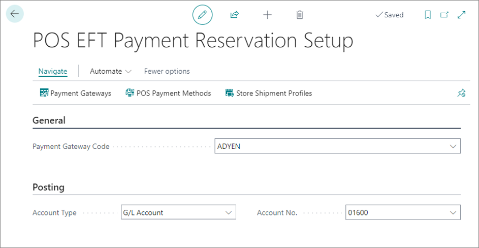
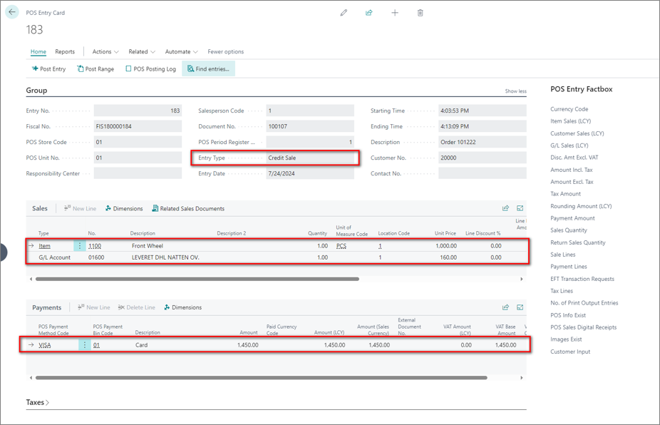

The endless isle gives stores the option to grant customers the ability to access and purchase items that aren't physically in stock. In other words, even if a product isn't available or typically carried by the store, customers can still order it from the retailer's extended inventory. 

The NP Pay endless aisle feature converts a POS sale, which can include out-of-stock items in a sales order. During this process, the shopper needs to make a payment reservation with their credit/debit card. They can choose from several shipment fees that are predefined at the store level, and have the option to update their shopping information if needed. The payment isn't captured until the sales order has been posted. 

To set up the endless aisle functionality, follow the provided steps:

1. Click the  button, enter **POS EFT Payment Reservation Setup**, and choose the related link.           
2. Populate the following fields:    
   - **Payment Gateway Code** - specify which payment service provider will be used to process the payment reservation in the exported sale order; it's necessary to choose a payment gateway that supports capturing, canceling, and refunding. Only [<ins>Adyen gateways<ins>]() are supported.
   - **Account Type** - define the type of account to which the payment reservation will be posed.
   - **Account No.** - specify the account number to which the payment reservation will be posted. 

   

3. Navigate to the **POS Payment Methods**.      
   An EFT [<ins>POS payment method<ins>]() that supports manual capture is required for the payment reservation. The setup allows you to make a payment reservation with your debit or credit card, authorizing the payment without capturing it immediately.
4. Open the **POS Payment Method Card** that you wish to set up, and select **EFT** as the **Processing Type**.
5. [<ins>Link the POS payment method to a POS bank terminal<ins>]().       
   Only NP Pay POS terminals are supported.
6. Navigate to the **EFT Adyen Payment Type Setup** by clicking **Payment Type Parameters** for the created payment type, and enable the **Manual Capture** toggle switch.     
   This option ensures that the payment reservation isn't automatically captured.
7. Navigate to the **Store Shipment Profile Card** to set up different shipment methods and fees related to the store's shipping profile.       
   The shipping profile can be assigned to the store in the **POS Shipment Profile** field of the [<ins>**POS Store Card**<ins>]().    
8. Populate the following fields in the **General** section:      
   - **Code** - specify the code of the store's shipment profile.
   - **Description** - add a brief description of the shipment profile.
9.  Populate the following fields in the **Shipment Fees** section:       
       - **Description** - add a brief description of the shipment option that will be displayed on the POS and in the sales order.
       - **Shipment Method Code** - specify the code for the shipment method to be used in the sales order. 
       - **Shipping Agent Code** - specify the code for shipping agent to be used in the sales order. 
       - **Shipping Agent Service Code** - specify the code for the shipping agent service to be used in the sales order.
       - **Shipment Fee Type** - specify how the shipment fee is represented on the POS and in the sales order (G/L account or an item).
10. Move on to configuring the **SALES_DOC_EXP** [<ins>POS action<ins>]().       
    This action is used for exporting the POS sale with a payment reservation. The following parameters need to be populated:
      - **Select Customer** - set to true; this parameter will prompt the user to select a customer for the sales order.
      - **POS Payment Reservation** - set to true; this parameter enables the payment reservation functionality.
      - **POS Payment Method Code** - specify a POS payment method that has previously been declared as EFT and supporting manual capture; this method will be used to make the payment reservation.
      - **Open Document** - set to true; when enabled, the sales order is opened automatically after being created, allowing you to easily update the shipping information, if needed.
      - **Select Shipment Method** - set to true; this parameter enables the shipment method selection; when you select the shipment method, it will be added as a line on the POS sale, and exported to the sales order. 
11. Move on to configuring the **EFT_RESERVE_DOC_PAY** [<ins>POS action<ins>]().       
      - **Open Document** - when set to true, the document will be opened for review before the payment reservation is made.
      - **POS Payment Method Code** - specify a POS payment method that has previously been declared as EFT and supporting manual capture; this method will be used to make the payment reservation. 
      - **Select Customer** - set to true; this parameter will prompt the user to select a customer for the sales order.

## Next steps

#### Reserve a POS sale to a sales order

Once all setups are complete, you can export a POS sale to a sales order with a payment reservation. You can try out the reservation process in the following interactive demo:

<iframe class="vidyard_iframe" title="Hartmann’s uses Dynamics 365 Business Central to artfully improve operations" src="
https://demo.arcade.software/7RUlchVHtuA8okU2LwVe?embed"
width=835 height=470 scrolling="no" frameborder="0" allowtransparency="true" allowfullscreen></iframe>

After the export is complete, a credit sale POS entry is created. It is not going to be posted, but it contains all the necessary information on the completed POS sale. 

   

You can find the related sales order by navigating to **Related** > **Related Sales Documents** from the **POS Entry Card**. 

From the sales order, you can review the payment reservation by navigating to **Related** > **Payments** > **Payment Lines**. The sales order is treated like a webshop order, meaning that when the document is posted, the payment is captured, and the funds are taken from the shopper's account. 

If you decide to delete the document, the payment reservation will be canceled. 