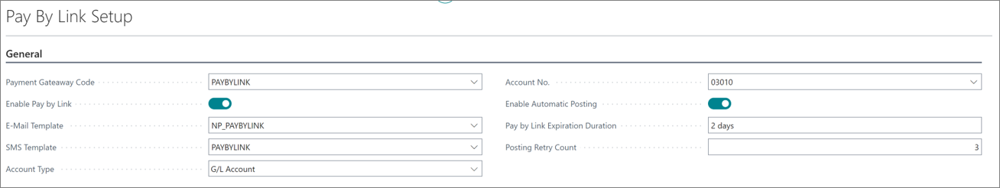

The Pay by Link feature enables businesses to streamline and simplify the payment process by allowing customers to make secure online payments through a direct link. 

1. Click the  button, enter **Pay by Link Setup**, and choose the related link.           
2. Use the following fields and options to complete the setup. If necessary, refer to the screenshot below for more information.

   
   
| Field Name      | Description |
| ----------- | ----------- |
| **Payment Gateway Code** | Specifies which payment service provider will be used to process transactions through the link. You need to choose a payment gateway that has capturing, cancelling, and refunding functions enabled. | 
| **Enable Pay by Link** | Use this field to enable or disable the Pay by Link feature, which integrates with payment processing. When enabled, a webhook is created to receive information from payment, allowing the system to process payments automatically. | 
| **E-mail Template** | Specifies the email template that will be sent for Pay by Link via email. | 
| **SMS Template** | Specifies the SMS template that will be sent for the Pay by Link via SMS. | 
| **Enable Automatic Posting** | Enable or disable the automatic posting of payment lines via job queue for posting sales invoices. | 
| **Account Type** | Defines the type of account to which the transaction will be posted. |
| **Account No.** | Specifies the number of the account to which the transaction will be posted. |
| **Pay by Link Expiration Duration** | Defines the expiration duration for Pay by Link payment requests. This determines for how long the payment link will remain valid after it's been generated and sent to the recipient. If the expiration duration is not explicitly set, a default expiration period of 1 day is automatically applied. | 
| **Posting Retry Count** | Specifies the number of attempts that will be made to perform the job postng process if it initially fails. | 

3. Optional If you want to send Pay by Link via SMS or email, you need to do additional setup in either [<ins>Email Setup<ins>]() or the [<ins>SMS Setup<ins>]().
4. Issue Pay by Link from documents (sales order, sales invoice, posted sales invoice) by opening the **Actions** dropdown in the ribbon, and selecting **Pay by Link**.    
   The **Pay by Link** window is displayed. 
5. Populate the available fields and verify the automatically input information:

| Field Name      | Description |
| ----------- | ----------- |
| **Amount** | Specifies the total payment amount for Pay by Link. It is automatically populated with the total amount including VAT from teh related document, and it can be changed to the lower amount for partial payments. | 
| **Send to E-mail** | Specifies the email address to which the Pay by Link will be sent. This field is automatically populated with the email address of the customer associated with the document, but it can be edited if needed. | 
| **Send to Mobile Phone No.** | Specifies the phone number to which Pay by Link will be sent. This field is automatically populated with the email address of the customer associated with the document, but it can be edited if needed. | 
| **Send SMS** | Indicates whether an SMS notification is going to be sent to customers. This field is automatically enabled if the **Bill-to Customer** was populated with a mobile phone number. | 
| **Send E-mail** | Indicates whether an email notification is going to be sent to customers. This field is automatically enabled if the **Bill-to Customer** was populated with an email address. | 
| **Expiration Link Duration** | Specifies the duration for the Pay by Link payment requests. This field is automaticallz populated with the value from **Pay by Link Setup**. | 

   

6. After creating Pay by link, you can see the details by opening the **Related** dropdown, and navigating to **Pay by Link** > **Payment Lines**. 

   

   The following fields and options are used to define payment lines:

   | Field Name      | Description |
   | ----------- | ----------- |
   | **Requested Amount** | Specifies the amount that is requested to be paid via Pay by Link. | 
   | **Payment ID** | Specifies the unique identifier associated with each Pay by Link transaction. |
   | **Expires At** | Specifies the deadline by which the customer needs to complete the payment. When the specified date and time expires, Pay by Link becomes invalid. |
   | **Pay by Link URL** | Contains the unique URL generated for the customer to make a payment via Pay by Link. This URL directs the customer to a secure payment page. |

After authorization is completed, the **Payment Lines** are automatically populated with **Transaction ID**, **Authorized Amount**, and **Authorization Date**. Subsequently, the payment amount can either be captured automatically upon posting or triggered manually. 

   | Field Name      | Description |
   | ----------- | ----------- |
   | **Transaction ID** | Specifies the unique identifier for each payment transaction processed through Pay by Link. |
   | **Amount** | Specifies the amount that is paid via Pay by Link. | 
   | **Date Authorized** | Specifies the date when the payment has been authorized. |

   