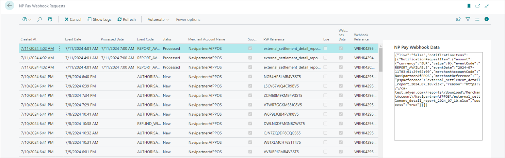

There are two scenarios when it comes to performing NP Pay reconciliation - automatic and manual. Both are explained in more detail in further text.

## Automatic reconciliation

In this scenario, the entire processing is handled automatically. User interaction is required only if the matching or posting processes fail, or if user confirmation is needed to proceed with specific transaction types.

The automatic flow involves the creation of an NP Pay Webhook Request, upon which the job queue generates a reconciliation document, attempts to match it, and proceeds to post it. 

The process is conducted as follows:

1. When a new report is ready, NP Pay triggers a webhook request creating a new record on the **NP Pay Webhook Requests** page.

   

2. A job queue creates a new entry on the **NP Pay Reconciliation Reports** page.
3. A job queue creates a new reconciliation document.
4. A job queue tries to match all transactions within a reconciliation document. 
5. A job queue tries to post all transactions within a reconciliation document.

User intervention may be required in the following cases:

- **Logs and event handling** - you may need to check logs for events such as report retrieval, schema validation, document creation, entry matching and posting.
- **Handling failed matches** - it may be required to manually finish the matching process if lines fail to match automatically (this may also involve finalizing a parked or incomplete sales).
- **Handling chargebacks** - you may need to manually confirm awareness of chargeback-type transactions prior to posting.
- **Final option for unmatched entries** - you may need to post unmatched entries without matching with user confirmation. 
- **Manual posting** - it may be necessary to finish processing entries if automatic posting isn't enabled. For this purpose, you can use the **Set as Reconciled** action in **NP Pay Setup**. 

## Manual reconciliation

In certain scenarios, you may choose to manually create a reconciliation document for testing purposes, or in order to reconcile older transactions predating the specified **Reconciliation Integration Starting Date** in the **General Setup**. This flexibility allows for comprehensive financial oversight and adjustment, as needed. 

1. Click the  button, enter **NP Pay Reconciliation Reports**, and choose the related link.           
   The **NP Pay Setup** administrative section is displayed.
2. Use the **Create Reconciliation Document** action group, which includes the following options:
   - **From Request** - create from existing report entry
   - **From File** - import a local file
   - **Import Report by Name** - import by specifying the exact report name

3. Open the created **Reconciliation Document** and manually perform matching or posting.    
   The **Recreate Document** action regenerates every unposted transaction within the document; transactions that have already been posted will not be affected. 

4. If you haven't done so already, you need to ensure the **Match Entries** have been completed prior to posting. If the transactions have already been matched, post them by selecting **Post Entries**.        
   If posting is disabled, the **Reconciled** status is assigned at the end of the reconciliation workflow. This status ensures the matched transactions aren't processed in other reconciliation documents. 

   

## Interactive demo

Try out the reconciliation feature yourself with our interactive demo:

<iframe class="vidyard_iframe" title="Hartmann’s uses Dynamics 365 Business Central to artfully improve operations" src="
https://demo.arcade.software/iUq6gBdvnTJBtkarTeUQ?embed"
width=835 height=470 scrolling="no" frameborder="0" allowtransparency="true" allowfullscreen></iframe>
