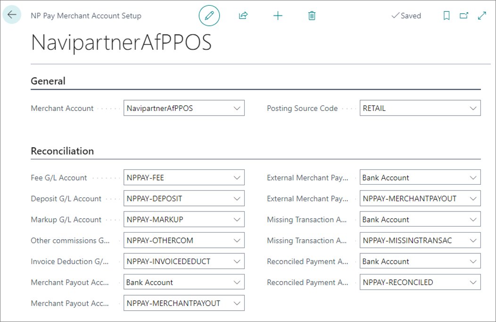

Certain configurations need to be completed in Business Central to make the NP Pay Reconciliation available. In addition to the general setup, you also need to configure webhooks, the general ledger or bank accounts for journal types. 

To set up NP Pay Reconciliation Automation in the SaaS environment, make sure the prerequisites are met, and follow the provided steps:

#### Prerequisites

- Retrieve the NP Pay Web Service User credential from NaviPartner.
- Retrieve the NP Pay Report Service User credentials from NaviPartner.

#### Procedure

1. Click the  button, enter **NP Pay Setup**, and choose the related link.           
   The **NP Pay Setup** administrative section is displayed.
2. Activate the **Enable NP Pay Automation** if you wish to enable specific integrations like Pay by Link without adding the reconciliation functionality or importing external webhooks. 
3. Set the **Environment Type** in the **Management** section to either **Test Environment** or **Live/Production Environment** depending on the type of your NP Pay account. 
4. Provide the **Management API Key** received from NaviPartner as the Web Service User Credential.     
   The key is tested automatically as soon as you input it. A warning is displayed if the key is expired or removed. 
5. Move on to the **Reconciliation** section, and activate the **Enable Reconciliation** toggle switch for handling reconciliation tasks.      
   It creates a job queue for processing reconciliation webhooks if the Reconciliation Webhook setup is missing.
6. Input the **Download Report API Key** received from NaviPartner as the Report Service User Credential.
7. Specify the number series for creating reconciliation documents in the **Reconciliation Document Nos** field, and specify the number series for posting during the reconciliation process in the **Posting Document Nos**.
8. Specify whether you want the reconciliation lines to be automatically posted after the matching is successfully completed in the background.     
9.  Specify whether you want the chargeback-related transactions to be automatically posted or triggered manually. 
10. Specify whether you want to post the entries with the **Posting date** being the same as the **Date of Transaction**.
11. Set the **Reconciliation Integration Starting Date** from which the integration will become effective.

   
   
12. Click **Actions** in the ribbon, followed by **Configurations** in the dropdown list, and then click **Upgrade Payment Lines** to mark all payments before the specified date as reconciled. 
13. **Enable NP Pay Automation** in the **General** section to create a web service and job queue for processing reconciliation-related webhooks.
14. Give consent for the NP Pay webhook application to access the automation, web service API, and sign by clicking **Create Setup (Admin)** under **Actions/Configurations**.

   

## Next steps

### Configure webhooks

1. Navigate to the **NP Pay Webhook Setup List** page to configure notifications for new reports. 
2. Click **Import Webhooks from NP Pay** to retrieve and create an **NP Pay Webhook Setup Card** for each webhook. 
3. Create a **New** webhook, and populate the following fields:
    - **Webhook Type** - select the type based on the required events, e.g. **REPORT_AVAILABLE**
    - **Describe Webhook** - provide a description to ensure easier identification
    - **Web Service URL** - use the **Suggest Web Service URL** option to fill in the link automatically
    - **Active** - specify whether the webhook is enabled or not
    - **Merchant Account** - select the merchant account that will trigger the webhook

4. Send webhook configuration to NP Pay by clicking **Set up a Webhook**.     
    A confirmation message is displayed.

### Set up merchant account

1. Navigate back to the **NP Pay Setup** administrative section, and click **Open Merchant Account Setup** under **Actions/Additional Setup**.
2. Select the **Merchant Account**, and assign the **Posting Source Code**.
3. Create/assign general ledger accounts for all journal types.

   

### Perform reconciliation

Once you're done setting up NP Pay reconciliation, you can perform it by following the steps provided in [<ins>this guide<ins>]().

