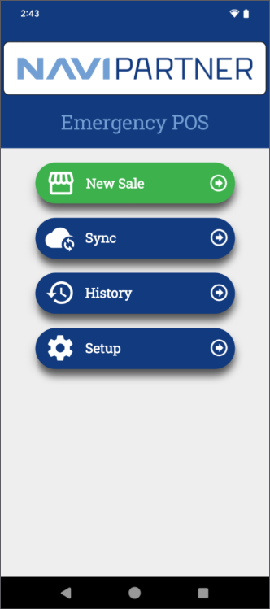
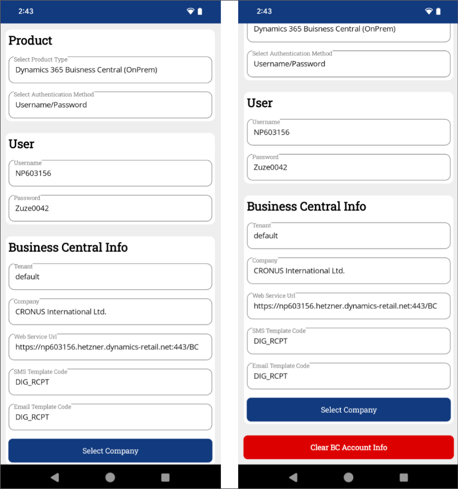
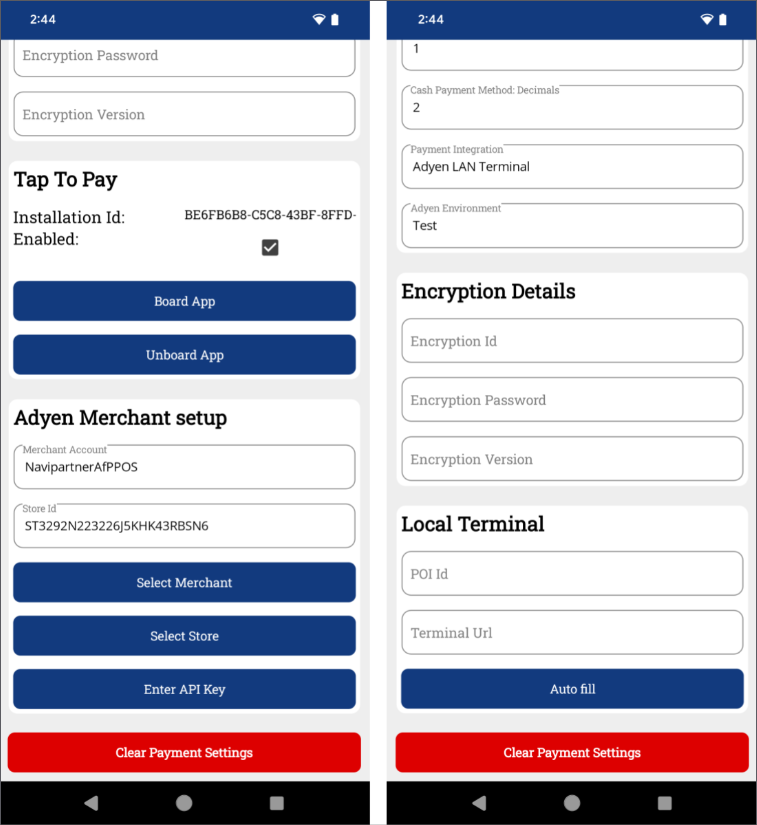
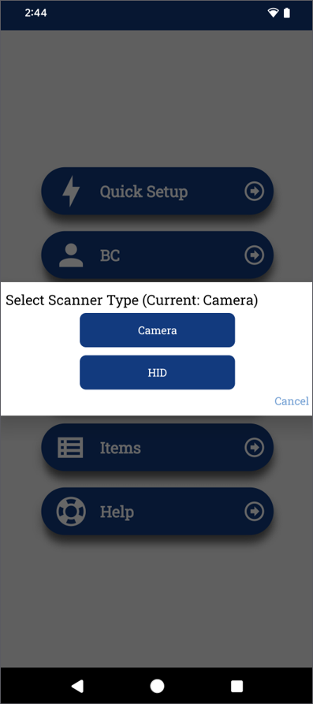
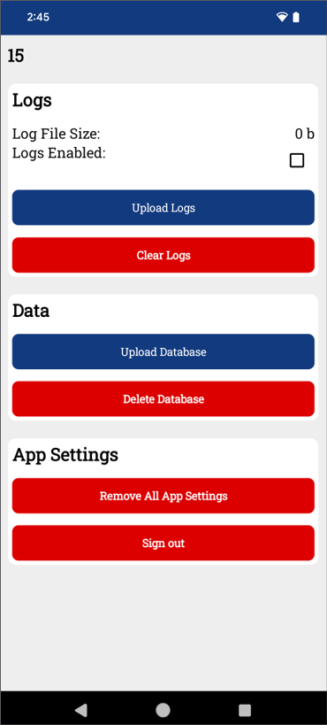
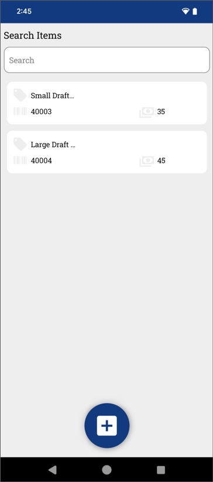
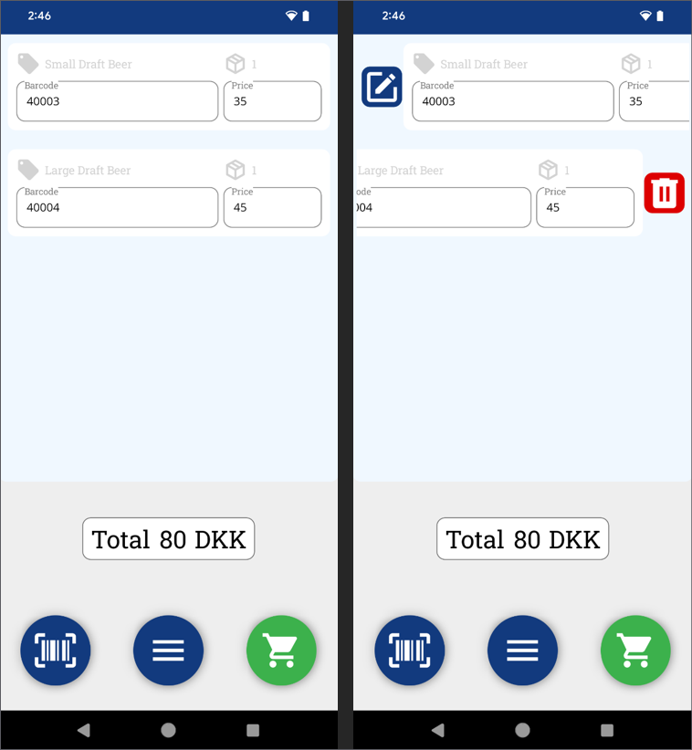
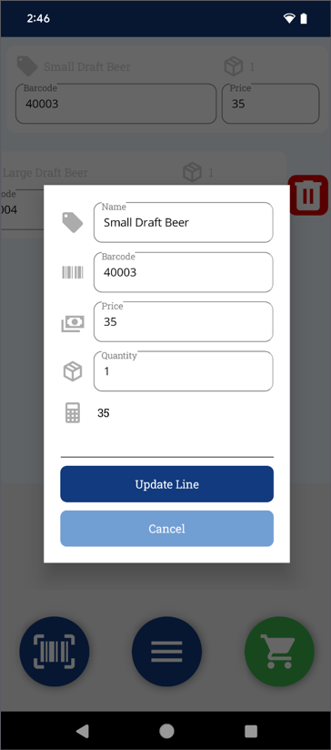
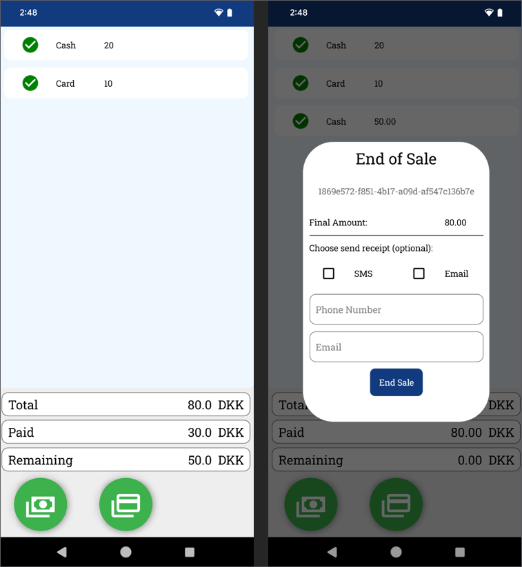
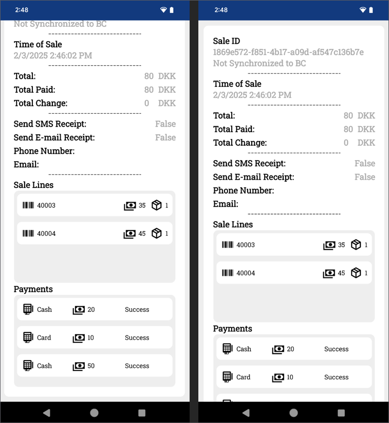

This article contains details on all setup pages in the NP Retail Emergency mPOS app.

## NP Retail Emergency mPOS home page

As soon as you open the app, you are presented with the following options:

| Action Name      | Description |
| ----------- | ----------- |
| **New Sale** | Begin a new sale or resume an existing sale on the POS. | 
| **Sync** | Synchronize unsynchronized sales. |
| **History** | Open a list of completed sales. |
| **Setup** | Open the setup menu. | 

  

## Setup page

The **Setup** page is opened by tapping **Setup** on the home screen. It contains the following options:

  | Action Name      | Description |
  | ----------- | ----------- |
  | **Quick Setup** | Perform basic setup. |
  | **BC** | Configure Business Central options. | 
  | **Payment** | Configure payment. | 
  | **Scanner** | Choose between **Camera** and **HID** (Hardware Input Device/keyboard simulator) for scanning. | 
  | **Items** | Manage products and pricing. |
  | **Help** | Access troubleshooting guides. |        

## BC setup

The Business Central setup page is used for connecting to Business Central and synchronizing sales. Most of the available fields it contains are used for targeting specific Business Central environments. The SMS and Email Template codes refer to special setups that are used when sending out receipts. 

   

## Payment setup

The payment setup page specifies all configurations related to sales and payments. 

  | Action Name      | Description |
  | ----------- | ----------- |
  | **Sale POS ID** | References the POS unit. Each POS unit should be linked to only one device. This setup allows the emergency POS to share the same cash drawer as the regular POS. | 
  | **EFT Payment Method** fields | All EFT payment method fields are related to the POS payment method. When sales sync with NP Pay, card details are automatically mapped. |
  | **Cash Payment Method** fields | 	Specify configuration details for handling cash transactions. |
  | **EFT Payment Method: Monetary Unit/Cash Payment Method: Monetary Unit** | Defines the smallest accepted payment unit. For example, a value of 0.50 means valid payments are 1.00, 1.50, 2.00, but not 1.33 or 1.25. | 
  | **Payment Integration** | Configures payment processing options: <ul><li>Adyen Tap to Pay – Uses the Adyen Payments app for Android devices.</li><li>LAN Terminal – Uses the NP Pay device’s built-in payment functionality.</li></ul> | 
  | **Encryption Details** | Stores security credentials (ID, password, and version) at either the terminal or store level. When using the [<ins>Tap to pay<ins>]() feature, configuration must be done at the store level, as the **Terminal List** does not include these details.| 
  | **Tap to Pay** | After configuring Encryption Details and Adyen Merchant Setup, you can establish a connection with the Adyen Payments app (a process called Boarding). If the app is uninstalled or unregistered, the Boarding process must be repeated.| 
  | **Local Terminal** | The **POI ID** uniquely identifies an NP Pay device using the format: [Device Model]-[Serial Number]. This applies only to NP Pay devices and is usually auto-filled. | 

   

## Scanner setup

For scanning, you can either use the camera together with the **Binary Eye** app for barcode scanning, or the HID (Hardware Input Device), which is keyboard simulated events. The latter is typically used with devices that have built-in laser scanner functionality. 

   

## Help page

The **Help** page is used for troubleshooting the app. It contains **Logs** and **Data** sections.

   

### Logs

Error and crash events are automatically collected, but enabling the **Logs** feature extends the info written to a local file. The upload logs can upload the log file to a NaviPartner online storage, so a developer can identify issues with the app. 

### Data

The database is another type of local storage that keeps track of all sale and item data. In case of data corruption, the database can be uploaded and inspected to identify issues within the sale data. 

   

## Item page

The **Item** page contains a list of all created items. The items can contain the following information:

- Name
- Barcode
- Price

If a user scans a barcode and the barcode is registered in the app, the app will automatically fill the information when inserting the sale line. 

  

### POS page

The **POS** page contains the list of items in sale lines. The sale lines can be created in one of the following ways:

- Scanning a barcode
- Creating a new empty line
- Creating a new item
- Adding an existing item

  

You can also take the following actions:

- Cancel the entire sale if no payments have been made. 
- Proceed to the **Payments** page, by pressing the green cart button.
- Edit or remove lines with the buttons that appear from swiping the item to the right and left respectively.

  

  

### Payment page

On the **Payment** page, you can create new payments either with cash or electronic payments that use the NP Pay setup. It also contains the overview of the sale total, the amount paid and the remaining amount. 

If the sufficient amount has been paid, the user is prompted with the **End of Sale** pop-up window, where the phone number and email can be collected, as well as information on whether the customer wishes to receive an electronic receipt when the sale is synchronized to Business Central. After you click **End Sale**, the sale is finished and you will be redirected back to the home screen. 

  

### History page

The **History** page contains all sales made with the app in reverse chronological order. If you press on a sale, you will be presented with its details. 

  

  