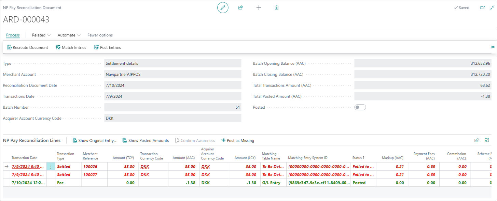
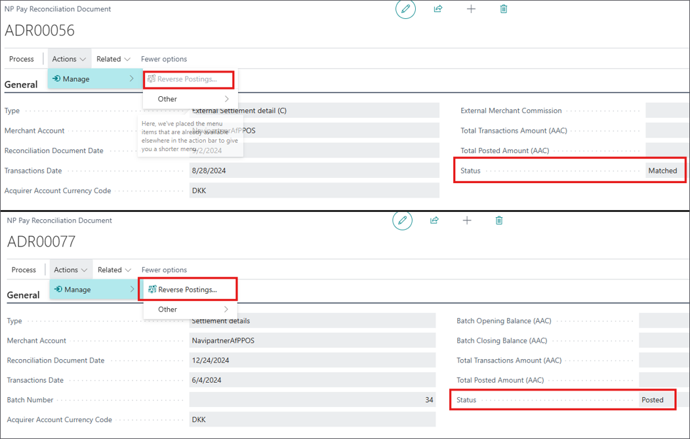
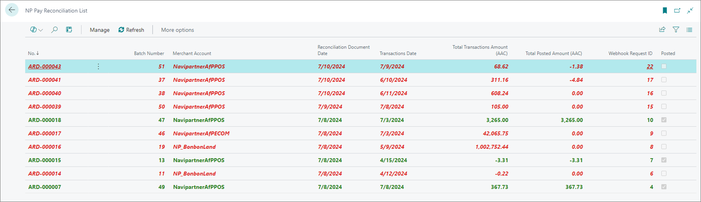
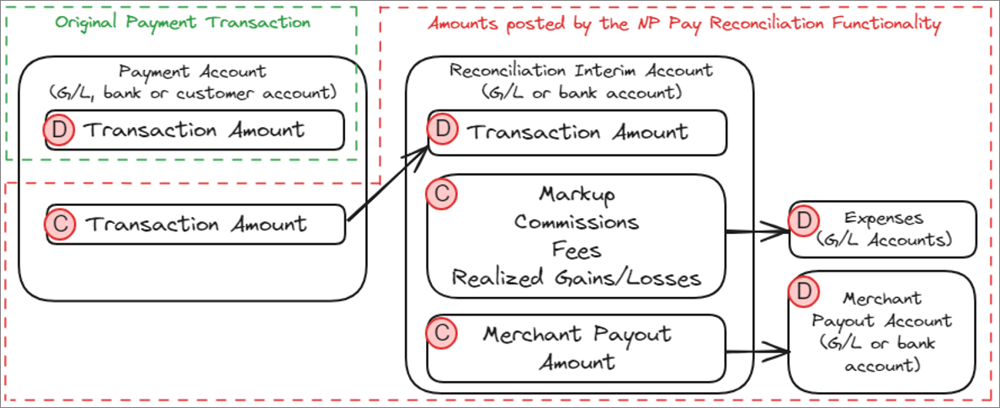

This article describes the available fields and options found in the **Reconciliation Document Details** administrative section:

   

From the **Reconciliation Document Details**, you can recreate the document, match the available entries, and post them. If necessary it is also possible to **Reverse Postings** via a designated action. The action completely reverses all postings related to the selected reconciliation document. 

To access the full list of documents, you can navigate to the **NP Pay Reconciliation List**. This section contains information such as batch numbers, merchant account details, document dates, transaction dates, total transaction amounts, and the total posted accounts. 

The **NP Pay Reconciliation Line Relation** page tracks all previous posting records. If a document is posted and reversed multiple times, the page will maintain records for each posting cycle. There's a **Reversed** field, that indicates whether the last posting was reversed or not.

Reversing a posting toggles the **Reconciled** field of related **Transaction Entries** and resets their **Reconciliation Date** value. It is only enabled if the document is fully **Posted**.

   

The lines marked in red signify failed statuses, whereas the lines marked in green indicate that posting has been conducted successfully. If the lines aren't marked with any color, they are in the intermediate status. 

   

The following actions are available in the **NP Pay Reconciliation Lines**: 

| Action Name      | Description |
| ----------- | ----------- |
| **Show Original Entry** | Opens the original payment that the current reconciliation line was matched with. | 
| **Show Posted Amounts** | Displays the amounts that were posted from the current line classified by the amount type. | 
| **Confirm Awareness** | Used for manually confirming that you are aware of a chargeback-type line, so you can proceed with its posting. | 
| **Post as Missing** | Used for skipping the matching process, and posting the current reconciliation line if it's missing and was **Failed to Match**. | 

   

The reconciliation posting scheme is visually represented in the following image:

   