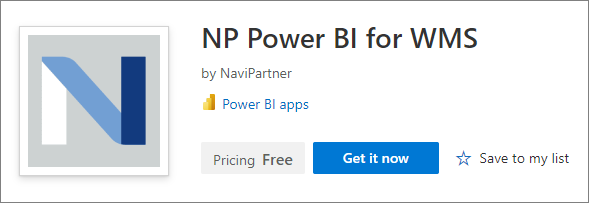
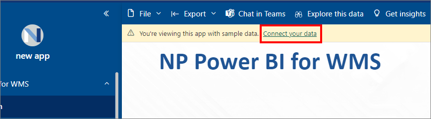

The Power BI NP-WMS Report is an innovative solution seamlessly integrated with NaviPartner Business Central WMS, designed to revolutionize how businesses perceive and manage their warehouse operations. With the transformative capabilities of Power BI, this comprehensive report delivers an unparalleled depth of insight into every facet of your warehouse dynamics.

To install the application, make sure the prerequisite is met, and follow the provided steps:

## Prerequisite

- Prior to initiating the installation process, it is imperative to ensure that you have an active Power BI account associated with the same business email address used for logging into Business Central. This alignment of email addresses will facilitate a seamless integration and ensure a smooth installation experience. 

## Procedure

1. Log into your Power BI account. 
2. Go to the [<ins>Microsoft AppSource<ins>](https://appsource.microsoft.com/en-us/product/power-bi/navipartner.np_pbi_wms) and find our product **NP Power BI for WMS**. Click **Get it now** to run the installation wizard.    

   

3. Once the installation wizard is displayed, click **Install**.     
                 
    When the application is installed, it will be added to your list in the **Apps** section.      
   
4. If you've already installed the application, you can update it to the new version by selecting the first option in the update app pop-up window, or install a new copy by selecting the third option. After selecting the third option, you need to add a new name of the installation app, and confirm it.    
   
5. Once the app is installed, click on the application name to initiate its activation.     
   You can explore the content carefully curated with test data.

   

6. To connect to your data from Business Central, click **Connect your data** in the alert ribbon in the **NP Power BI for WMS** app.     

   

7. In the **Connect to NP Power BI for WMS** pop-up, refer to the relevant URL (e.g. *https://businesscentral.dynamics.com/3850537a-9e72-423a-9ff9-asdasd345322/EnviromentName-Prod?company=Test%20Company%20Aps&node=0000233e*), and provide the data for the following required parameters:
   
   - **Environment** - provide the environment name from the URL using capital letters (e.g. ENVIRONMENTNAME-PROD)
   - **Company** - provide the company name from the URL without extra characters (e.g Company Aps)

   

8. (Optional) Populate the following optional parameters:

   - **From Date**: 01/01/2020
   - **To Date**: 31/12/2024
   - **Fiscal Year Month**: 1

   

9.  Click **Next**.
10. Choose the **OAuth2** authentication method, and the **Organizational** privacy level settings.
11. Click **Sign in and connect** to synchronize your Power BI app with the data from Business Central.     
    This step may take some time, and after it's completed you will be able to see your personalized data within the report.    
    The data will be automatically refreshed once per day by default, but this can be changed in the dataset settings, based on your preferences. 