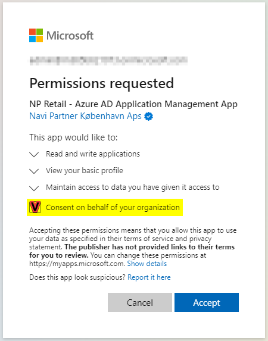
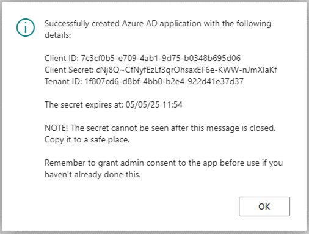

Azure Active Directory (AAD) application[^1] is needed to ensure HeyLoyalty can update data in Business Central (BC).
To create one along with the set of credentials, follow the steps provided below.
[^1]: To interact with the web services (APIs) of Business Central, the external party (HeyLoyalty) needs to use the OAuth 2 protocol to gain an access token. When working with two services interacting with one another, the client needs to use the client credentials flow. The credentials for the client credentials flow are obtained through an Azure Active Directory application.

#### Prerequisites

-	Make sure the actions are performed by a user that is both an Azure Active Directory administrator and a BC administrator. These steps require you to grant the administrator access to certain parts of your Azure Active Directory. You should therefore be an administrator in your tenant or get your administrator to perform these steps.
-	This procedure can only be used when your BC tenant is registered with Azure Active Directory as the login method. If you are using Microsoft’s SaaS this will already be the case.

#### Procedure

1. In BC click the  button, search for the **HeyLoyalty Integration Setup** page and open it.

Cannot find the page?

HeyLoyalty integration feature is not enabled by default. To enable it, navigate to <b>NaviPartner Feature Management</b> page, and make sure there is a checkmark in field <b>Enabled</b> on the <b>HeyLoyalty Integration</b> line. Do not forget to log into to the system again after enabling the integration.

2. In the page's menu ribbon select **Actions** > **Initial Setup** > **Azure Active Directory OAuth**, and click **Create Azure AD App**.   
   A pop-up window is displayed.       

3. Grant permission to the **NP Retail - Azure AD Application Management App**.       
   This app allows the code to create the Azure Active Directory application for the HeyLoyalty integration.     
4. Make sure that the consent screen identifies the application as being verified with "Navi Partner København ApS" as Microsoft Partner.
5. On the **Permission Requested** page select **Consent on behalf of your organization**.

6. When asked if you want to create a user, click **Yes**.

7. When asked if you want to grand admin consent, click **Yes**.     
    If there is an issue granting consent (e.g. a pop-up didn’t open), you’ll be able to do it later.

    As soon as the Azure Active Directory application is created, the information will be displayed on the screen.

8. Make sure to copy the client secret that is shown in the message box to a safe place.    
   It will not be visible after the box is closed.

9. In BC click the  button, search for "aad" and open the **Azure Active Directory Applications** page.

10. Find the newly created application (it’ll have "HeyLoyalty" in its name), and open the card by clicking **Client ID**.

11. On the **Azure Active Directory Application Card**, click **Grant Consent** to allow the newly created application access to the Business Central API.
