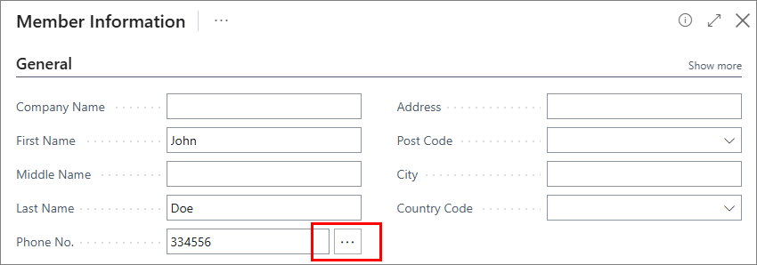
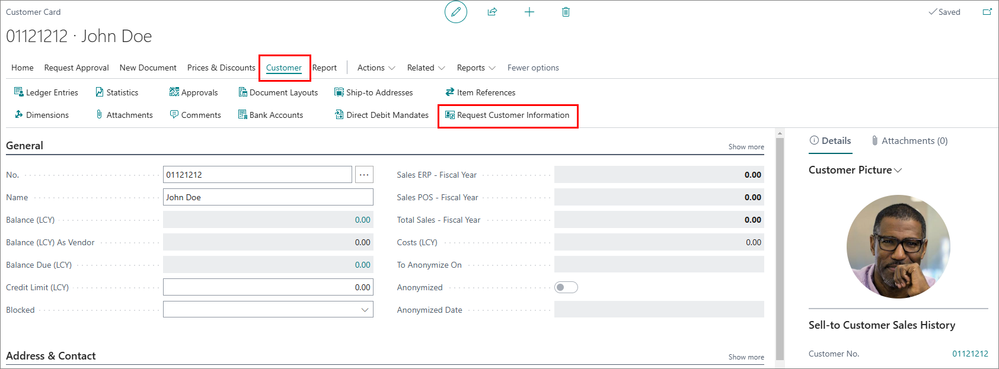
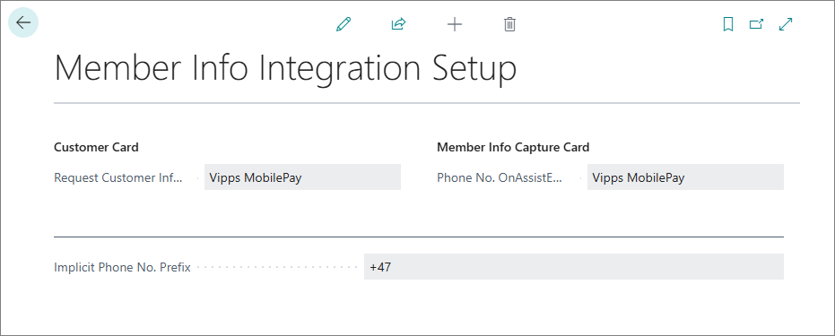

The Member Info Integration feature allows you to use various integrations to request additional information when registering new members, or requesting additional information from your customers.  

This helps in preventing mistakes that could occur during manual information entry, and saves time for both retail staff and customers.

The integration is currently available via the  button next to the **Phone No.** field on the **Member Information** page, displayed on POS when registering new members:  

  

and on the **Customer Card** page as an action:  

  



You can select which integrations you wish to use on the **Member Info Integration Setup** page. You can also set up an **Implicit Phone No. Prefix** to be used during requests so that you don't have to provide it on the POS for each member.

        

## Vipps/MobilePay

Vipps/MobilePay is a mobile wallet app (originally two apps, Vipps, founded in Norway and MobilePay, which originated in Denmark).  
Although the app is primarily used for making payments/transfers through the phone, the Login functionality provides a quick and easy way to request additional information from its users.

#### See also

- [<ins>Use Vipps/MobilePay Login functionality<ins>]()

