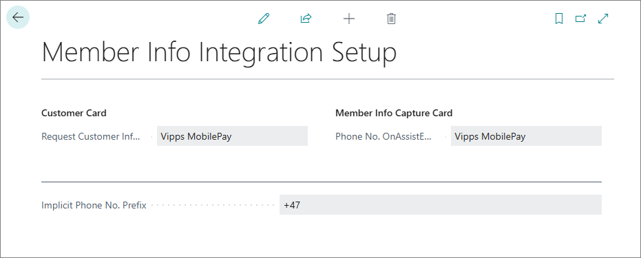
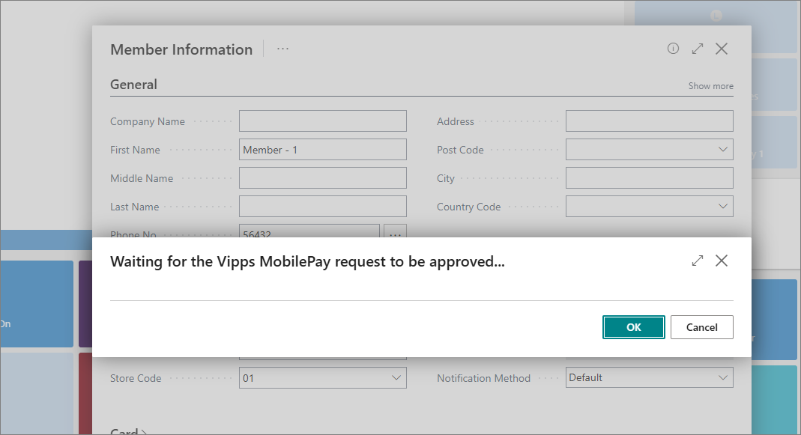
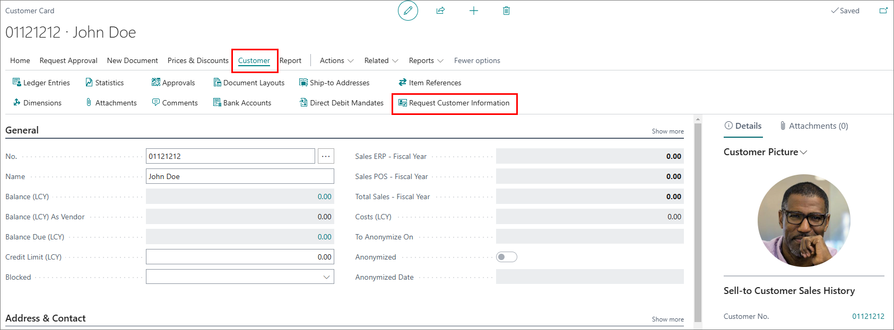

Despite Vipps/MobilePay app being primarily a mobile wallet, it can also used for storing additional information about the user.

To use the Vipps/MobilePay Login functionality, make sure the prerequisites are met, and follow the provided steps:

#### Prerequisites

- Make sure the **Vipps/MobilePay** use cases have been selected in the [<ins>**Member Info Integration Setup**<ins>]() page in Business Central.     

         

   The following options are available:    

   - **Request Customer Info. Action** - specifies which integration is tied to the request for customer information on the **Customer Card** page.
   - **Phone No. OnAssistEdit Integr.** - specifies which integration is tied to the request for customer's phone number when registering a new member on the POS. 

#### Procedure

You can request customer information either from the POS or from the relevant **Customer Card** in Business Central. Both procedures are described in the following text:

### POS

1. Open the POS, and add a membership to the checkout.     
2. Select a membership and register a new member.     
   The **Member Information** pop-up window is displayed.
3. Enter the customer's phone number in the dedicated field on the page and click .      
   A dialog is displayed, informing you that the request needs to be confirmed by a customer to proceed.  

   

   After the customer confirms the request, the dialog page closes and the customer's information is promptly collected and saved.   

   

   Try out the POS portion of the Vipps/MobilePay Login feature with our interactive demo:

   <iframe class="vidyard_iframe" title="Hartmann’s uses Dynamics 365 Business Central to artfully improve operations" src="
   https://demo.arcade.software/oQlm82iH9P5uxYkhGYq3?embed"
   width=835 height=470 scrolling="no" frameborder="0" allowtransparency="true" allowfullscreen></iframe>

### Customer Card

1. Click the  button, enter **Customers**, and choose the related link.         
   The list of available customers is displayed.
2. Select the customer you need to retrieve personal information from.      
   The **Customer Card** is opened.
3. In the ribbon, click **Customer**, followed by **Request Customer Information**.        

       

   A dialog is displayed, informing you that the request needs to be confirmed by a customer to proceed. After the customer confirms the request, the dialog page closes and the customer's information is promptly collected and saved.   

   

#### See also

- [<ins>Vipps/MobilePay merchant portal<ins>](https://portal.vippsmobilepay.com/login)       
  *Refer to this portal for more information on any changes regarding flagging parts of the request as mandatory.*
- [<ins>Member info integration overview<ins>]()