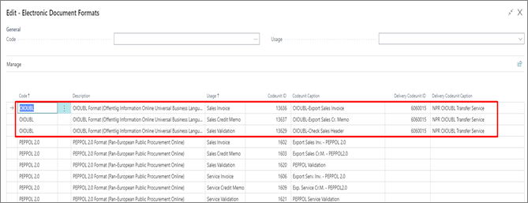
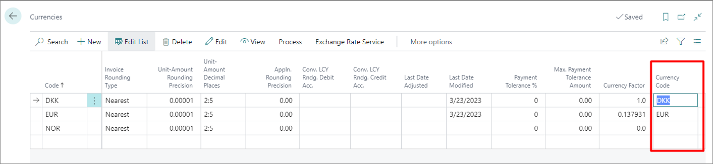
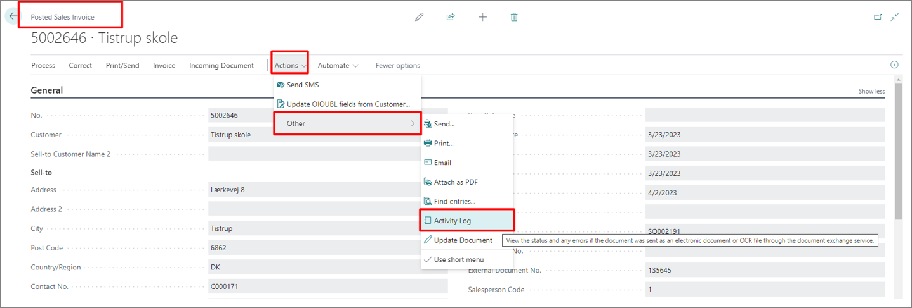
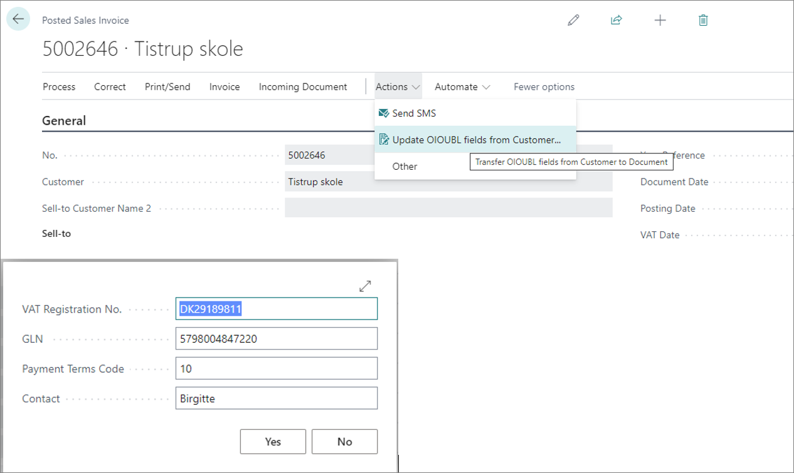

To send sales invoices, credit memos, finance charge memos, and reminders to the Danish public sector electronically, you first need to perform certain configurations in Business Central.

1. Click the  button, enter **Document Sending Profiles**, and select the related link.      
2. Open the **OIOUBL** profile, and select **Through Exchange Service** in the **Electronic Document** field.
3. Navigate to the **NP OIOUBL Setup** administrative section.

  

4. Open the **Actions** dropdown, click **Setup Pages**, followed by **Electronic Document Formats**.
5. Set the necessary codeunit - 6060015.    

  

6. Open the **Customer Card** used for sending the documents with the OIO UBL extension.
7. Populate the following fields: 
   - **Document Sending Profile**
   - **VAT Registration No.** in the following format: \[DK][VAT registration number] e.g. *DK123121562*
   - **GLN**
   - **Profile Code**
8. Enable the **Use GLN in Electronic Documents** toggle switch.
9. Navigate to the **Profile List**, and create a profile with the **BILSIM** code.
10. Navigate to the **Currencies** administrative section, and make sure the currencies you're using have the OIO UBL **Currency Code** filled in.

  

11. If you're sending sales documents, make sure the following fields are populated in them: **External Document**, **VAT Number** and **Contact**.    
    If some of these are missing, an error will occur.
12.  Once everything is set correctly, send the documents with the **Post & Send** action.
13.  Confirm the destination to which the document is about to be sent.    

## Next steps - checking the file validity

If the OIO UBL function is disabled, the invoice will be posted, and the XML will be downloaded in the browser. If you wish to check whether the file is correct, you can import it into an online OIO UBL validator or check the **Activity Log** on a **Posted Sales Invoice**.

The **Activity Log** shows the status of sending the invoice. If some of the data for the invoice was incorrect, there's an option in the **Posted Sales Invoice** section to correct the data on the customer, and update the posted document with the **Update OIOUBL fields from Customer** function.

All data from the **Customer Card** is retrieved as a result, and the fields in the **Posted Sales Invoice** are updated.