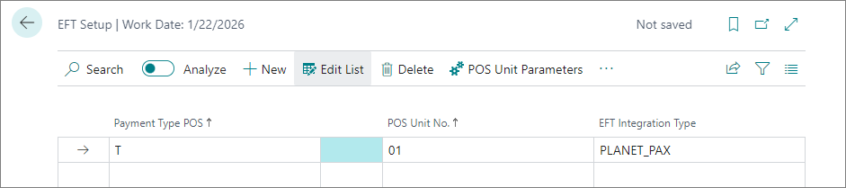

[<ins>Planet<ins>](https://www.weareplanet.com/) provides payment and technology solutions for Retail and Hospitality solutions worldwide. To set up integration with Planet in NP Retail, follow the provided steps: 

1. Click the  button, enter **EFT Setup**, and select the related link.      
2. Add a new line with the **Payment Type POS** set to **T** (Cash), select the desired **POS Unit** to be affected by the integration, and choose **PLANET_PAX** as the **EFT Integration Type**. 

  

3. Open the **Payment Type Parameters**, and make sure the **Log Level** is set to **Error**. 
4. Close the **Planet Pax Integration Configuration** pop-up window.
5. Open the **POS Unit Parameters**.     
   The **Planet PAX Terminal Configurations** page is displayed.
6. Create a new record, and provide the necessary information:  
   - **POS Unit No.** - The unique number used for identifying a POS unit affected by the integration.
   - **Terminal ID** - This ID should be displayed on the terminal device you're setting up. This information is typically provided at the same time the terminal is provided.
   - **Location ID** - This ID should be displayed on the terminal device you're setting up. This information is typically provided at the same time the terminal is provided.
   - **URL Endpoint** - This URL is provided by Planet. It is the Cloud Endpoint the POS sends a request to, which in turn connects to the terminal.