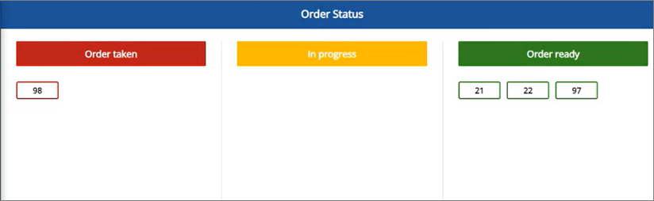

The Kitchen Display System (KDS) provides a convenient interface for changing virtual stations that each restaurant order goes through before its completion. It is accompanied by the Order Status Display System, and its reliable way of tracking the restaurant order statuses intended for customers.

By default, each dish needs to go through at least two stations before it can be collected. These are typically the kitchen station and the packing station in fast food restaurants, while fine-dining restaurants have a more complex system consisting of multiple different stations.

As soon as a customer purchases their order, the request for preparation is automatically created. Then, a member of the kitchen staff can see that the order is displayed on the **Kitchen Order Request** screen on their POS. If any extra add-ons need to be applied, they will be stated here as well.  



Each order will be marked with a specific color. The green color indicates that the order preparation is still within the expected time frame, whereas the yellow color indicates the order is taking a bit longer than expected to be completed. The red color implies that the order is taking too long to be prepared. 



Certain items aren't required to go through the kitchen station during the preparation process, e.g. fries. They are typically set to be handled by the packing station exclusively. There are also combined orders, consisting of both the articles prepared in the kitchen and the articles handled only by the packing station. In such cases, the order shouldn't be moved to the packing station until the main dish is prepared in the kitchen station.

## Order Status Display System

The Order Status Display System is intended for customers to see how long until they can collect their order. As soon as a customer purchases their order, the request for preparation is automatically created. The order is then displayed in the first column of the customer-facing screen - **Order Taken**. As soon as preparation starts, the order is moved to **In Progress**, and so on, until fully prepared and ready.

The transition between the preparation and packing stations is tracked on a screen that only the restaurant staff has access to. Once the dish is prepared and packed, the customer is notified through their screen that they can come to the counter and collect the order. 

<iframe width="560" height="315" src="https://www.youtube.com/embed/FwkgHZAFeAU?si=7fTN_L-GRigdHNlL" title="YouTube video player" frameborder="0" allow="accelerometer; autoplay; clipboard-write; encrypted-media; gyroscope; picture-in-picture; web-share" allowfullscreen></iframe>