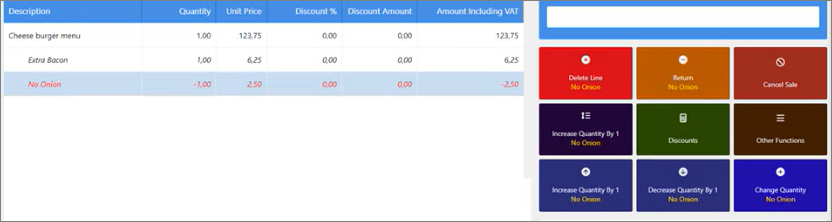
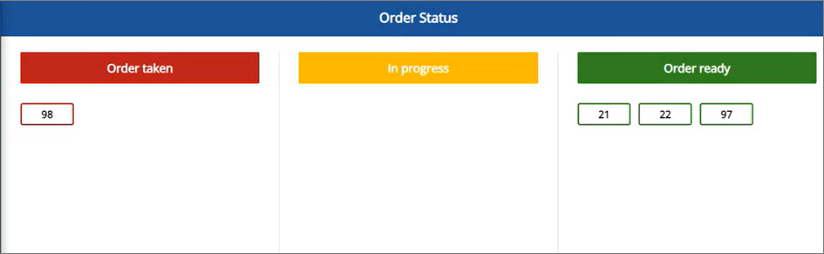
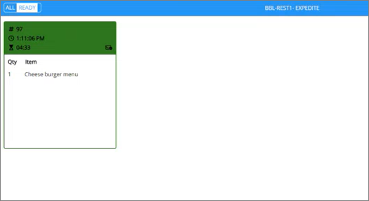

As soon as you've set up the necessary restaurant components in Business Central, you can start taking orders and tracking their status via KDS. Refer to the following example procedure for using KDS in a fast-food restaurant:

#### Prerequisite

- [Set up the KDS]() and the Restaurant in Business Central.

#### Procedure

1. Log into the POS
2. If there are multiple options available, select the fast-food restaurant from the restaurant list.     
   Typically, fast-food restaurants consist of two stations - one for the kitchen, and the other one for packing. But the available options will depend on your setup in Business Central.
3. Place an order by selecting an item such as **Cheeseburger** from the menu.      
   The **Select Options** window is displayed.
4. Select any item addons the customer may wish to add to their order, like extra cheese. Optionally, you can remove one of the ingredients included in the order by default, e.g. remove the onion. 

   

5. Press **Go to payment**.      
   The order is sent to the kitchen automatically, and the **New Waiterpad** window is displayed.

   

6. Provide the customer name and phone number in the pop-up window, then press **OK**.       
   The order is now displayed in the **Order taken** column of the **Order Status Display System** visible to the customers. They can use it to track the status of their order and see when they should approach the counter to collect it. 

   

7. Open one of the KDS kitchen screens.      
   The placed order is displayed on it. It is a freshly placed order, so it's marked in green color. The order color might change depending on the time it takes for it to be prepared and picked up. The expected food preparation time and color change are set up in Business Central.

   
  
8. Double-click the placed order once it's been produced to move it to the next stage - packing.      
   The order is moved from **Order taken** to **In progress** on the Order Status Display screen.
9. Open the KDS packing screen, and double-click the order once it's been packed or placed on a tray.       
   The order is moved from **In progress** to **Ready**, and the customer is notified that they can approach the counter to pick the order up.

#### See also

- [<ins>Kitchen Display System<ins>]()