This is an example procedure for setting up a working fast-food restaurant environment. Certain steps need to be taken when setting up all fast-food restaurants, while other depend on the restaurant's unique features. The setup will be separated into several meaningful components:

## Restaurant Setup

The [<ins>**Restaurant Setup**<ins>]() administrative section is where you can configure the general setup for the restaurant module. It covers basic elements such as the **No. Series**, **Seating Statuses**, **POS Actions** that are used in different processes, as well as options related to the integration with the KDS or printer and print templates for kitchen printers. Populate the necessary fields that dictate how the restaurant will be run, and move on to the following sections.

## Restaurant Card

You can create a new **Restaurant** entity in the **Restaurants** list in Business Central. Once you do, you can set up its **Restaurant Card** according to your business needs. 

You need to configure the general information and behavior of the restaurant. Use the following screenshot and the provided [<ins>Restaurant card reference guide<ins>]() if needed.

  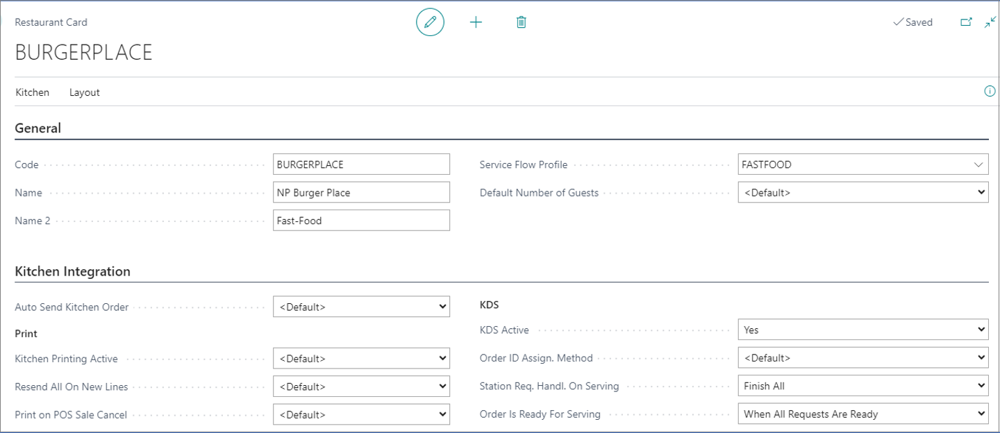

## Rest. Service Flow Profile Card

Set up the [<ins>service flow<ins>]() to determine how the restaurant operations are performed. 

Note that the **NEW_WAITER_PAD** POS action that is used for configuring the autosave function on the waiter pad needs to have the following parameters defined in a fast-food setting:

  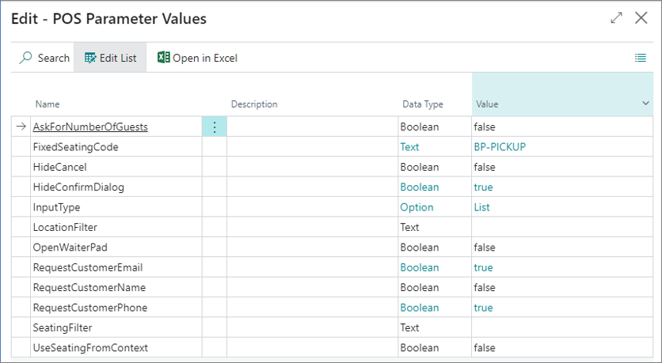

## Restaurant Kitchen Stations

There can be at least two [<ins>kitchen stations<ins>]() per a fast-food restaurant defined in the system. By default, all food is prepared in one stations, while the drinks are added in the packing stage. In certain cases, fryers can be defined as a standalone station.

  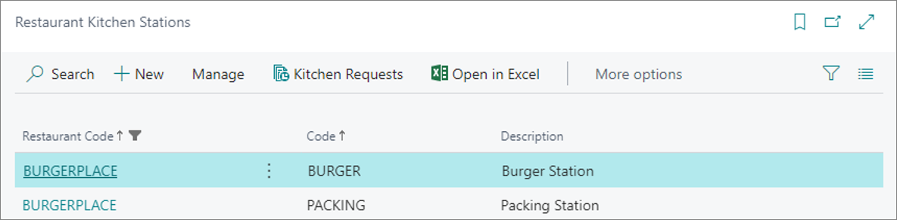

## Seating location

By default, a single seating location is created in the system, without the seats capacity.

  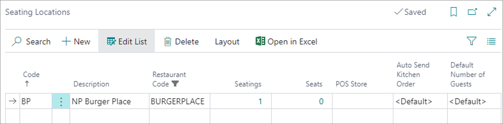

## Seating list

By default, a single seating is created in the system. 

  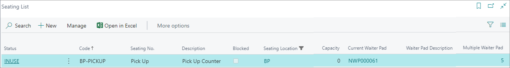

## Kitchen Station Selection Setup

Define the sequence in which a meal is passed from one station to another. Dish components can be prepared in parallel or as a part of a sequence. 

For example, in preparation of a Burger bundle meal, you can prepare the burger and the fries in parallel, but the full order will still be transferred to the packing station when both productions are completed. 

  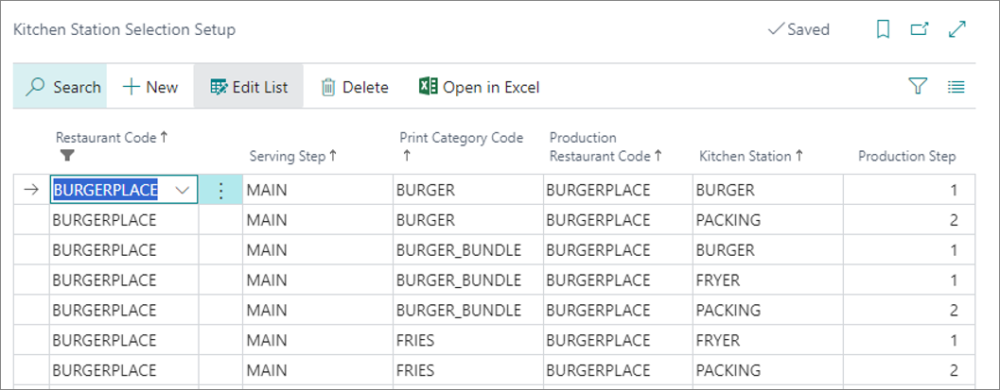

## Flow statuses (to be skipped)

The flow statuses for serving don't apply to fast-food environments. You don't serve meal components separately, unlike in restaurants that employ a flow such as *Entrée > Main Course > Dessert > Cheese*.

## Rest. Item Routing Profile (to be skipped)

The [<ins>**Rest. Item Routing Profile**<ins>]() indicates under which serving step the dishes are going to be served, and which print/production category they refer to. In fast-food restaurants, there's only one serving step and one station. You only need to configure this profile if there are multiple stations in the fast-food environment. 

  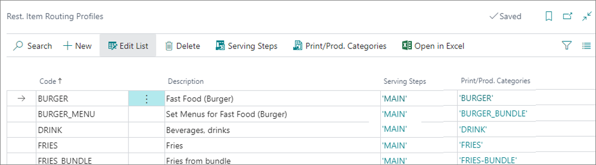

### Serving steps

In a fast-food restaurant setting, the serving steps consist only of **MAIN**, as there's only a single serving step: *Production > Packing*.

  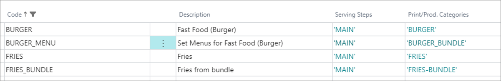

### Print/Prod. Categories

Since you're only using the production station in the fast-food scenario, the **Print/Prod Category** is used to determine which dish type is being produced. It doesn't have much effect on the routing for preparation and kitchen printers output. 

## POS unit setup

In the **POS Unit Card**, you don't use a specific profile for the restaurant, as you don't have a **Restaurant Floor Plan**. The POS layout will resemble any other retail POS, except that you can add POS actions for splitting bills and similar.

  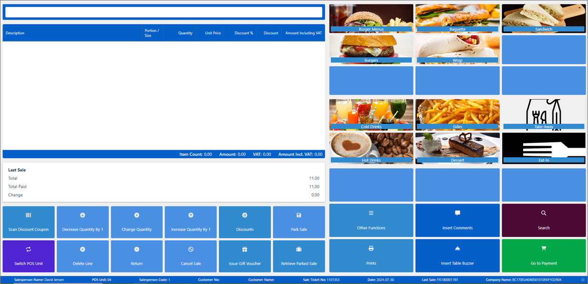

## Restaurant notifications

### SMS functionality

When taking an order, you can notify the customer via SMS that their order is ready. This feature is useful for fast-food restaurants located in malls or parks. Customers can order their food and continue with their other activities instead of waiting in line for the food. Once ready for pick-up, the customer will receive an SMS to come pick up their order. 

You can add the necessary configurations in the [<ins>**SMS Setup**]() administrative section.   

  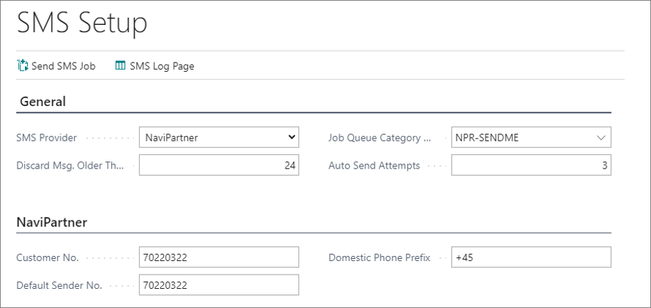

In the backend, a job queue checks if there's an SMS to be sent, and sends it to the recipient automatically. The format of the SMS is defined in the relevant SMS template. 

### Restaurant notification setup

Refer to the [<ins>**Restaurant Notification Setup** reference guide<ins>]() for more information on the available fields and options.

### SMS template for restaurant notifications

You can define the template which will be used when sending restaurant notifications in the form of an SMS. The content of the said template may vary depending on the reason it's sent for, e.g. delayed order, order ready for pickup etc. 

  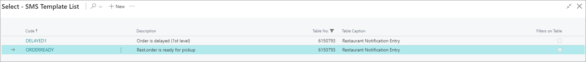

For example, when sending an SMS to notify customers that their order is ready, the message can be as simple as *"Your order #-- is ready."*

  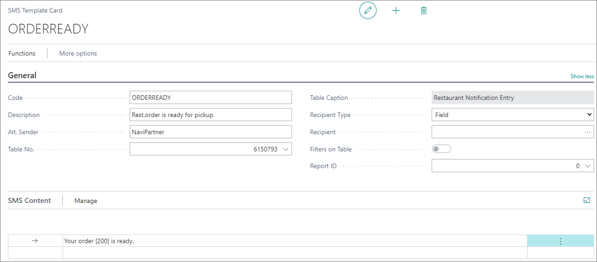