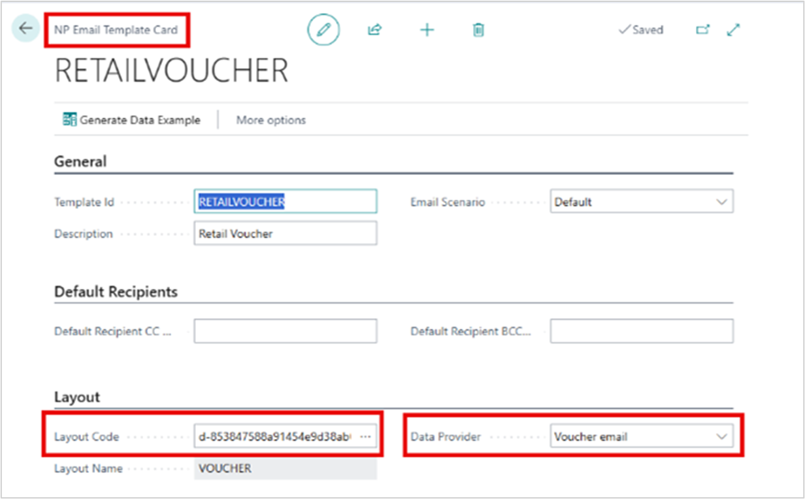
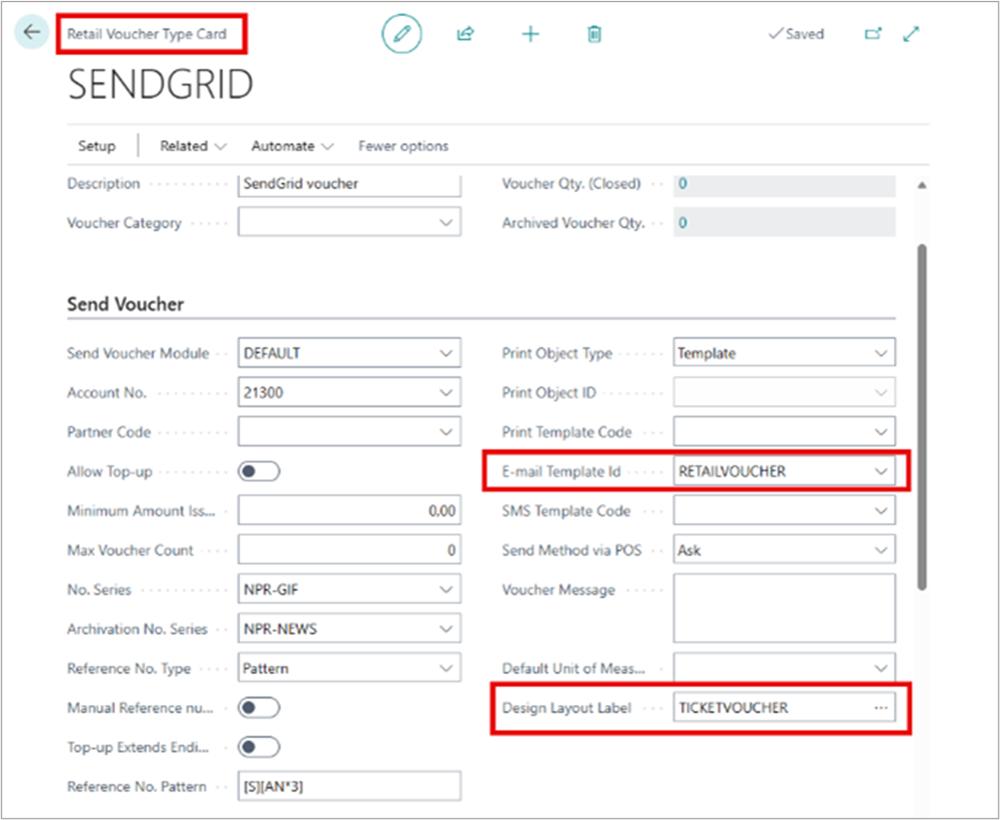
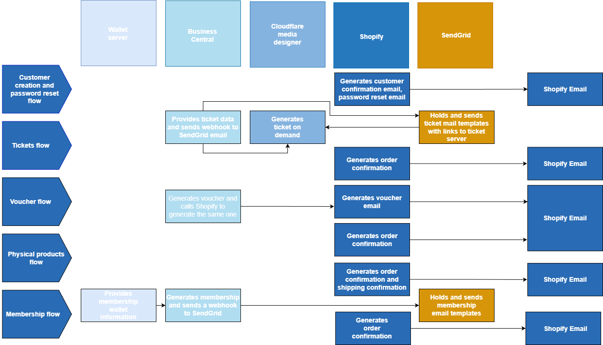

NP Email is NaviPartner’s SaaS solution for handling transactional emails in Business Central and the web. It integrates with [<ins>Twillo SendGrid<ins>](https://www.twilio.com/en-us), enabling drag-and-drop email template design, improved deliverability insights, and advanced analytics. By offloading email management from Business Central, NP Email allows dynamic templates that pull real-time data (e.g., Membership and Ticketing) to support personalized and automated communication.

## Prerequisites

Before using NP Email, the following requirements must be met:

 - NP Email feature enabled in Business Central with necessary permissions.
 - User must be a fully licensed Business Central user (delegated admins and guest accounts are not supported).
 - NP Email account configured in Business Central.
 - SendGrid access provided (NP Email tenant + user invited to the correct SendGrid account).
 - Customer details collected:
    - Billing email
    - Sending email
    - Domain administrator contact (DNS access required)
 - Templates created in NP Email and linked to relevant notification setups (e.g., Membership and Ticketing).

## Create email templates 

After the required setup has been completed by NaviPartner, you can log in to SendGrid and access your account. Once logged in, navigate to Email API → Dynamic Templates and click Create a Dynamic Template in the top-right corner to begin creating a new template.

 - 

### Setup “NP Email Templates”

To ensure that all emails are sent with the correct content and language, you need to create and configure the NP Email templates in Business Central as follows:
 - Go to “NP Email Templates” in Business Central.
 - Create template for each email. Language versions can be added on each template.
 - Member emails: “Member notification setup” -> “Template Filter Value” should be the relevant “Template Id” created in “NP Email Templates”
 - Ticket: “Ticket notification profile list” -> “Template Code” should be the relevant “Template Id” created in “NP Email Templates”

### Email template for Retail voucher

To enable email delivery for retail vouchers, configuration is required in Business Central, SendGrid, and NP Designer. The setup ensures that voucher-related emails are correctly generated, designed, and sent to recipients.

**SendGrid**
 - Create a new email template in SendGrid.
 - Use the handlebars provided by the voucher data example from Business Central.
   - These placeholders define where dynamic voucher information (such as name, amount, and start/end date) will appear in the email.

**Business Central**
 - In Business Central, create a new Email Template that uses the Voucher data provider.
     
 - This connects Business Central to SendGrid and ensures the correct data is passed to the email template.
     

**NP Designer**
 - In NP Designer, create a new design using the Voucher type.
 - When selecting dynamic fields from the Designer, note that data fields are not yet categorized. Currently, all available fields from Business Central (Ticket, Coupon, and Voucher) are displayed. Be sure to select only the fields relevant to Voucher.

 - 
For more information about NP Designer, refer to <a href="" target="_blank"><ins>this link.</ins></a>


### Adding test data in SendGrid

To ensure that email templates are rendered correctly and display dynamic content as intended, test data from Business Central must be added to SendGrid. Follow these steps:
 - In “NP Email Templates”, navigate to the relevant template, click “…”, then select “View” or “Edit.” Click “Generate Data Example” and copy the generated test data.
 - In SendGrid, open the corresponding email template, click “Preview”, then “Show Test Data.” Paste the test data copied from Business Central and click “Save” at the top of the page.

### Shopify for Attraction customers and customers that use membership module

The following drawing provides a comprehensive overview of the NP Email feature for customers with membership. It illustrates the complete process flow, including ticket flows, voucher flows, and other key interactions, giving a clear picture of how the feature operates end-to-end.

#### See also

- [<ins>Set up Email<ins>](https://learn.microsoft.com/en-us/dynamics365/business-central/admin-how-setup-email)
- [<ins>Email setup<ins>]()
- [<ins>Set up email templates<ins>]()