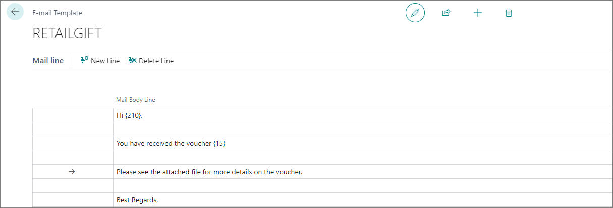

You can create custom templates which will be sent via email to customers in various scenarios. For example, if a membership is about to expire, the affected customer may be notified via an email, the content of which is defined in the **E-mail Templates** administrative section in Business Central.

To set up email templates, follow the steps provided in this article:

1.	Click the  button, enter **E-mail templates**, and choose the related link.
2.	Click **New** in the ribbon.
3.	Fill in the following data:
    - **Code** - the code should help easily distinguish this template from the others, and it needs to be unique. 
    - **Description** - specifies additional information about the template's usage; it is optional.
    - **Table No.** - the table ID provided here depends on what kind of email template you're building.
    - **Filename** - specifies the name of an attached file.
    - **Subject** - specifies the name of the email subject line. 
    - **From E-mal Name** - specifies the name of the email's sender.
    - **From Email Address** - specifies the address of the email's sender.
4. If you wish to format the email template though HTML, activate the **Use HTML Template** toggle switch, and click the three dots next to **HTML template** to open the text editor where you can provide the code snippet. 
5. Add the email body to the **Mail Line** section.     
   You can reference values from the table provided in **Table No.** as presented in the following screenshot. 

   

#### See also

- [<ins>Set up Email (Business Central)<ins>](https://learn.microsoft.com/en-us/dynamics365/business-central/admin-how-setup-email)
- [<ins>Send Documents and Emails (Business Central)<ins>](https://learn.microsoft.com/en-us/dynamics365/business-central/ui-how-send-documents-email)
- [<ins>Email setup<ins>]()