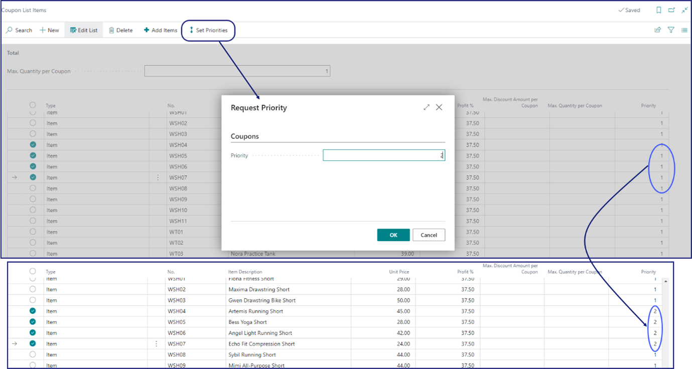

If you wish to create a list of items to be used as a base for applying discounts, you will choose **ITEM_LIST** as the discount module. After this, you need to add the items to that list. 

1. Click the  button, enter **Coupon Type** and choose the related link.         
   A list of all existing coupon types is displayed.
2. Click **New** to open a **Coupon Type Card**.
3. Populate the fields and options, and use one of the [<ins>recommended discount coupon setups<ins>]() as reference. 
4. Click **Setup** in the ribbon, followed by **Setup Apply Discount**.    
   The **Coupon List Items** is displayed.
5. Click **Add Items** and use the available filters to find and add the items you wish to be discounted.      
6. Set the priorities on the items in the list by clicking **Set Priorities** in the ribbon.       
   **1** signifies the highest priority.       

   
         
   The list of items is generated, but you can modify it manually at any time.

#### See also

- [<ins>Coupon troubleshooting<ins>]()
- [<ins>Discount types<ins>]()
- [<ins>Create a new coupon<ins>]()
