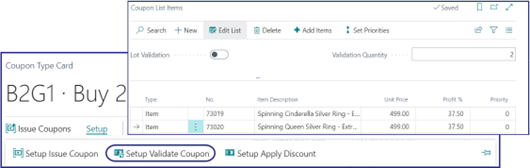

You can create multiple discount coupon types that correspond to different use cases. 

## Fixed amount discount coupon

If you wish to add a fixed discount amount of 200 Danish krone to the total price, regardless of which items are purchased, make sure to do the following:

1. Create a new [<ins>**Coupon Type**<ins>]().
2. Add the **Code**, i.e. the unique identifier of the discount, then also provide an appropriate **Description**.
3. Set the **Discount Type** to **Discount Amount**, and provide the fixed amount of **200**.

    

4. Enable the discount type via the toggle switch.      
   This coupon now gives a discount of 200KR to any sale on POS. 

## Fixed percentage discount coupon

A coupon is issued by the shop to its customers, so that they can benefit from a discount upon presenting the coupon to the salesperson when purchasing certain items. The coupon is printed and distributed by the shop. 
To create a fixed percentage discount coupon on all items follow the provided steps: 

1. Create a new [<ins>**Coupon Type**<ins>]().
2. Add the appropriate **Code** to the coupon type, e.g. **10%OFF**. 
3. Provide the discount coupon name, e.g. **10% Off - Max 70.00**. 
4. Set the **Discount Type** to **Discount %**, and provide the percentage of **10** in the designated field. 
5. Set the **Max Discount Amount** to **70**.       
   This field limits the maximum discount that can be awarded to customers. In this example, when the discount percentage is calculated, the figure will be taken into consideration, and the discount of 70 LCY will be awarded. 
6. Enable the discount coupon type, so that it can be used.
7. Select the **DEFAULT** option in the **Issue Coupon Module**.      
   The module determines how the coupon is being issued. If set to the default value, the shop issues and prints discount coupons in advance, and then they are awarded to customers.
8. Specify how the coupon should be numbered and printed on the right side of the **Issue Coupon** section.
9. Set the **Validate Coupon Module** field to **DEFAULT**, and provide the dates for the validation period in the **Validate Coupon** section. 
10. Set the **Apply Discount Module** to **DEFAULT**.     
    By doing so, you are applying the discount to all items, without any restrictions. 
11. Set **Max Use Per Sale** to **1**.    
    The coupon can be scanned only once during a sale. 
12. Make sure the **Multi-Use** is disabled.      
    It is not necessary to populate other fields for this discount coupon type. 

## Fixed percentage discount coupon issued on sale

A coupon is issued by the shop to the customer when specific items are purchased. It can be used during the customer's next purchase.

1. Create a new [<ins>**Coupon Type**<ins>]().
2. Add the appropriate **Code** to the coupon type, e.g. **20%OFF**. 
3. Provide the discount coupon name, e.g. **20% off coupon on all items**. 
4. Set the **Discount Type** to **Discount %**, and provide the percentage of **20** in the designated field. 
5. Set the **Max Discount Amount** to **60.00**.       
6. Enable the discount coupon type, so that it can be used.
7. Select the **ON-SALE** option in the **Issue Coupon Module**.      
   A coupon is generated when the sales are completed.
8. Specify how the coupon should be numbered and printed on the right side of the **Issue Coupon** section.
9. Use the **Setup** action in the ribbon to choose which items need to be sold so that the customer gets a discount coupon. 
10. Select **Item Sales Amount** in the **Type** and specify the **Item Sales Amount**, e.g. **100**.      
    The issue scheme is based on the value of sales of the items defined in the list.

    

11. Close the **Setup** pop-up window, and make sure that **Match POS Store Group** isn't enabled.    
    If the selected coupon module is **On-Sale**, and this option is enabled, a coupon can only be generated from stores that match the selected POS store group.
12. Specify how the coupon should be numbered and printed on the right side of the **Issue Coupon** section.
13. Set the **Validate Coupon Module** field to **DEFAULT**, and provide the dates for the validation period in the **Validate Coupon** section. 
14. Set the **Apply Discount Module** to **DEFAULT**, and make sure the **Application Sequence No.** is **0**.     
    By doing so, you are applying the discount to all items, without any restrictions. 
15. Set **Max Use Per Sale** to **1**.    
    The coupon can be scanned only once during a sale. 
16. Make sure the **Multi-Use** is disabled.      
    It is not necessary to populate other fields for this discount coupon type. 

## Free item discount coupon

As stated in the previous instructions, setting the coupon issuing method to **DEFAULT** means that the shop will issue, print, and distribute the coupon to the public, and that presenting such a coupon on a purchase provides customers with the specified benefit. 

To create a discount coupon that gives customers a free item, follow the provided steps:

1. Create a new [<ins>**Coupon Type**<ins>]().
2. Add the appropriate **Code** to the coupon type, e.g. **FREEAR**. 
3. Provide the discount coupon name, e.g. **Free Earrings Coupon**. 
4. Set the **Discount Type** to **Discount %**, and provide the percentage of **100** in the designated field. 
5. Make sure that **Max. Discount Amount** is left blank since you aren't going to define which item is going to be given away when presenting a coupon.

    

6. Enable the discount coupon type, so that it can be used.
7. Select the **DEFAULT** option in the **Issue Coupon Module**.      
   The shop issues and prints discount coupons in advance, and then they are awarded to customers.
8. Make sure that **Match POS Store Group** isn't enabled as coupon doesn't need to be generated only by stores that match the specified POS store group.
9. Specify how the coupon should be numbered and printed on the right side of the **Issue Coupon** section.
10. Set the **Validate Coupon Module** field to **DEFAULT**, and provide the dates for the validation period in the **Validate Coupon** section. 
11. Set the **Apply Discount Module** to **EXTRA_ITEM**, and make sure the **Application Sequence No.** is **0**.     
    The coupon provides customers with the benefit of receiving an additional item from the store. 
12. Set **Max Use per Sale** to **1**.       
    The field determines the maximum number of coupons issued per a single sale. It is not possible to scan it more than once in this case.
13. Make sure the **Multi-Use** is disabled.      
    It is not necessary to populate other fields for this discount coupon type. 
14. Use the **Setup** action in the ribbon, and then click **Setup Apply Discount**.     
    A pop-up window is displayed. In it, you need to configure the extra item that will be given away.
15. Add the **Item No.** and **Item Description**, then make sure to set the **Discount %** to **100**, since the item is given away for free. Leave **Max. Discount Amount** blank.

    

## Free item A if items B & C are purchased

With this coupon, customers receive one free item when two are purchased. These can be specific items, or a combination of random available items from the store, depending on the selected configuration. 

The validation process is carried out depending on the item list. You can set the quantity that needs to exist in the sales line to activate the coupon. There are three types of validation:

- Default - the coupon is valid on any items defined in the item list. This validation type is used in the guide below.
- Validation quantity - The coupon is only valid if the specific items exist in the sales line, and are equal to the validation quantity. 
- Lot validation - All items in the list are considered as a lot. In this case, the customer needs to purchase each component of the lot to benefit from the discount coupon.

To create a discount coupon that gives you the benefit of receiving a specified free item on condition that certain two items are purchased beforehand, follow the provided steps: 

1. Create a new [<ins>**Coupon Type**<ins>]().
2. Add the appropriate **Code** to the coupon type, e.g. **B2G1**. 
3. Provide the discount coupon name, e.g. **Buy 2 items Apply1 Free Coupon**. 
4. Set the **Discount Type** to **Discount %**, and provide the percentage of **100** in the designated field. 
5. Make sure that **Max. Discount Amount** is left blank since you aren't going to define which item is going to be given away when presenting a coupon.

    

6. Enable the discount coupon type, so that it can be used.
7. Select the **DEFAULT** option in the **Issue Coupon Module**.      
   The shop issues and prints discount coupons in advance, and then they are awarded to customers.
8. Make sure that **Match POS Store Group** isn't enabled as coupon doesn't need to be generated only by stores that match the specified POS store group.
9. Specify how the coupon should be numbered and printed on the right side of the **Issue Coupon** section.
10. Set the **Validate Coupon Module** field to **ITEM_LIST**, and provide the dates for the validation period in the **Validate Coupon** section.       
    When the coupon is scanned, and it is verified that the purchased items belong to the predefined list, the customers can receive the free item.
11. Use the **Setup** action in the ribbon, and then click **Setup Validate Coupon**.     
    A pop-up window is displayed. In it, you can set the list of items against which the validation is performed.

    

12. Close the **Setup**, and move on to **Apply Coupon** section in the **Coupon Type**.
13. Provide **EXTRA_ITEM_QTY** in **Apply Discount Module**, and set **Max Use per Sale** to **1**.
14. Make sure the **Multi-Use** is disabled.      
    It is not necessary to populate other fields for this discount coupon type. 
15. Use the **Setup** action in the ribbon, and then click **Setup Apply Discount**.     
    Here, you can set the extra item that will be given away for free when the two specified items are purchased.
16. Add the **Item No.** and **Item Description**, then make sure to set the **Discount %** to **100**, since the item is given away for free. Leave **Max. Discount Amount** blank.
17. Make sure you add **2** in **Extra Item per Qty**.
18. (Optional) You can also add **4** in **Max. Extra Item per Coupon**.     
    This is the number of extra items a customer is allowed to receive when using this coupon. In this specific case, if a customer purchases 8 or more items from the list, they will receive 4 free items.

## Discount coupon based on a time period

To create a discount coupon the customers can use within a fixed timeframe, follow the provided steps:

1. Create a new [<ins>**Coupon Type**<ins>]().
2. Add the appropriate **Code** to the coupon type, e.g. **TIME**. 
3. Provide the discount coupon name, e.g. **Happy Hour on NECKLACE**. 
4. Set the **Discount Type** to **Discount Amount**, and provide the amount of **30** in the designated field. 
5. Make sure that **Max. Discount Amount** is left blank since you aren't going to define which item is going to be given away when presenting a coupon.
6. Enable the discount coupon type, so that it can be used.
7. Select the **DEFAULT** option in the **Issue Coupon Module**.      
   The shop issues and prints discount coupons in advance, and then they are awarded to customers.
8. Make sure that **Match POS Store Group** isn't enabled as coupon doesn't need to be generated only by stores that match the specified POS store group.
9. Specify how the coupon should be numbered and printed on the right side of the **Issue Coupon** section.
10. Set the **Validate Coupon Module** field to **TIME**, and provide the **Starting Date**.       
    When the coupon is scanned, and it is verified that the items have been purchased in the specified timeframe, the customer can benefit from the discount.
11. Use the **Setup** action in the ribbon, and then click **Setup Validate Coupon**.     
    A pop-up window is displayed. In it, you can set the timeframe for coupon validity.

    

    If you select **Every Day** as **Period Type**, you will be able to set the time interval for every day of the week, whereas, if you select **Weekly**, you will be able to set on which day of the week you wish the coupon to be validated. 

12. Close the **Setup**, and move on to **Apply Coupon** section in the **Coupon Type**.
13. Provide **ITEM_LIST** in **Apply Discount Module**, and set **Max Use per Sale** to **1**.
14. Make sure the **Multi-Use** is disabled.      
    It is not necessary to populate other fields for this discount coupon type. 
15. Click **Setup Validate Coupon** in the ribbon, and add the items which are affected by the coupon in the **Coupon List Items** window.
16. Select the items you wish to be affected by the discount.

## Discount coupon based on loyalty points

Loyalty points can be converted into a discount amount in NP Retail. This is done by adding a button with the **MM_MEMBER_LOYALTY** action to the POS unit. When a salesperson presses this button, a discount coupon line equivalent to the sales amount or the maximum number of points that can be converted is created on the POS sales line. Consequently, that number of points is omitted from the member's loyalty card.  

To create a discount coupon for loyalty, follow the provided steps:

1. Create a new [<ins>**Coupon Type**<ins>]().
2. Add the appropriate **Code** to the coupon type, e.g. **LOYALTY**. 
3. Provide the discount coupon name, e.g. **Loyalty**. 
4. Set the **Discount Type** to **Discount Amount**, and provide the amount of **1** in the designated field. 
5. Enable the discount coupon type, so that it can be used.
6. Select the **MEMBER-LOYALTY** option in the **Issue Coupon Module**.      
   In this case, no physical coupon is being printed. The discount amount is added to the POS sales line. 
9. Make sure that **Match POS Store Group** isn't enabled as coupon doesn't need to be generated only by stores that match the specified POS store group.
10. Specify how the coupon should be numbered and printed on the right side of the **Issue Coupon** section.
11. Use the **Setup** action in the ribbon, and then click **Setup Issue Coupon**.     
    The **Loyalty Points Setup** pop-up window is displayed. In it, you can set the conversion rules.       
    In this example, the discount coupon value is calculated by converting the loyalty points of this member to a maximum of 100 pts - 100.00 LCY. 

    

    
