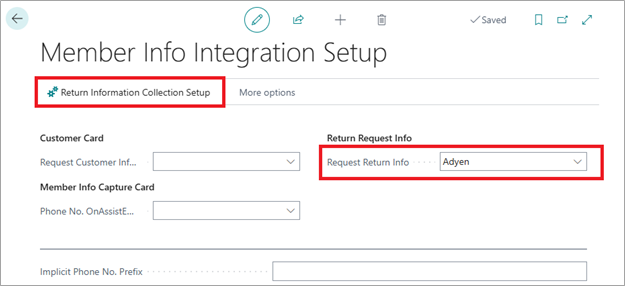

This article explans a streamlined process for collecting customer data during return sales on the POS.
It improves the return workflow by prompting the cashier to capture essential customer details, such as signature, email, and phone number, before completing the transaction. 

The process relies on two configurable settings that must be properly set up for the feature to operate correctly. 
Prior to finalizing payment, a confirmation prompt allows the customer to approve or decline the provided information, which then determines whether the return proceeds or is canceled.

### Prerequsities

On **Member Info Integration Setup** page, customer needs to set **Return Request Info** field. After that, the main setup – **Return Information Collection Setup**, can be accessed from action on the page.

On the **Return Information Collection Setup** page, customers can configure the following:
 - **Collect Signature**, **Collect Phone No.**, and **Collect E-Mail** fields specifies which customer information is collected during a return sale.
 - **API Key** is provided in the Adyen Portal, and the Environment specifies whether you are working in Live or Test.
 - **Device Settings** is a list part used to define and link different terminals with specific POS units.

### Process flow

When performing a return sale on the POS, if this feature is enabled and configured correctly, the system will automatically prompt for the information defined on the Return Information Collection Setup page — no matter the payment method.

If a customer is specified but missing an e-mail address or phone number, the POS will ask the user to provide one or both, depending on what information is missing. Once the process begins, a spinner will appear on the POS screen with the message: **Data Collection – Collecting Information**.

On the terminal, depending on the setup, the user may be prompted to provide up to three types of information: signature, e-mail, and phone number.

After entering the requested information, a verification popup will appear, allowing the customer to approve or decline the data collection.

 - If the information is valid and approved, the sale will proceed as normal. At the end of the transaction, the entered e-mail and phone number will be stored for the customer/member associated with the sale.

 - If the information is missing or incorrect, the customer can decline it. In this case, the payment process will be canceled, and the user will have the chance to re-enter the information.

### Stored information

When the collected data is approved and the payment process is completed, a new record is created in the **POS Entry** table.
In the FactBox section of the POS Entry record, there is a field **Customer Input** which specifies whether customer input was provided for that entry.
If selected, the related **Customer Input** record opens, showing the information collected and stored during the process.

