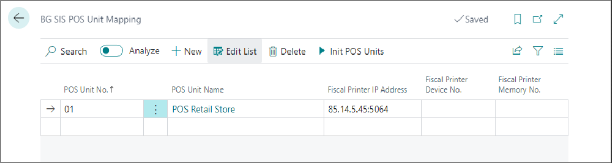
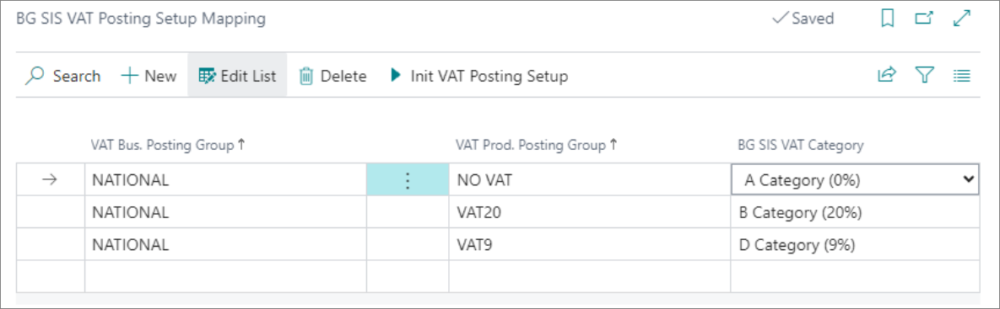

This article details how to configure NP Retail for compliance with Bulgarian fiscal laws.

1. Open the **BG Tax Fiscalization Setup**, and enable the fiscalization compliance with Bulgaria by activating the **Enable BG Fiscalization** toggle switch.
2. Go to **POS Audit Profiles** page, enable the audit log, and set the **Audit Handler** to **BG_SIS**.      
3. Set this audit profile for all POS units from the **POS Unit List**. 
4. Navigate to **BG SIS POS Unit Mapping**.       
   For every POS unit that needs to be compliant with the Bulgarian fiscal law, you need to assign the relevant fiscal printer which will send the information on transactions to the TA.
5. Choose the **POS Unit No.**.       
   The **POS Unit Name** is populated as the result. 
6. In the **Fiscal Printer IP Address** enter the IP address of the fiscal printer. 

   

7. To assign the VAT category to the related VAT business and product group, navigate to the **BG SIS VAT Posting Setup Mapping** page.     
   The Bulgarian law recognizes different VAT categories for different VAT rates which should be assigned in the system to combinations of VAT groups. 
8. Select the **VAT Business and Product Group** from the table, and choose the category related to the selected combination from the **BG SIS VAT Category** field. 

   

9. To create a payment media for Bulgarian compliance, navigate to the **BG SIS POS Payment Method Mapping** page.
10. Choose the **POS Payment Method Code** from the **POS Payment Method List**, then select one of the possible payment methods from the **BG SIS Payment Method** list. 
11. On the **POS Payment Method Card** for the cash sales, set the maximum amount to **9.999,99**, as is required by the Bulgarian fiscal law.
12. Navigate to the **POS Audit Profile**, and enable the **Require Item Return Reason** toggle switch, so that every time a return sale is created, it's necessary to provide a return reason.
13. Navigate to the **BG SIS Return Reason Mapping** page to select the possible reasons for returning an item from the **BG SIS Return Reason** dropdown list. You also need to provide the accompanying **Return Reason Code**.
