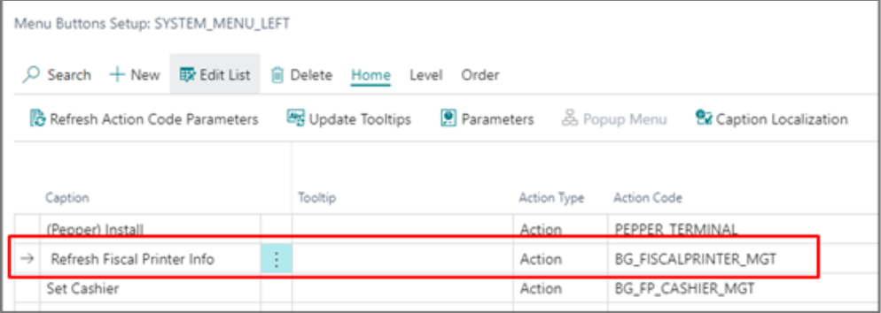
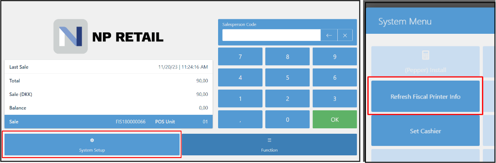
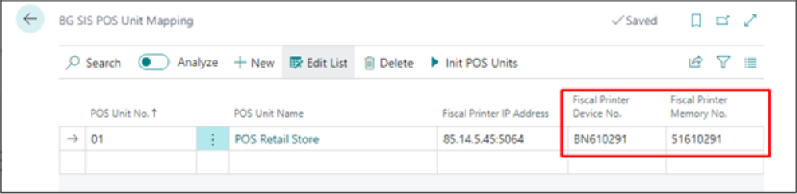

This article details how to configure NP Retail for compliance with Bulgarian fiscal laws.

1. Open the **BG Tax Fiscalization Setup**, and enable the fiscalization compliance with Bulgaria by activating the **Enable BG Fiscalization** toggle switch.
2. Go to **POS Audit Profiles** page, enable the audit log, and set the **Audit Handler** to **BG_SIS**.      
3. Set this audit profile for all POS units from the **POS Unit List**. 
4. Navigate to **BG SIS POS Unit Mapping**.       
   For every POS unit that needs to be compliant with the Bulgarian fiscal law, you need to assign the relevant fiscal printer which will send the information on transactions to the TA.
5. Choose the **POS Unit No.**.       
   The **POS Unit Name** is populated as the result. 
6. In the **Fiscal Printer IP Address** enter the IP address of the fiscal printer. 

   

7. To assign the VAT category to the related VAT business and product group, navigate to the **BG SIS VAT Posting Setup Mapping** page.     
   The Bulgarian law recognizes different VAT categories for different VAT rates which should be assigned in the system to combinations of VAT groups. 
8. Select the **VAT Business and Product Group** from the table, and choose the category related to the selected combination from the **BG SIS VAT Category** field. 

   

9. To create a payment media for Bulgarian compliance, navigate to the **BG SIS POS Payment Method Mapping** page.
10. Choose the **POS Payment Method Code** from the **POS Payment Method List**, then select one of the possible payment methods from the **BG SIS Payment Method** list. 
11. On the **POS Payment Method Card** for the cash sales, set the maximum amount to **9.999,99**, as is required by the Bulgarian fiscal law.
12. Navigate to the **POS Audit Profile**, and enable the **Require Item Return Reason** toggle switch, so that every time a return sale is created, it's necessary to provide a return reason.
13. Navigate to the **BG SIS Return Reason Mapping** page to select the possible reasons for returning an item from the **BG SIS Return Reason** dropdown list. You also need to provide the accompanying **Return Reason Code**.

## Next steps - Create POS actions

### Refresh fiscal printer info

1. Navigate to the **POS Menu** administrative section in Business Central.
2. Find **SYSTEM_MENU_LEFT** in the list, and click **Buttons** in the ribbon.
3. Name the action (*Refresh Fiscal Printer Info*), set the action type to **Action**, and provide the **Action Code** - **BG_FISCALPRINTER_MGT**.      
   The changes are automatically saved.

     

4. Open the POS.
5. Before logging in, click **System Setup**, and run the **Refresh Fiscal Printer Info** action. 
  
     

  Additional information on the fiscal printer (**Fiscal Printer Device No.** and **Fiscal Printer Memory No.**) will be automatically populated when the IP address of the printer is entered.

     

### Set the cashier

1. Navigate to the **POS Menu** administrative section in Business Central.
2. Find **SYSTEM_MENU_LEFT** in the list, and click **Buttons** in the ribbon.
3. Name the action (*Set Cashier*), set the action type to **Action**, and provide the **Action Code** - **BG_FP_CASHIER_MGT**.      
4. Set the parameter value for this action to **setCashier**. 
   The changes are automatically saved.
5. Open the POS.
6. Press **System Setup**, and select the cashier that will have access to the given POS unit from the list of salespeople that is displayed.     
   This process needs to be done only once per a salesperson.

### Delete the cashier

The cashier can be deleted, and their access to the POS unit can be revoked. They can be deleted only if they haven't completed any sales during the day. If they have, they can be deleted after the POS balancing is performed. 

1. Navigate to the **POS Menu** administrative section in Business Central.
2. Find **SYSTEM_MENU_LEFT** in the list, and click **Buttons** in the ribbon.
3. Name the action (*Delete Cashier*), set the action type to **Action**, and provide the **Action Code** - **BG_FP_CASHIER_MGT**.      
4. Set the parameter value for this action to **deleteCashier**. 
5. Open the POS.
6. Press **System Setup**, followed by **Delete Cashier**.     
   The list of salespeople is displayed.
7. Select which salesperson needs to be deleted.