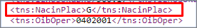
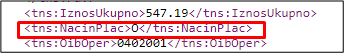

You can choose which payment methods will be accepted in the **Payment Method Card** where the setup for the given payment method is done. In the following example, cash is selected as the payment method in use.

The created payment method needs to be sent to TA in an XML message according to the Croatian Fiscal Law. Therefore, all **Payment Method Codes** need to be mapped to the adequate **CRO Payment Methods** in the **CRO POS Payment Method Mapping** page.

Whenever these payment methods are used, the accompanying XML message should contain a payment method label that is defined by the law.

  

## Multiple payment methods

When a customer wishes to pay with more than one payment method, the label in the XML file for the payment method will be „O“  which stands for „Ostalo“. The same applies to sales returns.

  

## Non-mapped payment methods

Using a payment method type that isn't recorded in **CRO Payment Method Mapping** isn't possible. If the payment method isn't recorded in **CRO Payment Method Mapping** and the POS button linked to that payment method is used, an error message will be displayed.

## Limited use of payment methods

The Croatian Fiscal Law references certain payment-related limitations. For example, it's only possible to pay by cash up to the amount of 10,000.00 EUR. Under other circumstances, this maximum amount is set up in the **POS Payment Method Card**. If the maximum amount is exceeded, an error message is displayed on the POS.