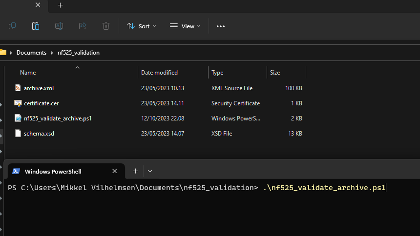

Cet article fournit les informations nécessaires pour comprendre comment NP Retail exporte vers des archives .xml, comment ces archives .xml doivent être sécurisées et comment vous pouvez vérifier qu'elles n'ont pas été falsifiées.

## Archives périodique
Vous devez surveiller périodiquement les périodes mensuelles fermées sur la page **Workshift Summary** et les exporter vers un fichier d'archive stocké sur un support sécurisé, c'est-à-dire des clés USB dans un coffre-fort.
Vous créez des archives à l'aide du bouton Archiver dans la liste **Workshift Summary**.
Notez que Business Central SaaS dispose déjà de plusieurs niveaux de sauvegarde de base de données sur les données, car elles sont toutes stockées dans la plate-forme ERP gérée par Microsoft. Cela inclut les sauvegardes géo-redondantes. Consultez leurs documents pour en savoir plus: 
https://learn.microsoft.com/en-us/dynamics365/business-central/dev-itpro/service-overview#database-and-backups


## Validation des archives

Pour garantir l'intégrité des archives exportées, toutes les archives .xml sont signées avec le même certificat que toutes les signatures d'événements POS.

La méthode de canonisation XMLDSIG est XML-C14N 1.0 et la signature se fait via RSA et SHA256 comme toutes les autres signatures d'événements POS.
Si vous contactez NaviPartner, nous pouvons vous fournir un fichier de certificat .cer qui inclut la clé publique du certificat utilisé par un client spécifique.
NaviPartner fournit également un script PowerShell qui peut être téléchargé et exécuté pour valider à la fois le schéma du fichier XML et la validité de la signature :
[Script de validation d'archive](https://docs.navipartner.com/nf525_validate_archive.ps1).

Le script dépend du noyau PowerShell qui peut être téléchargé et installé à partir du lien suivant: 
https://learn.microsoft.com/en-us/powershell/scripting/install/installing-powershell-on-windows?view=powershell-7.3 

Le script doit être placé dans un dossier avec les 3 fichiers nécessaires à la vérification :
- archive.xml
- schema.xsd
- certificate.cer

Le fichier de schéma auquel adhèrent les archives peut être téléchargé à l'adresse
[Schéma d'archive](https://docs.navipartner.com/schema.xsd)

Les 3 fichiers doivent être nommés exactement comme ci-dessus. Voir l'image par exemple.


## Structure des archives

L'archive contient la structure globale de:
```
<Archive>
    <GrandPeriod>
        <ArchiveSignature/>
        <SystemEntryNo/>
        <SequentialID/>
        <FromDate/>
        <ToDate/>
        <GrandTotal/>
        <PerpetualAbsoluteGrandTotal/>
        <PerpetualGrandTotal/>
        <PeriodGrandTotalSignature/>

        <Tickets/>        

        <Duplicates/>        

        <GrandTotals/>        

        <JET/>        
    </GrandPeriod>

    <Signature/>    
</Archive>
```

Au début il y a  une section d'en-tête pour la grande période mensuelle archivée, suivie de listes de tous les événements signés au cours de cette période. Après l'élément GrandPeriod se trouve un élément Signature qui contient la signature XML du fichier, ce qui le rend inviolable.

Voir le fichier de schéma lié ci-dessus pour un aperçu détaillé de tous les éléments XML dans chacune des 4 sections de type d'événement (tickets, doublons, grands totaux, jet).

## XML Tags

| Tag                            | Français                                     |
|--------------------------------|----------------------------------------------|
| Archive                        | Archive                                      |
| GrandPeriod                    | Période majeure                              |
| ArchiveSignature               | Signature d'archive                          |
| SystemEntryNo                  | Numéro d'entrée système                      |
| SequentialID                   | ID séquentiel                                |
| FromDate                       | De la date                                   |
| ToDate                         | À la date                                    |
| GrandTotal                     | Total général                                |
| PerpetualAbsoluteGrandTotal    | Total absolu perpétuel                       |
| PerpetualGrandTotal            | Total perpétuel                              |
| PeriodGrandTotalSignature      | Signature du total de la période             |
| Tickets                        | Billets                                      |
| Ticket                         | Billet                                       |
| DocumentType                   | Type de document                             |
| TicketSignature                | Signature du billet                          |
| SalesLine                      | Ligne de vente                               |
| TaxLine                        | Ligne de taxe                                |
| PaymentLine                    | Ligne de paiement                            |
| Type                           | Type                                         |
| ExchangeRate                   | Taux de change                               |
| IssuedGenericVoucher           | Bons génériques émis                         |
| AppliedGenericVoucher          | Bons génériques appliqués                    |
| IssuedCoupon                   | Coupons émis                                 |
| AppliedCoupon                  | Coupons appliqués                            |
| RelatedInfo                    | Informations connexes                        |
| Duplicates                     | Duplicatas                                   |
| Duplicate                      | Duplicata                                    |
| ID                             | ID                                           |
| FiscalDocumentNumber           | Numéro de document fiscal                    |
| ReprintNumber                  | Numéro de réimpression                       |
| DuplicateSignature             | Signature du duplicata                       |
| RelatedInfo                    | Informations connexes                        |
| GrandTotals                    | Totals généraux                              |
| GrandTotal                     | Total général                                |
| PerpetualAbsoluteGrandTotal    | Total absolu perpétuel                       |
| PerpetualGrandTotal            | Total perpétuel                              |
| GrandTotalSignature            | Signature du total général                   |
| JET                            | JET                                          |
| JETEntry                       | Entrée JET                                   |
| JETSignature                   | Signature JET                                |
| SystemEntryKey                 | Clé d'entrée système                         |
| DocumentNumber                 | Numéro de document                           |
| NoOfPrints                     | Nombre d'impressions                         |
| SalespersonCode                | Code du vendeur                             |
| POSCode                        | Code POS                                     |
| Date                           | Date                                         |
| Time                           | Heure                                        |
| OperationType                  | Type d'opération                             |
| NoOfSalesLines                 | Nombre de lignes de vente                   |
| TotalInclTax                   | Total TTC                                   |
| TotalExclTax                   | Total HT                                    |
| LineNo                         | Numéro de ligne                              |
| ProductCode                    | Code de produit                             |
| ProductLabel                   | Libellé du produit                          |
| Quantity                       | Quantité                                     |
| TaxIdentifier                  | Identifiant de taxe                         |
| TaxRate                        | Taux de taxe                                |
| UnitPriceInclTax               | Prix unitaire TTC                            |
| DiscountCode                   | Code de réduction                           |
| DiscountPercentage             | Pourcentage de réduction                    |
| DiscountAmount                 | Montant de réduction                        |
| TotalExclTax                   | Total HT                                    |
| TotalInclTax                   | Total TTC                                   |
| BaseQuantity                   | Quantité de base                            |
| UnitOfMeasureCode              | Code de l'unité de mesure                   |
| Created                        | Créé                                         |
| Description                    | Description                                 |
| Amount                         | Montant                                      |
| Currency                       | Devise                                       |
| CurrencyAmount                 | Montant en devise                            |
| ExchangeRate                   | Taux de change                               |
| CreatedAt                      | Créé à                                       |
| SoftwareVersion                | Version du logiciel                         |
| StoreName                      | Nom du magasin                              |
| StoreName2                     | Nom du magasin 2                            |
| StoreAddress                   | Adresse du magasin                          |
| StoreAddress2                  | Adresse du magasin 2                        |
| StorePostCode                  | Code postal du magasin                      |
| StoreCity                      | Ville du magasin                            |
| StoreCountry                   | Pays du magasin                             |
| IntraCommVATIdentifier         | Identifiant de TVA intracommunautaire        |
| SalespersonName                | Nom du vendeur                             |
| UserCode                       | Code d'utilisateur                           |
| GrandTotalType                 | Type de total général                       |
| SequenceNumber                 | Numéro de séquence                           |
| AdditionalInfo                 | Informations supplémentaires                |

## Héritage

Avant la version fiscale 11 de NPRetail, les fichiers d'archives n'étaient pas signés et suivaient un schéma différent. L'ancien schéma peut être téléchargé depuis 
[Ancien schéma d'archive](https://docs.navipartner.com/nf525_schema_old_pre11.xsd)

Avant la version fiscale 21.6 de NPRetail, les fichiers d'archives suivaient un schéma différent téléchargeable ici: 
[Ancien schéma d'archive](https://docs.navipartner.com/nf525_schema_old_pre216.xsd)

