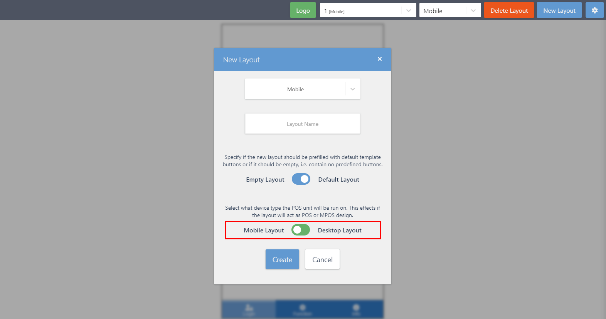
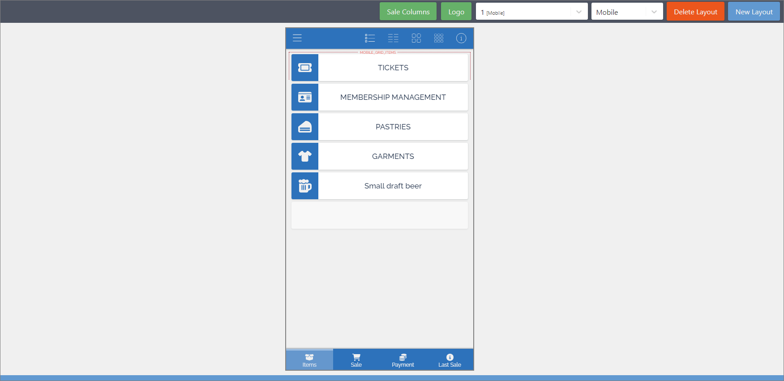

The MPOS editor gives users the option to set POS actions and buttons directly from within the MPOS UI, without having to work in Business Central back office in parallel. However, to make sure it's operational, you first need to activate it by following the provided steps:

1. Click the  button, enter **POS Layouts** and open the related link. 
2. Create a **New** layout.
3. Provide a unique **Code** which will help differentiate the layout from the others in the list.
4. (Optional) Add the **Template Name**.     
   You can view all available templates and choose the one that suits your business needs best once you open the POS.
5. Open the **POS Unit List**, and choose the POS unit you wish to apply the MPOS layout to (or [<ins>create a new one<ins>]()).       
   The **POS Unit Card** is displayed.
6. In the **Profiles** tab of the **POS Unit Card** select the layout you've previously created from the **POS Layout Code** dropdown.
7. Open the **POS**.     
   If you're opening it for the first time, you can choose the one you've edited from the pop-up window that is displayed. Otherwise, you can choose your POS unit in the **User Setup**.
8. Click the <image src="Images/cog.PNG" width="30" height="30"> icon, to open the [<ins>POS Editor<ins>](). 
9. If the MPOS-friendly layout isn't applied, click **New Layout**, and then **New Layout** again.  
10. Make sure the toggle switch points to the **Mobile Layout** option, and add the **Layout Name**.     

    

    The screen shrinks in size to match the mobile device screen as the result.

    

11. Save the layout, and log in.      
    Once you're logged into the MPOS in the browser, you can use the POS Editor to edit buttons, upload a logo, and choose which options will be available to MPOS users.
12. Assign a mobile device to a POS unit.     
    You can do this by generating a QR code in the **MPOS QR Code List** administrative section, and scan the code with your phone's camera.

    The changes performed on the desktop are applied on the MPOS upon reload. The design on the editor is now the same as the one on the MPOS.      

    <iframe width="560" height="315" src="https://www.youtube.com/embed/o2FdbYVLXUo?si=TcyeiSn5fGS7NbAo" title="YouTube video player" frameborder="0" allow="accelerometer; autoplay; clipboard-write; encrypted-media; gyroscope; picture-in-picture; web-share" allowfullscreen></iframe>

## Next steps - create/edit buttons

To create new or edit the existing buttons in the MPOS layout you've just created, follow the steps in the procedure for [<ins>Creating new buttons in the MPOS menu<ins>]()