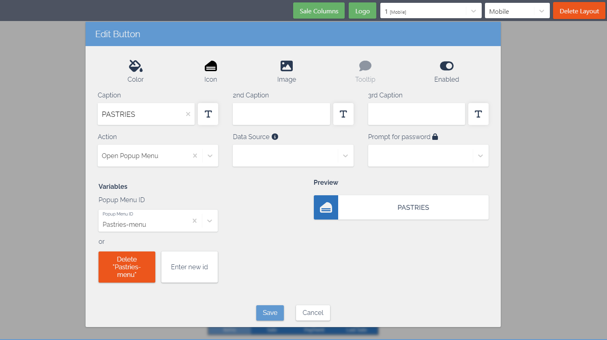

To create new buttons in the NP Retail POS mobile app, make sure the prerequisite is met, and follow the provided steps:

#### Prerequisite

- Activate the [<ins>MPOS editor<ins>]().

#### Procedure

1. Open the POS with the MPOS layout in which you want to create buttons from your desktop/browser version of Business Central.
   
   

2. Open the [<ins>MPOS Editor<ins>]() by clicking <image src="Images/cog.PNG" width="30" height="30">.
3. Click on an empty cell in the MPOS screen area you wish to add the button to, followed by **Edit** in the dropdown list that is displayed. You can also edit an existing button, as presented in the screenshot below.     
   The **Edit Button** window is displayed. It contains various customizable elements for buttons.     

   

4. Provide the **Caption**, and make sure you've attached the desired POS **Action** to it.     
   If the POS action you need doesn't exist yet, you can [<ins>create it<ins>]().
5. (Optional) You can also provide an image for the button background, change its color, and even add a password that will be required before the button’s action is triggered.
6. Once you’re satisfied with your changes, click **Save**.     
   The button is now displayed in the selected MPOS screen area.
7. Open the NP Retail POS mobile app to view the changes on your mobile device.      
   
   