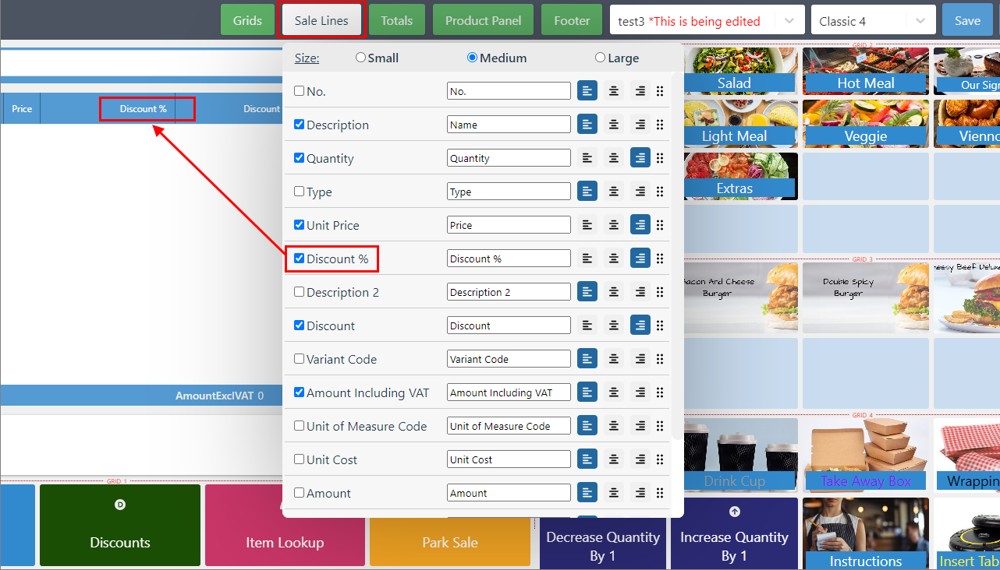
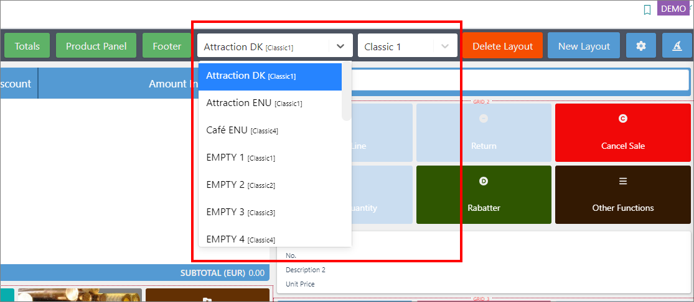

The POS (Frontend) Editor provides customization options for the POS screen. It is accessible from the ribbon at the top of the interface and contains labels corresponding to various customizable areas, such as Sale Lines and Totals.

To open the POS Editor, you can click the <image src="Images/cog.PNG" width="30" height="30"> button located at the bottom right corner of the screen. 



The following screen areas can be customized on the Login view and in the Sale view respectively: 

## Login view editor

### Logo

You can upload a desired logo or provide a URL path to it. The logo will be displayed on the login screen exclusively. It can be updated or removed later if necessary.

### Panel Rows

You can select the content displayed in the left-side box, define the order of displayed items (e.g. the last performed sale, balance, salesperson code), and adjust the font size of the content. 

### Panel Bottom Line

You can also choose the content displayed in the panel footer (e.g. POS unit number from the last sale) and adjust the font size and order of the textual components.

### Footer

As per the title, you can customize the footer content of the POS login view. Default values include details about the last sale and the current date. 

## Sale view editor

### Grids

The **Grids** option allows you to configure the number of rows and columns in each POS menu (*SALE-LEFT*, *SALE-TOP*, and *SALE-BOTTOM*), create space for [<ins>new buttons<ins>](). You can use the **Remove Empty Buttons** option to clear unused spaces from the grid. 

### Sale Lines

**Sale Lines** lets you define which item-related details appear when adding items to the cart and the font size of column titles.

  

### Totals

With **Totals**, you can select which amounts (e.g. total amount, VAT) appear in the **Sale Lines** footer area, edit labels and font sizes, and reorder elements using drag-and-drop.

### Product Panel

The **Product Panel** section is located below the **Sale Lines**, and above *SALE-LEFT*. The **Product Panel** option in the POS Editor ribbon lets you configure which product data should be included on the POS screen, e.g. Unit Cost, Quantity, etc.

You can also adjust the font size and reorder elements using drag-and-drop. 

### Footer

The **Footer** section is located at the very bottom of the POS screen. It can display information such as the date and the salesperson code. You can adjust the order, font size, and content alignment (left, right, center). 

### POS Layout and Template dropdowns

The **Layout** dropdown displays previously created layouts from **POS Layouts** administrative section in Business Central, or from the POS Layout Setup Wizard.

The **Template** dropdown contains the list of available templates. Changing a template mid-setup may alter some customized settings.

   

### Other options

- Once you're satisfied with your customizations, you can **Save** them. 
- Alternatively, you can **Clear Changes**, and reset all modifications.
- The <image src="Images/cog.PNG" width="30" height="30"> icon brings up **Global Settings** which are intended for advanced users.
- The <image src="Images/weird_icon.PNG" width="30" height="30"> icon opens the [<ins>POS Layout Setup Wizard<ins>]().

<iframe width="560" height="315" src="https://www.youtube.com/embed/TOnYujxa7wc?si=pWIaJMF9Y0YYZmGQ" title="YouTube video player" frameborder="0" allow="accelerometer; autoplay; clipboard-write; encrypted-media; gyroscope; picture-in-picture; web-share" allowfullscreen></iframe>

#### See also

- [<ins>POS editor<ins>]()
- [<ins>Create buttons in POS menus<ins>]()
- [<ins>Create POS menu filters<ins>]()
- [<ins>Use the POS Layout Setup Wizard<ins>]()