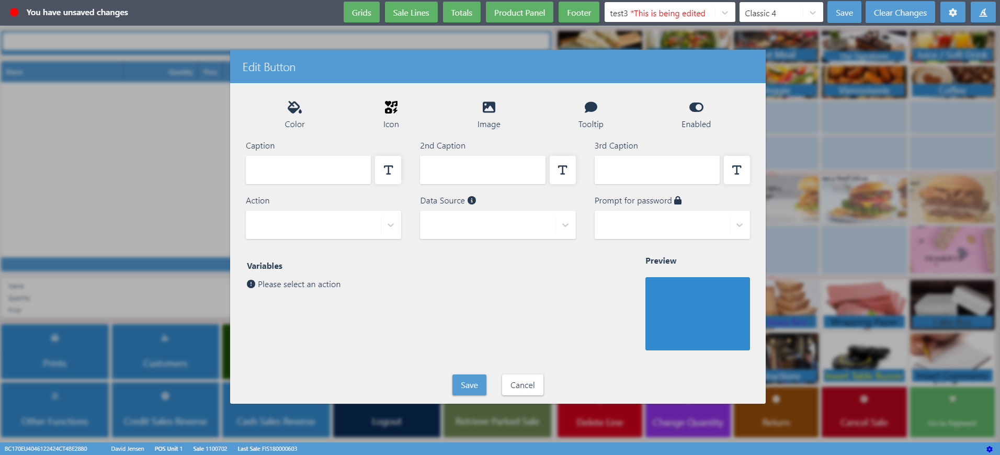

To create new buttons in the POS menu, make sure the prerequisite is met, and follow the provided steps:

#### Prerequisites

- Enable the [<ins>POS Editor<ins>]().

#### Procedure

1. Open the POS.    
   The [<ins>POS Layout Setup Wizard<ins>]() is displayed.
2. Select the layout category from the available options, or close the Wizard to create all buttons and options manually.
3. (Optional) If there's no space left, press **Grids** in the POS Editor, and edit the number of rows or columns for the selected screen area to make room for new buttons.
4. Press on an empty cell in the POS screen area you wish to add the button to, followed by **Edit** in the dropdown list that is displayed.     
   The **Edit Button** window is displayed. It contains various customizable elements for buttons.     

   

5. Provide the **Caption**, and make sure you've attached the desired POS **Action** to it.     
   If the POS action you need doesn't exist yet, you can [<ins>create it<ins>]().
6. (Optional) You can also provide an image for the button background, change its color, and even add a password that will be required before the button's action is triggered.
7. Once you're satisfied with your changes, press **Save**.    
   The button is now displayed in the selected POS screen area.

