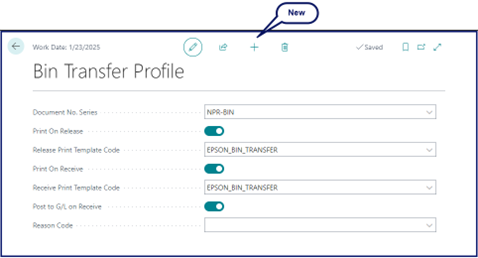

The **POS Payment Bin Transfer Journal** administrative section in Business Central is used for performing all transfers between different payment bins. 

Before performing these transfers, you need to set up the rules that will govern them in the **Bin Transfer Profile**. All you need to do is create a **New** bin transfer profile, and enable the desired functionalities. 

After you're done with the initial set up, you can perform one of the available transfer types:

- [<ins>Transfer cash from a safe to a POS unit<ins>]()
- [<ins>Transfer cash from a POS unit to a safe<ins>]()
- [<ins>Transfer cash from one POS unit to another<ins>]()