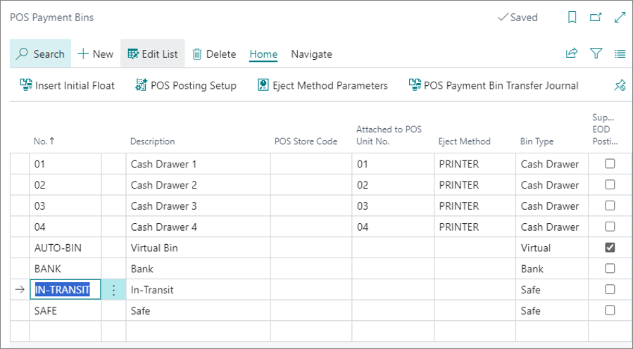
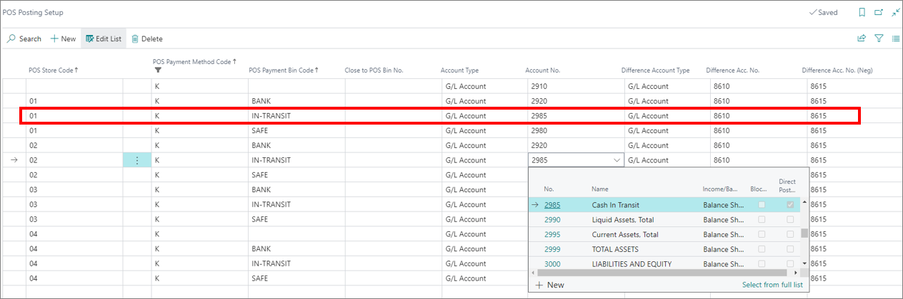
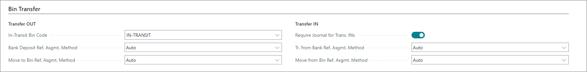
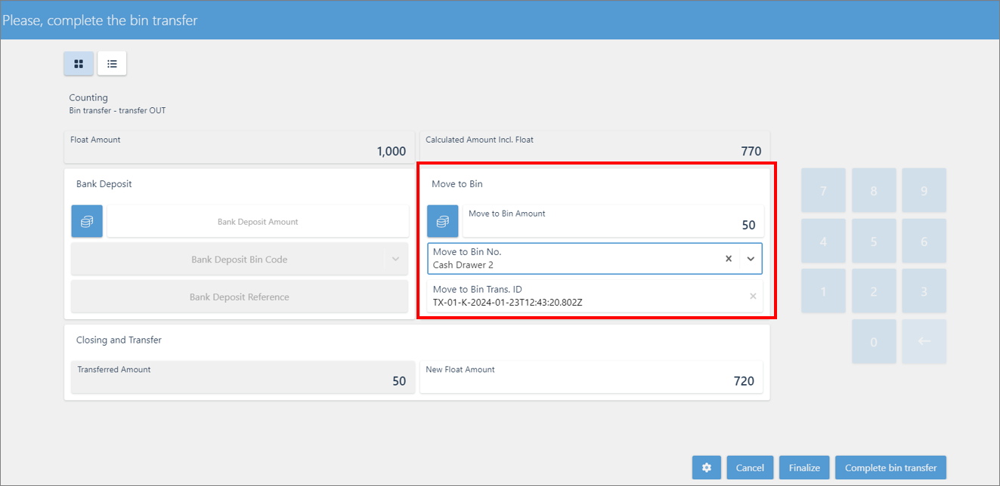
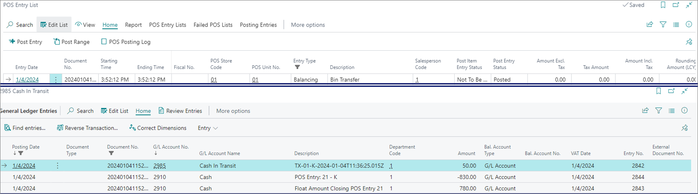

Transfer operation between two POS unit payment bins is performed in two steps:

1. Taking cash out of one POS unit payment bin
2. Receiving cash into the other POS unit payment bin

To complete the transfer, make sure the prerequisites are met, and follow the provided steps:

#### Prerequisites

- Create an [<ins>in-transit<ins>]() bin with the **Bin Type** set to a **SAFE**. 
  
  

- Create a cash in-transit account in the [<ins>Chart of Accounts<ins>](https://learn.microsoft.com/en-us/dynamics365/business-central/finance-setup-chart-accounts).
- Create a new [<ins>POS menu button<ins>]() on both source and target POS unit, and attach the **BIN_TRANSFER** action to them.       
  - The bin transfer button on the source POS should have the **Transfer Out** parameter attached to it.
  - The button on the target POS should have the **Transfer In** parameter attached to it.
- Link the cash in-transit account to the in-transit POS payment bin in the **POS Posting Setup**.

  

- Populate the options in the **Bin Transfer** panel of the **POS End of Day/Bin Tr. Profile Card**.

  

  In the **Transfer Out** section, you need to reference the **IN-TRANSIT** bin. and in the **Transfer Out** section, you need to enable **Require Journal for Trans. INs** to receive a journal from the source POS payment bin. When you receive the cash, you need to validate the transfer journal - there's no need to type in the details of the transfer received from the source POS unit bin.

## Procedure - Source POS

1. Open the POS which you're going to transfer the cash out of (the source POS unit). 
2. Press the button that has the **Transfer Out** parameter attached to it.     
   A new window is displayed.
3. Populate the details on the bin transfer screen - select the in-transit POS payment bin in the **Move to Bin No.** field. 

  

4. When you're done with setting this section up, **Finalize** and **Complete** the bin transfer.     
   A POS entry transaction line is created and posted. 
   The corresponding G/L entries are created.

   

   The cash is transferred from the POS unit payment bin/cash account into the in-transit payment bin/cash in-transit account. Follow the steps in the procedure below to receive the cash on the target POS unit.

## Procedure - Target POS

1. Open the POS which you are going to transfer the cash from. 
2. Press the button  that has the **Transfer In**.      
   A new window is displayed.
3. Press **Get Transfer Jnl. Line**, and select the available bin.
4. **Finalize** and **Complete** the bin transfer.       
  A POS entry transaction line is created and posted.       
  The corresponding G/L entries are created.

  

#### See also

- [<ins>Transfer cash with the POS Payment Bin Transfer Journal<ins>]()
- [<ins>Transfer and post stock-take worksheet<ins>]()