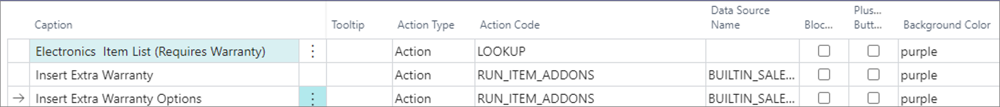

## Example: Item add-ons as a fixed accessory attached to the main item

If you wish to sell a cooker as a main item but want the cooker hood to be attached as a second item automatically, follow the steps below.

#### Prerequisites

- Create an item which is going to be the main item on the POS in this scenario.
- Create another item which will be a component of the main item.

#### Procedure

1.	Navigate to the **Item AddOn Card** in Business Central.

2.	Select the **Type**.   
    If you wish a line to be inserted immediately after the main item, add **Quantity** in this field.

3.	Insert the **Item No.** of the item that is attached as an add-on to the main item.    
    You can add more than one item if needed.
4.	Insert the **Variant Code** if a variant is going to be used as an item add-on on the POS.     
    If the item has a variant, and the field is left blank, you will be prompted to select the variant on doing the sale on the POS.

5.	Insert the **Description**.    
    The description is inherited from the **Item Card** of the item used as an item add-on.

6.	Input **1** as the **Quantity** of item add-ons that you wish to sell alongside the main item.

7.	Define if the item add-on is added **Per Unit** of the main item or not.    
    Each time you increase the main item quantity, the item add-on quantity is also increased according to the value provided in the **Quantity** field from the previous step.  

   

8.	Define whether the add-on **Quantity** you’ve provided will be always added to the cart regardless of the sale level with the **Fixed Quantity** option.

9.	Specify whether the item add-on is **Mandatory**.     
    If mandatory, the item add-on line can’t be deleted on the POS sale level. When you sell a main item, an accompanying item add-on will also be sold.
  
10.	Specify a **Unit Price** for the item add-on.    
    The unit price is taken from the add-on’s **Item Card**, but it’s possible to modify it. This price is used when inserting the line with the item add-on in the cart. 

11.	State whether the serial number will be copied in the **Copy Serial No.** field.    
    This field is relevant if tracking is performed with the item’s serial number.

12.	[<ins>Attach the Item add-on to the main item<ins>]().

## Example: Item add-ons priced as a percentage of the main item and presented as a list

In the example of an electronics shop, you may need to create a list of warranty schemes that can be sold alongside the main item. In this list, you can select more than one line and increase the quantity on a specific line. Additionally, instead of setting the price of the item add-on as a fixed price, you can calculate it as a percentage (%) of the main item’s price. 

#### Prerequisites

-	Create the main item and the item that will be used as the item add-on.  

#### Procedure in Business Central

1.	Navigate to the **Item AddOn Card** in Business Central.

2.	Select the **Type**.    
    If you wish a line to be inserted immediately after the main item, add **Quantity** in this field.

3.	Insert the **Item No.** of the item that is going to be attached as an item add-on.   

   

4.	Insert a **Variant Code** if a variant is going to be used as an item add-on on the POS.   

   

5.	Insert the **Description**.   
    The description is inherited from the **Item Card** of the item used as an item add-on.

6.	Don’t populate the **Quantity** of the item add-on as the salesperson needs to provide it during the sale. 

7.	Leave the **Per Unit** checkbox unticked as the salesperson needs to insert the quantity of item add-ons added to the line. 

8.	Leave the **Fixed Quantity** checkbox unticked, as there’s no fixed quantity attached.

9.	Leave the **Mandatory** checkbox unticked, as the salesperson can choose not to add any on the POS.

10.	Leave the **Unit Price** field blank, as the unit price is calculated as the percentage of the unit price of the main item.

11.	Insert **UnitPriceFromMaster** in the **Before Insert Function** field.    
    The price is based on the percentage of the main item price.

13.	State whether the serial number is going to be copied in the **Copy Serial No.** field.   
    This field is relevant if tracking is performed according to the item’s serial number.  

12.	Define the **Unit Price % from Master** in **Item AddOn Line Setup**.     
    You can navigate to the **Item AddOn Line Setup** by clicking **Manage** in the **Line Tab** and selecting the **Before Insert Setup** function.

  

13. [<ins>Attach the Item add-on to the main item<ins>]().

#### Procedure on the POS

On scanning the main item, a pop-up menu is displayed, and the salesperson needs to choose which scheme they need, and their selection is then inserted on POS lines.

  

## Example: Item add-ons as a list of options

You can create a list of warranty schemes that can be sold with the item. In this list, it will be possible to select only one option at a time, and the quantity is fixed. 

  

#### Prerequisites

-	Create the main item and the items that will be used as the item add-ons.

#### Procedure in Business Central

1.	Navigate to the **Item AddOn Card** in Business Central.

2.	Set the **Type** to **Select** to indicate that an item selection will be possible.

3.	Insert the **Description** to know what kind of options are going to be defined.

4.	Leave all other fields blank. 

5.	Click **Select Options** in the **Manage** tab to define the details of your scheme.      
    You can provide various options that the salesperson will be able to choose from on the POS.

6.	Insert the **Item No**.   
    Insert the item you want the system to insert as the item add-on. 

   

7.	Insert the **Variant Code**.   
    Specify which variant of the item that you are using as an add-on you wish to attach, if any.

   

8.	Insert the **Description**.   
    The description is inherited from the **Item Card** of the item used as the item add-on.

9.	Input **1** in **Fixed Quantity**.

10.	Specify a **Unit Price** for the item add-on.   
    The unit price is inherited from the **Item Card**, but it’s possible to change it.

11.	Specify the **Discount**.     
    Instead of modifying the **Unit Price**, you can assign a discount percentage for the price at this level.

12.	[<ins>Attach the Item add-on to the main item<ins>]().

#### Procedure on the POS

When you scan the main item, a pop-up menu is displayed, and the salesperson can choose which option they wish to use. The option is then inserted in the POS lines.

  

You can get more examples, use cases, and best practices in the [<ins>Item add-on general documentation<ins>]()

## Example: Item add-ons as a list of selections of ingredients and substitutes in a Burger menu

If a restaurant offers a burger menu to customers, you need to define a *Burger Menu* **Item Card** in the Business Central environment used by the restaurant. The price and cost of the menu needs to be specified, so you can get the margin in your accounting. In parallel, you need to have the burger menu ingredients created individually, as standalone items. If the price has already been accounted for in the burger menu, the ingredients need to have the price of 0 when sold as components of the menu. However, if you decide to sell them as extra add-ons, the extra addon price also needs to be defined. 

   

### Item add-ons in burger menus: selling burger menu instead of burger item

The burger menu consists of predefined components. You can also choose to add an option to upgrade some of the components (e.g. small fries into medium fries).

1. Create the following components for the burger menu as separate **Items**:
   - *Burger* 
   - *Small fries*
   - *Medium drink*
   - *Cheese*
   - *Tomato*
   - *Lettuce*
   - *Onions*
   - *Sauce*       
These are the elements you will use in the item add-on configuration. They will be applied for all burger types, and to different burger menus that the restaurant will sell:

  

   - Burger (Burger Menu Component) (60100)
   - Double Cheese Burger Menu (60101)
   - Bacon and Cheese Burger Menu (60102)
   - Double Bacon Cheese Burger Menu (60103)
   - Sriracha Deluxe Burger Menu (60104)
   - Veggie Burger Menu (60105)
   - Black Bean Veggie Burger Menu (60106)
   - Cauliflower Steak Burger Menu (60107)
   - Grilled Chicken Burger Menu (60108)
   - Spicy Chicken Burger Menu (60109)

2. Make sure you create the following burger menus on the POS:  

  

3. Create an item called **Burger** (a Burger Menu component) without a cost and a price that will be used as the item add-on component.      
   A line named **Burger** will be displayed on the POS, together with the details of other customer order components. 
4. Navigate to the **Item AddOn Card** for the **Burger Menu** to define its components.

      
  
  Only the **Burger (60100)** item is added to the lines. It is used to make the burger option visible on the POS when you sell items 60101 thru 60109. Thus, one **Burger** is a fixed quantity sold per a single unit of the **Burger Menu**, and that component is mandatory. 

5. For drinks, use the type **Select Option** instead of **Quantity**, as you wish to provide more than one option to the customers to choose from.
6. Expand **Select Options** and choose the logic that the menu has a **Medium Drink** component, then select Coke, Diet Coke or Sprite.    
7. Add the option to upgrade to **Large Drink** for an additional fee. 

  

   

  The following logic is used when defining item variants:

  

8. Make sure you set the quantity of 1 per unit, and make the quantity fixed.      
   In the case presented above, the unit price for a **Medium Drink** is 0, as it is already in the price of the **Burger Menu**, but the upgrade has an additional price of 2.00.

9. Use the same logic you've previously used for drinks when defining item add-on options for **Fries**.    

  

10. Use the same logic for cheese/tomato/lettuce/onions - add two options **Without** and **Extra**. You can do so via variant codes.    
  
  

  For **Without**, set -1 as quantity, so that it's clearly displayed that the quantity is negative, and that it needs to be decreased when preparing the burger menu. 

11. Define the sauce options customers can choose from. 

  

12. Once you have all components set in the **Item AddOn**, you need to attach it to the **Burger Menu** (item).      
    In the example of **60101 - Double Cheese Burger Menu**, which carries the cost and price for the menu, you will attach the item add-on to it in the **Item Card**.

    

13. Open the POS, and define the button for selling the **Double Cheese Burger Menu**.     
    
    

    When selecting the **Double Cheese Burger Menu** on the POS, you will see a pop-up window with various selections you've previously defined in Business Central. 

    

    

### Item add-ons as components to a burger: selling burger item instead of burger menu

This setup is done in a similar manner as the previous one, except there are only burger components included. Other add-ons and toppings are offered separately. The composition of the item add-on is simpler - it only contains the necessary ingredients to make the burger. Other items can be added later during the sale. 

  

## Example: Item add-on as standalone menu

There's a POS action **RUN_ITEM_ADDONS** that can be used to create a standalone button for item add-ons on the POS. In its parameters, you need to attach the add-on code, and run it. 

  

  

Since it is an item add-on, the condition is that there is an item on the sales line first, before you can use the button to access the menu on the POS. 

#### See also

- [Create item add-ons and attach them to main items]()
- [Set up item add-ons]()
