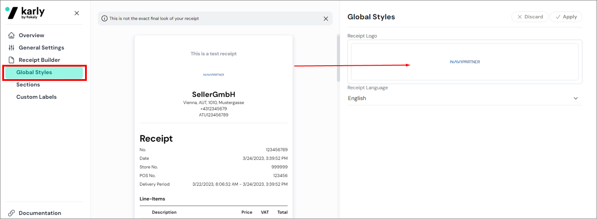

Digital receipts are an alternative to printed receipts that streamline the payment process, expedite receipt issuance, and offer a convenient way to manage warranties and returns.
 


To set up digital receipts, make sure the prerequisites are met, and follow the provided steps:

## Prerequisites in Fiskaly Dashboard

1. In the Fiskaly Dashboard sidebar, click **Settings**, followed by **API Keys**.
2. Click **Create API Key**.

## Procedure in Business Central

1. Click the  button, enter **Digital Receipt Setup**, and choose the related link.      
   The administrative section for setting up digital receipts is displayed.
2. Enable the feature by switching the **Enable** toggle on.     
   This activates the feature globally. 
3. Enter the **API Key** and **API Secret** in the indicated fields.       
   - API key uniquely identifies the connection to the Fiskaly API.
   - API secret is the confidential authentication code associated with the API key.
4. Click **Test API Credentials** in the ribbon to validate the API key and secret..     
   The **Credentials Test Success** toggle reflects the test result, and the **Last Credentials Test Time** field records the timestamp.

   

5. If the credentials pass validation, click **POS Receipt Profiles** in the ribbon.     
   Alternatively, you can find the **POS Receipt Profiles** with the Business Central's *Tell Me* feature.
6. Click **New**, and complete the [<ins>required fields<ins>]().
7. Open the **POS Unit List** administrative section, and find the POS unit you wish to set up. 
8. Open its **POS Unit Card**, and assign the newly created **POS Receipt Profile**.    
   This POS unit now supports the digital receipt functionality.

## Next steps

### (Optional) Add a logo to the digital receipt header

You can add a logo to digital receipts through the Fiskaly Dashboard:

1. In the **Fiskaly Dashboard** sidebar, click **Fiskaly Receipt**.     
   A new page is displayed.
2. Choose **Merchant Dashboard** from the available options.     
   From here, you can configure various settings for your receipts.
3. Access the **Global Styles** section, and click **Receipt Logo**.
4. Select the picture/logo for your digital receipt, and click **Apply**.     

   

### (Optional) Configure the PRINT_RECEIPT POS action

The [<ins>POS action<ins>]() **PRINT_RECEIPT** has two configurable parameters: 

  - **Print Physical Receipts** - When set to true, the associated action will be used for reprinting physical receipts. This parameter is set to true by default.
  - **Issue Digital Receipts** - When set to true, the associated action will be used for displaying the QR code of the selected POS sale again if it's been closed on accident. This parameter is set to false by default.

If you need help with configuring this POS action and its parameter, refer to the article on [<ins>Creating buttons in POS menus<ins>]().

### Issue digital receipts on the POS

1. Perform a [<ins>POS sale<ins>]().       
   After payment is accepted, a pop-up window displays a QR code.    
   

   

2. Scan the QR code to open a PDF link with a visualized digital receipt.     
   You can also find the QR code if you open the **POS Entry Card**, and locate the factbox section, where the **POS Sales Digital Receipts** line is located. If you click the number on the **POS Sales Digital Receipts** line, the corresponding digital receipts linked to that POS entry are displayed.

<iframe width="560" height="315" src="https://www.youtube.com/embed/Z4e4GaR_82U?si=P4JQ4i0dJ1xydrBo" title="YouTube video player" frameborder="0" allow="accelerometer; autoplay; clipboard-write; encrypted-media; gyroscope; picture-in-picture; web-share" allowfullscreen></iframe>

#### See also

- [<ins>Digital receipt POS actions<ins>]()