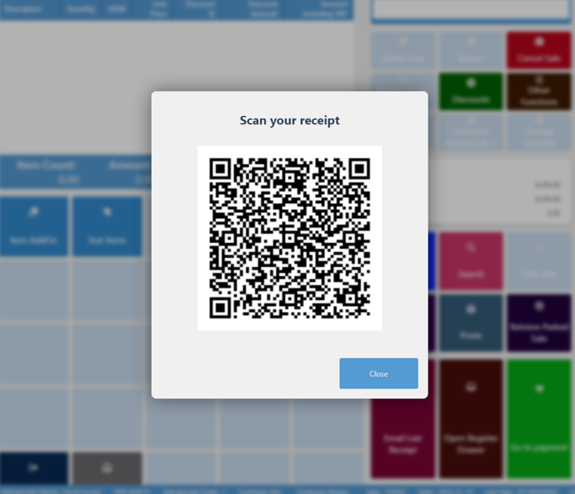

Digital receipts are a virtual replacement for printed receipts, which reduce the length of the payment path, speed up the process of issuing receipts, and provide a more convenient assurance for warranty or return purposes. 
 


To set up digital receipts, make sure the prerequisites are met, and follow the provided steps:

## Prerequisites in Fiskaly Dashboard

1. Click **Settings**, followed by **API Keys** in the Fiskaly Dashboard sidebar.
2. Click **Create API Key**.

## Procedure in Business Central

1. Click the  button, enter **Digital Receipt Setup**, and choose the related link.      
   The administrative section for setting up digital receipts is displayed.
2. Provide the **API Key** and **API Secret** in the indicated fields.       
   - API key is a unique identifier used for establishing connection with the Fiskaly API.
   - API secret denotes the confidential authentication code paired with your API key. 
3. Click **Test API Credentials** in the ribbon.     
   This action is used for validating the provided API key and secret, and ensuring the effectiveness of your Fiskaly API credentials. You will not be able to turn on the digital receipt functionality unless the credentials are successfully tested.     
   The outcome is reflected in the state of the **Credentials Test Success** toggle switch, and the date/time of the last test is recorded in the **Last Credentials Test Time** field.
4. If the credentials are tested and approved, click **POS Receipt Profiles** action in the ribbon.     
   Alternatively, you can find the **POS Receipt Profiles** with the Business Central's *Tell Me* feature.
5. Click **New**, and populate the [<ins>available fields and options<ins>]().
6. Open the **POS Unit List** administrative section, and find the POS unit you wish to set up. 
7. Open its **POS Unit Card**, and set the **POS Receipt Profile** to the one you've created in the previous steps.    
   This POS unit now supports the digital receipt functionality.

## Next steps

### Issue digital receipts on the POS

1. Perform a [<ins>POS sale<ins>]().       
   After a regular POS sale has been completed, and the payment accepted, a pop-up window that contains a QR code is displayed.
   
2. Scan the QR code to open a PDF link with a visualized digital receipt.     
   You can also find the QR code if you open the **POS Entry Card**, and locate the factbox section, where the **POS Sales Digital Receipts** line is located. If you click the number on the **POS Sales Digital Receipts** line, the corresponding digital receipts linked to that POS entry are displayed.