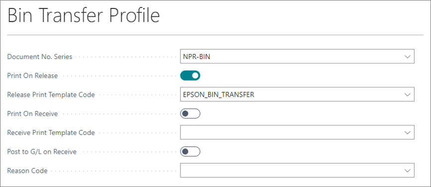
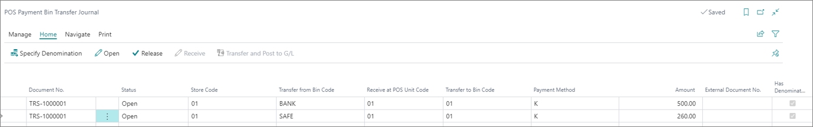
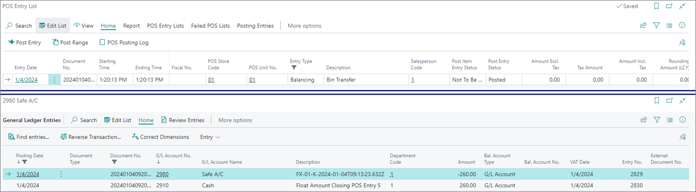

A transfer journal is prepared in the back office, reflecting from which source POS payment bin the cash is taken, and to which target POS payment bin will the cash is sent. The transfer process itself is done in two steps:

1. The journal is released from the back office.      
   The **POS Payment Bin Transfer Journal** needs to be released so that the transferred cash becomes available on the receiving end. 
2. The journal is accepted on the POS. 

To create a POS Payment Bin Transfer Journal, and gain the ability to initiate cash transfer from the back office, make sure the prerequisites are met, and follow the provided steps:

#### Prerequisites

Before performing these transfers, you need to set up the rules that will govern them in the **Bin Transfer Profile** in Business Central. 

- Create a new **Bin Transfer Profile**, and enable the desired options.
- If you wish to print transfer slips as paper trail when the supervisor takes the cash to the POS, you need to create the adequate print templates, and attach them to the actions in the **Bin Transfer Profile**.

  

#### Procedure

1. Click the  button, enter **POS Payment Bin Transfer Journal**, and open the related link.       
2. Populate the details for the POS payment bin transfer journal from there:

| Field Name      | Description |
| ----------- | ----------- |
| **Document No.** | Specifies the number of the document. It can be inserted manually or retrieved from the number series defined in the **Bin Transfer Profile**. | 
| **Status** | Specifies the status of the POS payment bin transfer journal. |
| **Store Code** | Specifies which store is targeted by the transfer. | 
| **Transfer from Bin Code** | Specifies the code of the POS unit which is receiving the cash. | 
| **Received at POS Unit Code** | Specifies the code of the payment bin to which the cash is transferred . | 
| **Payment Method** | Specifies the payment method of the transferred resources. |
| **Amount** | Specifies the transferred amount. | 
| **External Document No.** | Specifies an optional additional reference number. | 
| **Has Denominations** | Specifies denominations used for sorting the transferred amount on the **Home** tab of the page. | 

   

3. Release the journal lines one by one to make them available on the POS unit transfer screen.

## Next steps - Receive cash from the POS Payment Bin Transfer Journal

To accept a POS payment bin transfer journal entries on POS, make sure the prerequisites are met, and follow the provided steps:

#### Prerequisites

1. Create a new [<ins>POS menu button<ins>]() and attach the **BIN_TRANSFER** action to it.     
   The action should be named in such a way that it's clear the cash is received from that POS, e.g. *Transfer to POS unit*.
2. Configure the **POS Parameter Values**, and set the **Transfer Direction** to **Transfer In**.
3. (Optional) If you're going to print a receipt, also configure the following [<ins>parameters<ins>]() on the action:

   - Set the **Print Transfer** parameter to **true**. 
   - Define a [<ins>print template<ins>]() for it. 
   - Configure the print template in the **Report Selection - Retail** administrative section in Business Central.

4. Configure the [<ins>**POS Posting Setup**<ins>](), so that the proper accounting entries are recorded while the cash is transferred. 

   

#### Procedure

1. Open the POS.
2. Press the previously created button that has the **BIN TRANSFER** action with the **Transfer In** parameter attached.     
   A pop-up window is displayed, and you are prompted to complete the bin transfer.
3. Press **Get Transfer Jnl. Line**.      
   You are presented with the transfer source and the journal lines that are available for transfer to your POS unit.
4. Select the line you wish.      
   The **Move from Bin** box is displayed, with additional information on the selected line. 
5. Press **Finalize**, and **Complete bin transfer** after you've checked the validity of presented information.     
   A POS entry line is created and posted. The corresponding G/L entries are also created.

   

#### See also

- [<ins>Transfer and post stock-take worksheet<ins>]()
- [<ins>Transfer cash between POS units<ins>]()