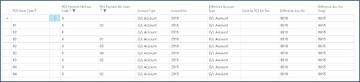
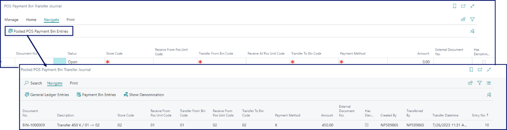
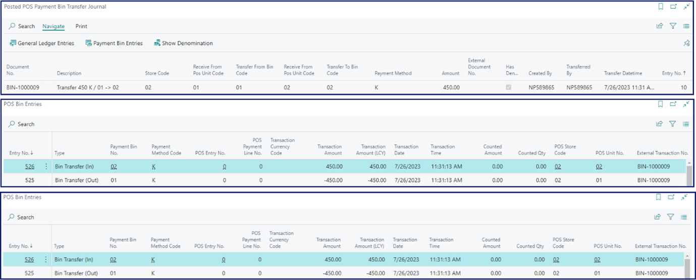

The transfer from one POS unit into another one is done using the **POS Payment Bin Transfer Journal**. Follow the provided steps to perform this kind of transfer.

## Procedure in Business Central

1. Click the  button, enter **POS Posting Setup**, and choose the related link. 

  

  In the provided example, there are four POS payment bins. The payment bin for the **POS Store 02** uses a different account when compared to other bins for the **POS Payment Method K** (cash). In the setup, the first line indicates that all cash goes into the account 2910, but if you pay attention to the third line, there's an exception for the **POS Store 02**, in which the cash goes into the account 2915. This needs to be taken into consideration when transferring cash between two different bins. 

  The setup will be carried out according to the following flow:

  - On receiving cash as payment to sales on POS in POS Stores 01, 03 & 04, the G/L account 2910 will be debited.
  - On receiving cash as payment to sales on POS in POS Store 02, the G/L account 2915 will be debited.
  - To transfer from for example POS Store 01 to POS Payment BIN 02, you will need to set the debit account as 2915 as per the 2nd line. And to transfer from POS Store 2 to POS Payment BIN 01, you will need to set the debit account to 2910 as per the 4th line. The same type of setup will be done for transfers involving the POS Store 02 as it is using a different account.
  - However, if two POS Stores are using the same account, like POS store 01 & POS store 03, you don't need to perform any specific setup, as it will use the setup from the 1st line. It will debit & credit the same G/L account. 

2. Create a [<ins>new POS menu button<ins>]().      
   The **POS Action** attached to this button should be **BIN_TRANSFER**.
3. Open the **Parameters** for the **BIN_TRANSFER** action, and select **Transfer In** in the **Transfer Direction** entry.     
   By doing so, you will be able to access the **POS Payment Bin Transfer Journal** when it is created in the back office. 
4. Navigate to the **POS Payment Bin Transfer Journal** or go to the **POS Payment Bins**, and open the **POS Payment Bin Transfer Journal** from there. 
5. Provide the following details in the exact sequence indicated in the table: 

| Field Name      | Description |
| ----------- | ----------- |
| **Store Code** | Specify for which store the transfer is being done. |
| **Receive At POS Unit Code** | Select to which POS unit the cash is going to be transferred. | 
| **Transfer To Bin Code** | Provide the code of the bin that is receiving the cash. |
| **Received From POS Unit Code** | Provide the code of the POS unit from which the cash is coming. |
| **Transfer from Bin Code** | Provide the code of the bin from which the cash is being taken. In this case, this is the bin attached to the issuing POS unit. |
| **Payment Method** | Provide the payment method to be transferred. |
| **Amount** | Insert the amount to be transferred. |
| **External Document No.** | Specify an additional reference document number if needed. |
| **Has Denominations** | You can specify the denominations used for sorting the amount that is transferred. | 

7. When you're satisfied with the journal preparation, **Release** it.      
   If it's not released, you will not be able to receive the transferred cash.       
   The status changes from **Open** to **Released** in the journal.

## Procedure on the POS

1. Open the POS. 
2. Click the previously created button with the **BIN_TRANSFER** attached.    
   A line for the journal is displayed.
3. Check which denominations you wish to receive the cash in. 

     

You can view the posted entry by clicking **Posted POS Payment Bin Entries** in **POS Payment Bin Transfer Journal** in Business Central.

Then, from **Posted POS Payment Bin Entries** you can navigate further to the **POS Bin Entries** and the **G/L Entries**.

