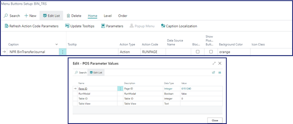
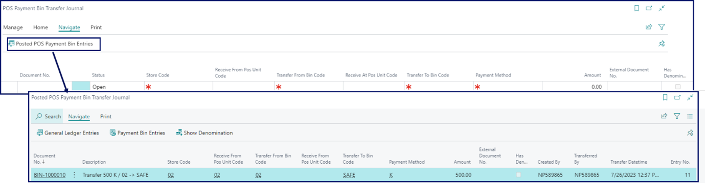
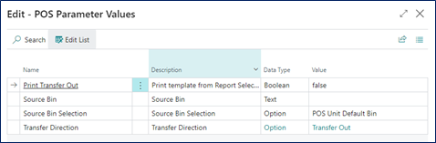
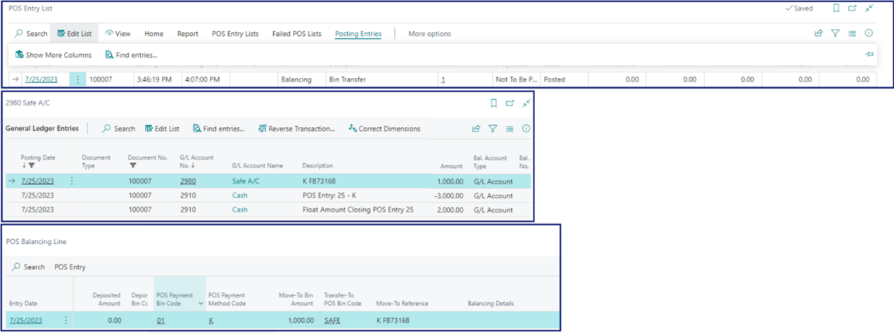

Given the cash is stored in the POS unit, the transfer process is initiated from it, as well, whereby the supervisor takes the cash out of the register, and transfers it into the safe. You can use the **POS Payment Bin Transfer Journal** to perform the transaction. There are some prerequisites that need to be set up in Business Central however.

To transfer cash from a POS unit to a safe, follow the provided steps:

## Prerequisite in Business Central

- Create a [new POS menu button]().      
  The **POS Action** attached to this button should be **RUNPAGE**, with the page **6151240** selected in the **Page ID** entry of the action's **Parameter Values**.

   

## Procedure on POS

1. Open the POS.
2. Click the previously created button that has the **RUNPAGE** action attached to it.      
   The POS Payment Bin Transfer Journal page is displayed, and you can fill in the required details.

| Field Name      | Description |
| ----------- | ----------- |
| **Store Code** | Specifies from which store the transfer is performed. |
| **Received From POS Unit Coe** | Provide the code of the POS unit from which the cash is taken out. |
| **Transfer From Bin Code** | Provide the code of the payment bin from which the cash is taken out. |
| **Receive at POS Unit Code** | Leave this field blank, as you aren't sending money to other POS units in this scenario. |
| **Transfer to Bin Code** | Set the bin code to **SAFE**. | 
| **Payment Method** | Specifies the method of payment that will be transferred. | 
| **Amount** | Specify the amount that will be transferred. | 
| **External Document No.** |  You can provide an additional reference number, if needed. | 
| **Has Denominations** | You can specify the denominations used for sorting the amount that is transferred. | 

3. **Release** the journal. 

## Procedure in Business Central

1. Click the  button, enter **POS Payment Bin Transfer Journal**, and choose the related link or go to the **POS Payment Bins** page, and open the **POS Payment Bin Transfer Journal** from there.    
   You can see the journal that awaits processing with the **Released** status. 
2. Verify the cash received to make sure the denominations and the total amount are in accordance with the **POS Payment Bin Transfer Journal**.
3. When you accept the cash and acknowledge it, click **Receive**.     
   The journal is posted.       

You can view the posted entry by clicking **Posted POS Payment Bin Entries** in **POS Payment Bin Transfer Journal** in Business Central.

You can also navigate from the **Posted POS Payment Bin Entries** further to the **POS Bin Entries** and the **G/L Entries**.

## Alternative process for transferring cash from a POS unit to a safe

It is also possible to create a POS menu button with a different action attached, to achieve the same result. 

## Prerequisite in Business Central

- Use the **BIN_TRANSFER** action when creating a button, instead of **RUNPAGE**. Just make sure that the **Transfer Direction** POS parameter is set to **Transfer Out**. This way, you will receive an option to transfer the cash out to either a bank or a safe on the POS.

  

## Procedure on POS

1. Open the POS. 
2. Click the POS menu button you've previously defined.   
   You will be prompted to select the denominations that will be moved.
3. Input the amount that you wish to transfer to the safe, and proceed with the transfer.     
   When the transfer is completed, you will be prompted to post the transaction.

You can see a new POS entry in the **POS Entry List** in Business Central, from which you can navigate further to the **Balancing Lines** and the **G/L Entries**.

