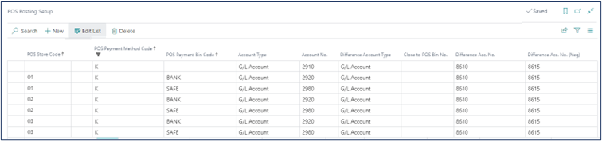
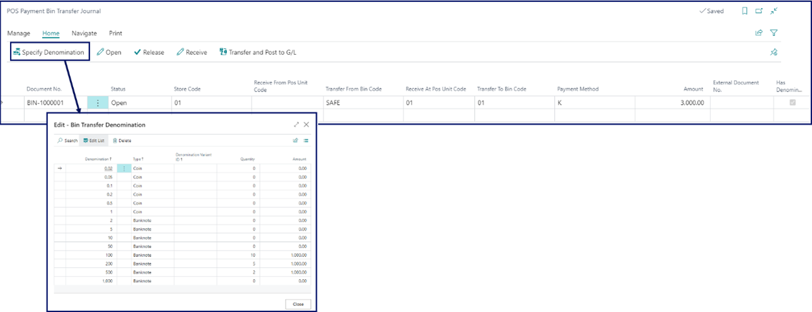
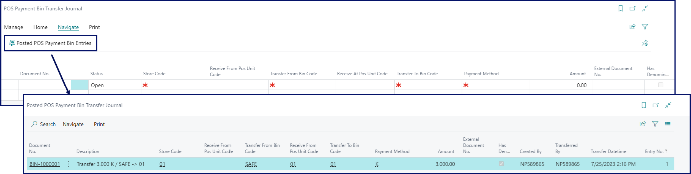
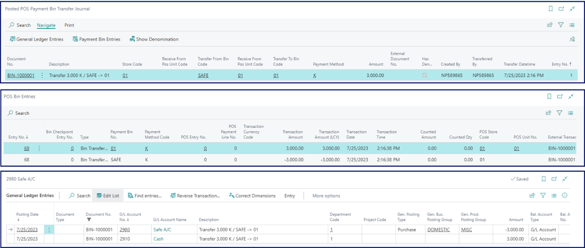

The process of transferring cash from a safe to a POS unit is initiated from Business Central, where the transfer is prepared, after which it is continued on the POS unit. After the transfer is completed, the cash is received by the POS unit. Follow the provided steps to complete the transfer:

## Procedure in Business Central

1. Click the  button, enter **POS Posting Setup**, and choose the related link.     
2. Provide the **G/L Account** required for the transfer between the **POS Store** and a **SAFE**.

  

3. Navigate to the **POS Menus** administrative section, and create a [new POS menu button]().      
   The **POS Action** attached to this button should be **BIN_TRANSFER**.
4. Open the **Parameters** for the **BIN_TRANSFER** action, and select **Transfer In** in the **Transfer Direction** entry.     
   By doing so, you will be able to access the **POS Payment Bin Transfer Journal** when it is created in the back office. 
5. To prepare the transfer journal, navigate to the **POS Payment Bin Transfer Journal** administrative section or to the **POS Payment Bins** page, and open the **POS Payment Bin Transfer Journal** from there.
6. Populate the following fields: 
   
| Field Name      | Description |
| ----------- | ----------- |
| **Store Code** | Specifies for which store the transfer is performed. |
| **Received From POS Unit Coe** | Leave this field blank as the cash isn't coming from a POS unit. |
| **Transfer From Bin Code** | Specifies from which bin the cash was taken out. In this case, the code you provide should be **SAFE**, if you are transferring from a safe to a POS unit. |
| **Payment Method** | Specifies the method of payment that will be transferred. |
| **Amount** | Specifies the amount that is transferred. |
| **External Document No.** | You can specify an additional reference number, if needed. |
| **Has Denominations** | You can specify the denominations used for sorting the amount that is transferred. |

  

7. Once you're satisfied with the journal preparation, you need to release it.      
   If the journal isn't released from the back office, it will not be available on the POS, and you will not be able to complete the transfer.     
   When the journal is released, its status will be changed accordingly (to **Released**). 

## Procedure on the POS

1. Open the POS.
2. Click the previously created button that has the **BIN_TRANSFER** action attached to it.      
   A line from the transfer journal is displayed.
3. Select in which denominations the cash is going to be received in. 

   

4. When you accept the cash, click **Receive**.     
   The journal is posted as a result.      
   
You can view the posted entry by clicking **Posted POS Payment Bin Entries** in **POS Payment Bin Transfer Journal** in Business Central.

You can also navigate from the **Posted POS Payment Bin Entries** further to the **POS Bin Entries** and the **G/L Entries**.

