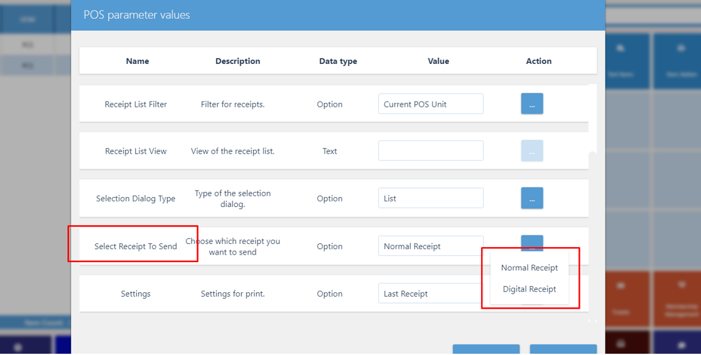

The following POS actions are associated with digital receipts, and can be configured to make the process of issuing digital receipts more flexible:



## SEND_RECEIPT - Sending digital receipts via email

The **SEND_RECEIPT** POS action has an option **Select Receipt to Send** that you can use to specify whether standard receipts or digital receipts will be sent after the sale. Digital receipts will be sent automatically only if they haven't previously been issued. Otherwise, they will not be generated twice - the first one that was issued will be used when requested the second time. 

  

## SEND_SMS_RECEIPT - Sending digital receipts via SMS

You can send digital receipts via SMS, provided that you've previously created and selected an SMS template for this action. After the phone number is provided, a message with the content corresponding to the template will be sent. A digital receipt will be issued automatically when the action ends, only if one hasn't been issued before. Otherwise, the first one that was issued will be used when requested the second time. 

## PRINT_RECEIPT - Printing receipt

Customers can print digital receipts on running the **PRINT_RECEIPT** POS action with the action parameter **Issue Digital Receipts** enabled. It will issue a digital receipt automatically after the action ends, only if one hasn't previously been issued. Otherwise, the first one that was issued will be used when requested the second time.
