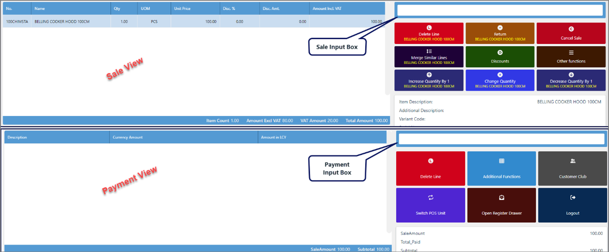

The POS input box profiles are used for setting up the type of data that will be recognized in the POS unit input boxes. There are two types of POS input box profiles, one is used in the **Sale View**, and the other one in the **Payment View** of the POS unit. 

Therefore, it is necessary to define two separate profiles for each view when configuring the **POS Unit Card**. There is a set of triggers or events that perform the desired actions in two different input boxes on the POS when enabled. 

1. Click the   button, enter **POS Input Box Setups**, and choose the related link.      
   A list of all existing POS input box setups is displayed. You can modify them accordingly.
2. Click **New**.
3. Insert a unique **Code** for the input box setup method, and a **Description** in the designated fields. 
4. Select a **POS View**.   
   This selection determines whether it will be used in the sale POS box or the payment POS box.
5. Move onto setting up the **POS Input Box Setup Events**.     
   The events trigger actions for inserting data in the **POS Input Box**. Every event needs to be enabled before it can be used on the POS. The following options are available: 

| Code     | Module name | Description | Action code | Action description | POS view | Event codeunit | 
| ----------- | ----------- | ----------- | ----------- | ----------- | ----------- | ----------- |
| **BOARDING_PASS** | Tax Free | Boarding Pass | BOARDINGPASS | a POS action for scanning a boarding pass | Sale | 6150837 |
| **BOARDINGPASS** | Tax Free | Boarding Pass | BOARDINGPASS | a POS action for scanning a boarding pass | Sale | 6150837 |
| **CUSTOMERNAME** | Customer | Customer Name | CUSTOMER_SELECT | a POS action for attaching or removing customers from a POS sale | Sale | 6150865 |
| **CUSTOMERNO** | Customer | Customer No. | CUSTOMER_SELECT | a POS action for attaching or removing customers from a POS sale | Sale | 6150865 |
| **DISCOUNT_COUPON** | Discount Coupon | Reference No. | SCAN_COUPON | a POS action that handles scanning discount coupons | Sale | 6151590 |
| **EXCHLABEL** | Exchange Label | Barcode | EXCHANGELABEL | a POS action for handling exchange labels | Sale | 6150830 |
| **GLOBAL_EXCHANGE** | Global Exchange | Handles return of the global exchange label | CROSS_REF_RETURN | a POS action for returning items based on their global cross reference numbers | Sale | 6151169 |
| **INPUTBOX_JSON_ACTION** | JSON Action Orchestration | JSON payload action | INPUTBOX_JSON | a POS action for handling JSON sent to the input box | Sale | 6150947 | 
| **ITEM_UNIT_PRICE** | Item | 