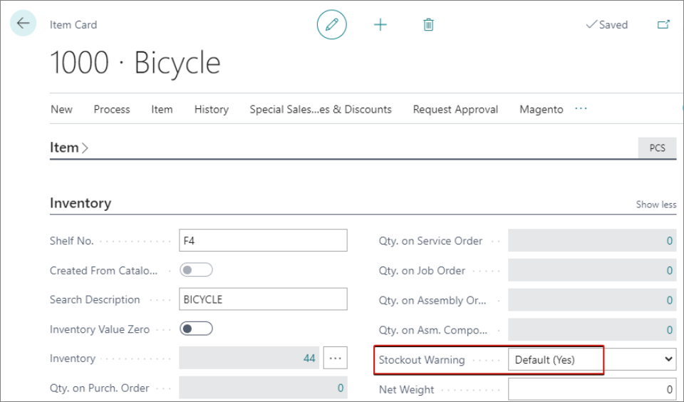

The POS Inventory Profile is used for configuring stockout warnings on the POS. To create a POS inventory profile, follow the provided steps:

1. Click the  button, enter **POS Inventory Profiles**, and choose the related link.
2. Create **New**.
3. Insert a **Code** and a **Description**. 
4. Tick the **Stockout Warning** checkbox if you wish the salesperson to be warned when a sales line brings the inventory level below 0.     
    If an attempt is made to accept payment towards the end of the POS sale, a confirmation message is displayed to notify the salesperson that the item stock has been depleted. You can also check the availability of these items in other locations. 



## Additional setup - Stockout warning

You can modify the default behavior of the stockout warning functionality in the **Sales & Receivables Setup** administrative section. If the **Stockout Warning** toggle switch is enabled, the warning is displayed whenever the stock level of any item in the system has been depleted.

It is also possible to change the behavior of stockout warnings on specific items only, in their respective **Item Cards**.

Additionally, each user can turn off warnings for low item availability on the **My Notifications** page in Business Central. This does not disable the **Availability Check Details** confirmation message that is displayed on an attempt to accept the purchase if the required quantity of items included in the sale is insufficient.

#### See also

- [<ins>POS profile overview<ins>]()