## Selling items on POS in local currency 

When items are sold on the POS, the transaction is recorded in the corresponding POS Entries. When you post the POS Entry, both the accounting entries and the inventory entries are updated.  

The General Ledger Entries for this example are provided in the screenshot below:

#### Results:

- Debit Cash for the receipt, i.e., the amount paid by the customer that includes both the full amount to be paid and the change.
- Credit Cash for the change that is given back to the customer.
- Credit Sales Revenue for the net sales.
- Credit Sales VAT for the vat portion of the sales.

## Selling items on POS in foreign currency 

You can perform transactions in foreign currencies on the POS. The selling rate of exchange is set up in the **POS Payment Method** card. It is a predefined selling rate determined by the management.



If the **Fixed Rate** is higher than the **Bank Rate**, the purchases performed in euros will be lower as demonstrated in the following screenshots:

If you set the **Fixed Rate** to be lower than the **Bank Rate**, the purchases in euros will be higher, as demonstrated in the following screenshots:

#### Results

- Debit Cash for the receipt in LCY equivalent.
- Credit Cash for the change given back to the customer.
- Credit Sales Revenue for the net sales.
- Credit Sales VAT for the VAT portion of the sales.

If you set the POS Posting Setup for euros with the **Bank Account** type instead of the **General Ledger Account** type, when the payment is received in euros, it is transferred to a bank account as EURO, and to the attached **General Ledger Account** in its LCY equivalent. 

## Counting cash in a single currency

When the transferring to a bank is done as a part of balancing, you can use a **Bank Account** instead of a **General Ledger Account**. The POS Posting setup works as presented in the provided screenshot:

## Counting cash on POS

#### Results

- Debit Cash for the closing balance.
- Debit Bank for the transfer into the Bank.
- Debit Safe for the transfer into the Safe.
- Debit Cash Discrepancies for the difference in counting.
- Credit Cash for the opening balance.

## Counting cash in foreign currencies

The content of **Counting** and **Balancing** pages is expressed in multicurrency, so whenever the count in a foreign currency needs to be performed, you can execute it in your own currency and denominators without needing to calculate or convert it into the equivalent local currency.

#### Posting setup

#### Counting foreign currency on POS

#### Results

- Debit Cash for the closing balance in the LCY equivalent.
- Debit Bank for the transfer into a Bank in FC.
- Debit Safe for the transfer into a Safe in the LCY equivalent.
- Debit Cash Discrepancies for the difference in counting in the LCY equivalent.
- Credit Cash for the opening balance in the LCY equivalent.



## Selling items on POS with discount

When dealing with discounts, there's a set in **Sales & Receivables Setup** that you need to activate if you wish to compute the discount separately from the sale amount. Otherwise, the discounted amount will be deducted from the sale amount automatically, and you will need to define the account for the discount in the **General Posting Setup**.

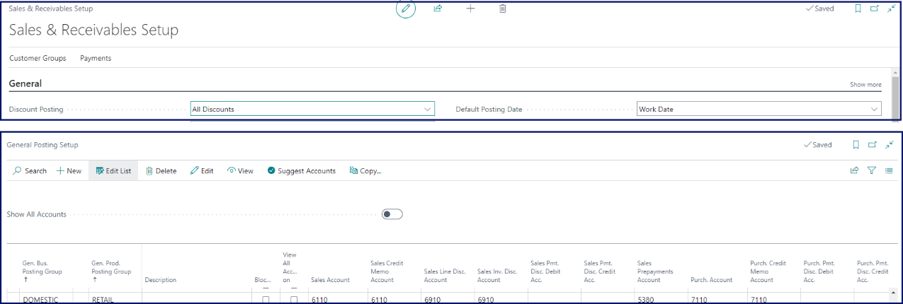

When you sell several items on the POS, the transaction is recorded on the **POS Entry** and the accounting entries for sales are updated, as well as the corresponding VAT accounts. 

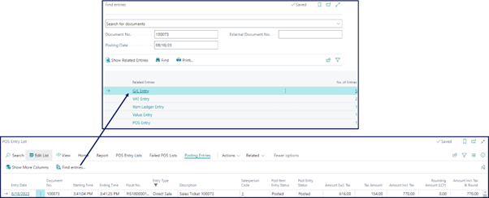

#### Results

- Debit Cash for the money receipt
- Debit Discount for discount given to customer
- Debit Sales VAT for the vat portion of the sales.
- Credit Sales Revenue for the net sales
- Credit Sales VAT for the vat portion of the sales.

## Payment with credit cards on POS

It is common to use a bank account when recording payment with credit cards, so that the money is received from the credit card company via a bank account. This approach is beneficial for reconciliation.

There are two major factors to consider when performing posting setup for the credit card payment method:

- how does the credit card company send the reimbursement into your bank account?
- is it consolidated per terminal on each end-of-day process?

### Receiving credit card transactions per transaction into the bank

If you're directly interacting with the card terminal during the end-of-day process, you can request the automatic count. If, however, you're not directly interacting with the terminal, you can perform a manual count by comparing the card terminal end-of-day ticket from your POS unit with the summary printout from your terminal.

You can also compress the entries, and request a double entry when performing automatic count during the balancing at the end of the day. This approach lets you keep the trace of details in an intermediary account, which is offset by the end-of-day process. The compressed amount is then inserted into the main account or the bank.



To make this setup fully functional, you also need to consider the following elements, and apply the necessary modifications:

- **POS Payment Method Card**

  In the **POS Payment Method Card**, you can specify that the received resources are counted virtually (automatic) at the end-of-day process, without the active involvement of the salesperson by setting the **Include in Counting** option to **Virtual**, and selecting the **Bin for Virtual Count** that you wish to use for this purpose.

  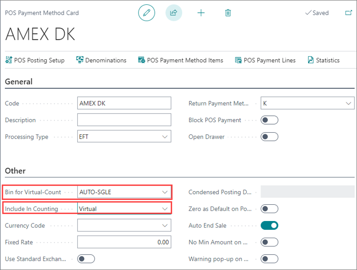

  If you don't already have a designated POS payment bin, you need to create one. 

- **POS Payment Bin**
  
  When creating a bin for the virtual count, you can give it any code/description, and enable an option to suppress the double entries created during the EOD process.

  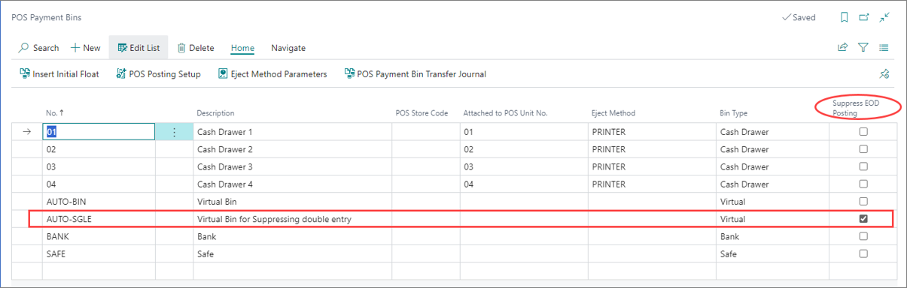

- **POS Posting Setup**

  If you are sending the payment from all your stores to one bank, you can perform a general setup for the bank account. Otherwise, you need to set up each store individually. 

  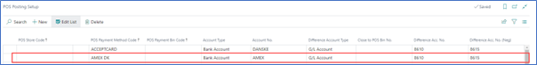

- **Bank and G/L postings**

  When you receive a payment via a credit card on the POS, an entry will be posted in your bank account per each transaction (one line per one transaction).

  **Bank Ledger Entries for the transactions**

  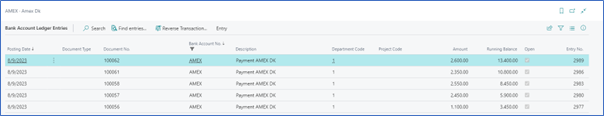

  **Corresponding G/L Entries for the transactions**

  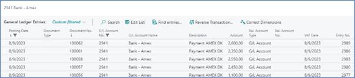

### Receiving the credit card transactions compressed per EOD of the TERMINAL

The other situation that you need to take into account is the scenario in which the credit card companies send the payment in a consolidated form, as per the EOD summary from their terminal.

Here again, as you are directly interacting with the card terminal, you can let the EOD process from the POS do an automatic count of the credit card transactions without any manual input from your end. The data is compressed automatically. 

If you wish to keep a record of the details in case of a dispute, and you need to reconcile your figures, you can use an intermediary account to store all details. On EOD, the balance is brought to zero and the other side of the double entry is added to the main account in compressed form. Hence the intermediary account will be zeroized, and there will be no duplicates of your figures in the accounts.

The following elements need to be configured in this scenario:

- **Chart of Accounts**   

  You need to create a G/L account in the balance sheet range to be used as an intermediary account.

- **POS Payment Method Card**

  You need to specify that the payment method is counted virtually (automatically) during the end-of-day process, without any input from the salesperson. To do so, set the **Include in Counting** option to **Virtual**, and select the **Bin for Virtual Count** that you wish to use for this purpose.

   If you don't already have a designated POS payment bin, you need to create one. 

- **POS Payment Bin**

  As you do need the data to be compressed, you need to create a separate bin for the virtual count. The one that you've created before has been tasked to suppress the double entries done by the EOD process. In this scenario, you need the system to do the double entry.

    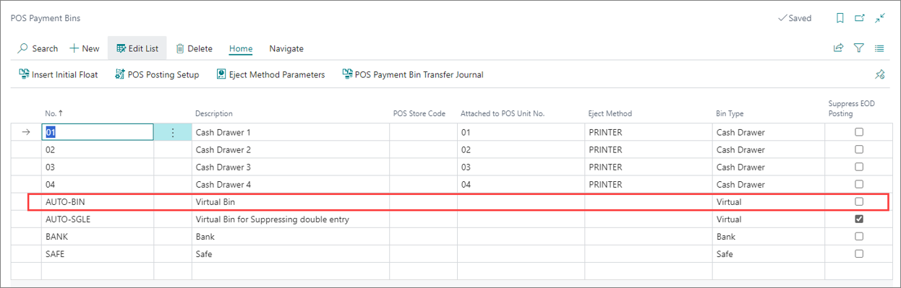

- **POS Posting Setup**

  When you're receiving the payment on the POS, the individual entry is posted to an intermediary account (one line per one transaction). Then, on performing the EOD, you need an additional system to transfer the amount (in a compressed format) into the real bank account, per store as each store may have their own bank account. 

    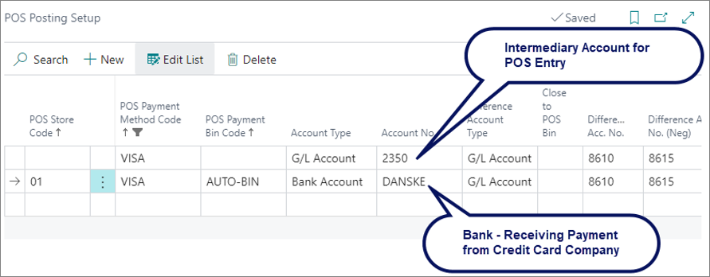

#### Bank & G/L postings

When you receive payment by credit card for each transaction on POS,an entry is posted in your intermediary account per each received payment. These entries will be in details. 

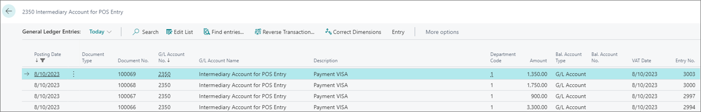

During the balancing process, the contra entry is created in a compressed format to bring the balance of the intermediary account to zero, and insert the other side of the double entry in the target G/L account:

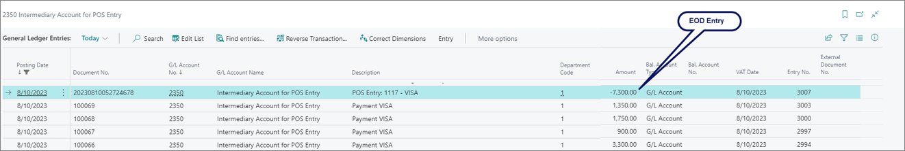

