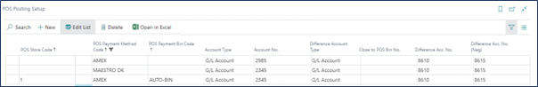

It is possible to perform certain configurations so that virtual counting can be performed automatically during the end-of-day process (balancing). Virtual-Count transfers the detailed transaction lines from the source account into the target account in a compressed format with the use of the **AUTO-BIN** payment bin code.  



In the provided example, the target account **2345** has been set for the **AMEX** payment method when using the virtual bin on the automatic counting during the balancing process. Consequently, when accepting the **AMEX** credit card on a POS unit, the transactions are moved into details on the account **2985**. When the balancing is performed, the account **2985** is credited, and the target account **2345** is debited with a single compressed entry, which is the sum of all transactions.

However, for **MAESTRO DK** the target account hasn't been defined, so the transactions are moved into the details on the account **2345**, and during balancing, the account **2345** is credited and debited, with a single compressed entry that is the sum of all transactions.

#### See also

- [<ins>Posting priority rule<ins>]()
- [<ins>Posting setup<ins>]()
- [<ins>Set up posting compression<ins>]()