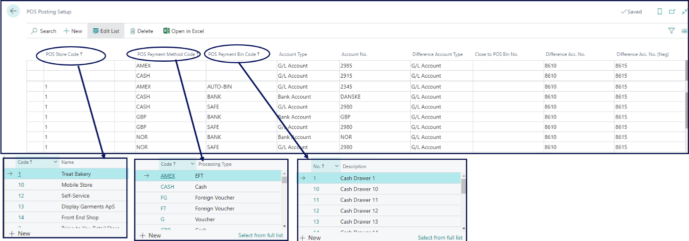
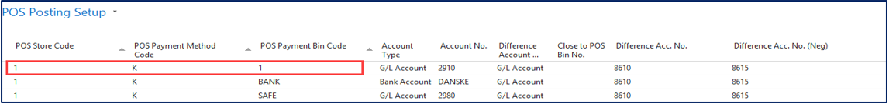
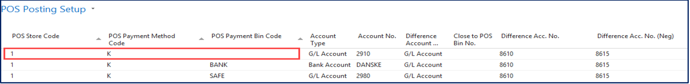
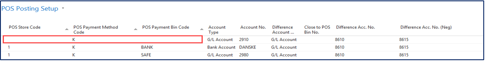

The purpose of the posting setup is to post a payment from the POS to a specific G/L account or a bank account. When doing this, the following elements need to be considered as well as their respective combinations:

- **POS Store Code**
- **POS Payment Method Code**
- **POS Payment Bin Code**

The combinations are prioritized in the following order:

1. Full Match with the **POS Store Code**, **POS Payment Method Code**, and the **POS Payment Bin Code**

   Full match method is required if different accounts are used for each store and POS unit. This is the most precise method out of the three, which is why it has a priority over them.

    

2. Two constraints with the **POS Store Code** and the **POS Payment Method Code**

   If each store has a different account for the **POS Payment Method**, you need to set a combination of the **POS Store Code** and the **POS Payment Method Code**. 

   

3. One constraint with the **POS Payment Method Code**

   If all POS stores use the same G/L account for posting, you only need to set the **POS Payment Method Code**.

    

## Limitations

The following combinations are not supported by our solution:

- Two constraints with the **POS Payment Method Code** and the **POS Payment Bin Code**
- Two constraints with the **POS Store Code** and the **POS Payment Bin Code**

#### See also

- [<ins>POS Posting profile - examples of usage<ins>]()
- [<ins>Posting compression (EOD)<ins>]()