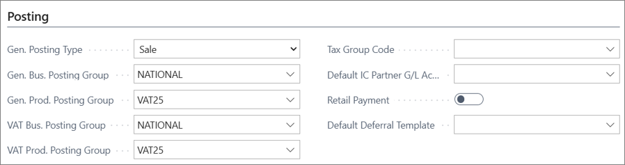

The following details are known at the time of issuance of a Single-Purpose Voucher:

- the place of supply of the goods or the services to which the voucher relates.
- the VAT due on those goods or services. 

To create one, follow the provided steps:

1. Click the  button, enter **Retail Voucher Types**, and choose the related link.     
   The available voucher types are displayed.
2. Click **New**. 
3. Populate or select one of the available values for the following options in the **General** section:
   - **Code**,
   - **Voucher Category** for reporting purposes

4. Populate or select one of the available values for the following options in the **Send Voucher** section:    
     - **Send Voucher Module**,
     - **Reference No.**
     - **Send Method via POS** (vouchers can be sent to a printer either via email or SMS; if sent to a printer, the appropriate template/codeunit also needs to be set).
     - **Account No.** under which the sale of the voucher will be posted on issuance.       
       It is the posting setup of this account that will determine whether VAT is charged on voucher sale or not. The **VAT Prod. Posting Group** needs to be **VATABLE** and the **Gen. Posting** details need to be defined.

    

5. Populate the following fields in the **Setup Voucher** section:    
   - **Voucher Amount** (if the amount is provided, all vouchers created from this voucher type will inherit it)
   - **POS Stores** in which vouchers can be used (if a POS store group is provided, the voucher can be used only in stores associated with it)
   - **Starting Date** and **Ending Date** are optional - they indicate a fixed period during which the vouchers are valid.
6. (Optional) If the voucher has a validity period, it needs to be defined in the **Validate Voucher** section.      
   When the voucher is issued for payment, its validity period will automatically be checked.
7. Use the options in the **Apply Payment** section to establish the conditions that need to be met for the voucher to be redeemed (**Apply Payment Module**), and the POS payment method (**Payment Type**) that will be used during that process.
8. Open the selected **Payment Type**.      
   The corresponding **POS Payment Method Card** is displayed.
9. In the **Vouchers** section, enable the **Reverse Unrealized VAT** toggle switch.     
   As the VAT is already charged on the sale of the SPV, the VAT amount charged on the sale of the voucher shouldn't be applied on the sale of goods that are VAT-able.

#### See also

- [<ins>VAT treatment of single-purpose vouchers (SPV) and multi-purpose vouchers (MPV)<ins>]()