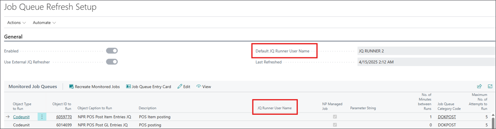

The external job queue refresher ensures that all critical background jobs continue running without user intervention - even outside working hours or on weekends. It is particularly useful for maintaining integrations, POS processing, and periodic data tasks. 

To set up the external job queue refresher, make sure the prerequisites are met, and follow the provided steps:

#### Prerequisites

- Install the latest version of NP Retail (v76.0 or higher)
- Make sure you're working on a SaaS environment. 
- Gain Azure administrative access to register applications.

#### Procedure

1. Click the  button, enter **Job Queue Refresh Setup**, and choose the related link.     
   The administrative section is displayed.
2. Click **Actions** in the ribbon, followed by **External JQ Refresher** > **Create External JQ Refresher User**.       
   This action creates an Entra App that will represent the external worker in your Azure tenant. The system also registers a new Entra App user that will be used to execute job queues.          
   If the process was unsuccessful, consent needs to be given manually through the **Grant Consent** action on the **Microsoft Entra Application** card.
3. Click **Actions** in the ribbon again, followed by **Enable External JQ Refresher**.     
   The worker-based integration for the current company is enabled. From that moment, job queues can be refreshed automatically without relying on users to log in.       
   
   

## Monitored Job Queue Entries

Each job queue entry that is flagged as **Managed by App** (in its corresponding [<ins>Job Queue Entry Card<ins>]()) is tracked and included in the refresh logic. Its corresponding record is created in the **Monitored Job Queue Entries** list. 

The **Monitored Job Queue Entries** list gives you full visibility and control over all tracked job queues. You can see which ones are managed, which users are assigned to run them, and what parameters are defined. If needed, you can also use the **Recreate Monitored Jobs** action to resynchronize the list.

Each monitored entry has a field **JQ Runner User Name**, which refers to the user responsible for executing that specific job. 

It's important to assign a user that has been granted the **Ext JQ Refresher** permission set. If no user is assigned, the system will fall back to the default runner user, which you can specify in the setup. This allows you to distribute job queues across different Entra ID (Job Queue Runner) users - an important step for environments with a high volume of parallel jobs.

  

   