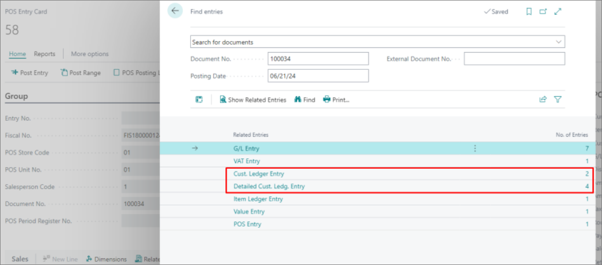

To be able to post customer ledger entries from a POS entry,follow the provided steps:

1. Click the  button, enter **POS Posting Profiles**, and choose the related link.     
2. Select one of the available posting profiles, or create a **New** one. 
3. **Enable Posting** of customer ledger entries via the designated toggle switch in the **Customer Ledger Entry Posting Setup** FastTab.
4. Configure the following options according to your business needs: 

  | Option Name      | Description |
  | ----------- | ----------- |
  | **Customer Posting Group Filter** | Specifies the customer posting group for which customer ledger entries will be posted. | 
  | **Post for Legal Entities** | Specifies whether the customer ledger entries should only be posted for legal entities (the customers that have **VAT Registration No.** defined on their **Customer Card**). |
  | **General Journal Template Name** | Specifies the journal template name that will be assigned to the general journal lines in the customer ledger activity. |
  | **General Journal Template Batch Name** | Specifies the journal batch name that will be assigned to the general journal lines in the customer ledger activity. This option is useful if you wish to separate G/L entries posted for customers by journal batch. |

  