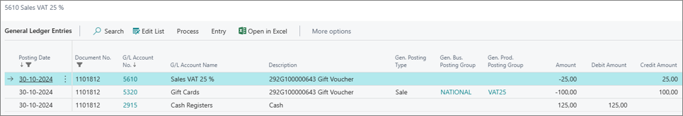
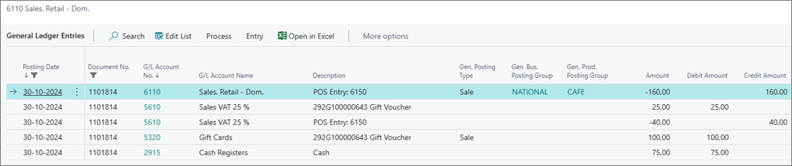
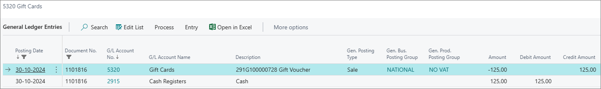
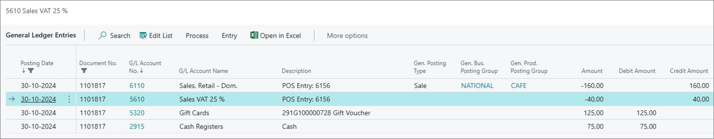

This article illustrates how VAT is treated in the context of SPV and MPV usage:

## SPV VAT treatment examples

On the sale of a SPV for 125,00, the VAT is charged on that sale: 

On redeeming of a SPV against a sale with the amount that exceeds the value of a voucher:

The VAT on the goods is calculated automatically, and then the amount equivalent to the VAT previously taken on the voucher sale is deducted from it.
Therefore, the full VAT isn't applied to the goods when using the SPV. If the VAT value calculated on the sale is higher, the VAT will be charged with the difference automatically. 

In the example provided above, a voucher with the value of 125 EUR is sold, and the SPV is used against a sale of goods for 200 EUR inclusive of VAT. The VAT of 25 EUR has already been taken at the time of the sale of the SPV, so when the goods are purchased, the VAT applies on the difference due on 75 EUR.

VAT on the entire transaction is 40 EUR. In this transaction, the charged VAT is 15 EUR (40-25) equivalent of the difference only. 

## MPV VAT treatment examples

On selling an MPV for 125 EUR, no VAT will be charged.

On redeeming of an MPV against a sale with the value higher than the voucher value:

The VAT due on the goods is fully applied. There's no VAT deduction because of the MPV. Provided that the voucher was an MPV, no VAT will be charged on the sale. 

In the example, an MPV with the value of 125 EUR is sold, and the MPV is used against a sale with the value of 200 EUR inclusive of VAT. No VAT has been taken at the time of the sale of the MPV. When the sale of goods is performed, the VAT will be applied to the full transaction amount. 

- [<ins>VAT treatment of single-purpose vouchers (SPV) and multi-purpose vouchers (MPV)<ins>]()
